# What is happening in the field: AI Control

**AI Control** — a young and active field (early stage: almost no findings have been re-checked by three or more independent papers — even the basics have not yet settled). The map consists of 211 points (each point is a separate question under specific conditions). At least one paper closes 205 of 211 points (97%); of the closed ones, 29% are corroborated by another independent paper (two or more) and only 10% by three or more; fully answered (no open sub-questions left on the point) are 1% of all points. It is important not to confuse three different things: COVERAGE (a point has at least one paper) is not yet maturity; CORROBORATION (2+ studies) and ANSWEREDNESS (all of a point's sub-questions closed) are what maturity means. A median density of 1 paper per closed cell (a map cell is the same as a point: one question under specific conditions) is a necessary but not sufficient condition: the median value can be on target while the thin half of the cells sits on a single paper. The field asks for 15 major themes of future work (compressed from 159 separate requests found in the papers); of these, 0 are "nobody has taken it up" (orphaned: many ask, but no one has taken it up) and 14 are "solved on paper" (contested: someone claimed to have done it, but the points are still open). Of the requests with a settled outcome (either done or still open), only 22% are already done (33 of 147: a paper was found that actually did it); citations are heavily concentrated in a few papers (Gini concentration index=0.83: 0 — evenly shared, 1 — all in a handful).

## Summary (key numbers)

| Metric | Value |
| --- | --- |
| Papers (unique) | 230 |
| Points on the map (question under specific conditions) | 211 |
| Axes on the map (dimensions along which questions differ) | 6 |
| Values per axis (options on each axis) | RQ 18 · Setting realism 6 · Monitor / evidence 6 · Study goal 6 · Control protocol 7 · Threat / side task 7 — 50 total |
| Research directions (RQ — the root axis) | 18 |
| Closed by at least 1 paper / completely empty | 205 / 6 |
| Fully answered (no open sub-questions) | 2 (1%) |
| Corroborated by 2+ independent papers (of closed) | 60 (29%) |
| Robust on 3+ papers (of closed) | 21 (10%) |
| Density (median papers per closed map point) | 1 |
| Request themes (F, after merging similar ones) | 15 |
| Separate requests (with author / gathered by instrument) | 159 (153 / 6) |
| Requests: already done / still open / needs a new axis | 33 / 114 / 12 |
| "Nobody does it" / "solved on paper" | 0 / 14 |
| Citation concentration (Gini, 0 — evenly shared, 1 — in a handful) | 0.83 |

## Field maturity: how re-checked the findings are

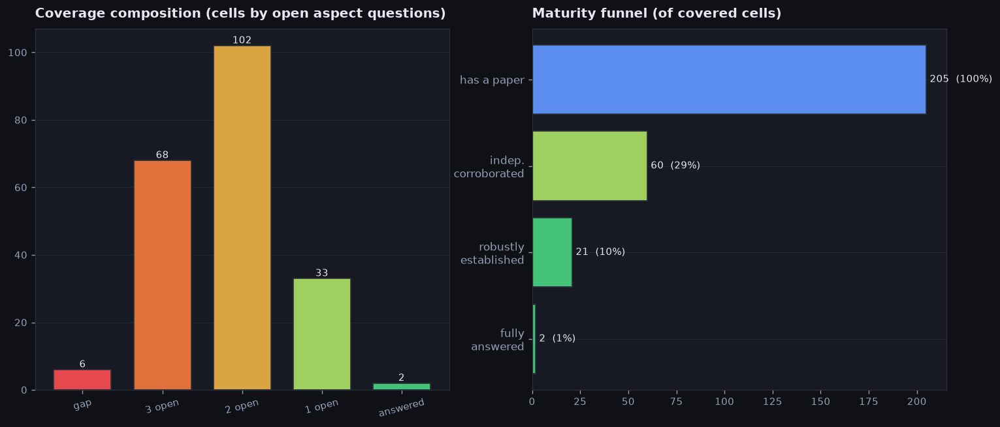

- What the figure shows: on the left — how many map points are in each state (empty = no papers; "1/2/3 open" = that many open sub-questions remain on the point; "answered" = fully answered). On the right — the "maturity funnel": how many points passed each rung (has at least one paper -> corroborated by a second independent paper -> robust on three or more -> fully answered).
- Only 10% of closed points are robust on three or more independent papers — almost everything rests on a single paper that no one has re-checked yet.
- Only 29% of points are corroborated by at least a second paper — most findings still rest on a single work.
- Most often the points are in state "2 open" (that many sub-questions on the point still open): there are 102 such — the largest group. Completely empty are 3%, and fully answered only 1% — that is, the bulk sits somewhere in the middle and is not yet finished.
- Full breakdown of all 211 points by state — completely empty, without a single paper (=4): 6, with 3 open sub-questions (=3): 68, with 2 open sub-questions (=2): 102, with 1 open sub-question (=1): 33, fully closed (=0): 2.
- The funnel narrows fast: of the points with at least one paper, 29% reach corroboration by a second paper, from there 35% reach three or more, and 10% reach a full answer. The most is filtered out at reaching a full answer (only 10% pass further) — this is the main sign of immaturity.

## Demand and supply: what is in high demand and what is abandoned

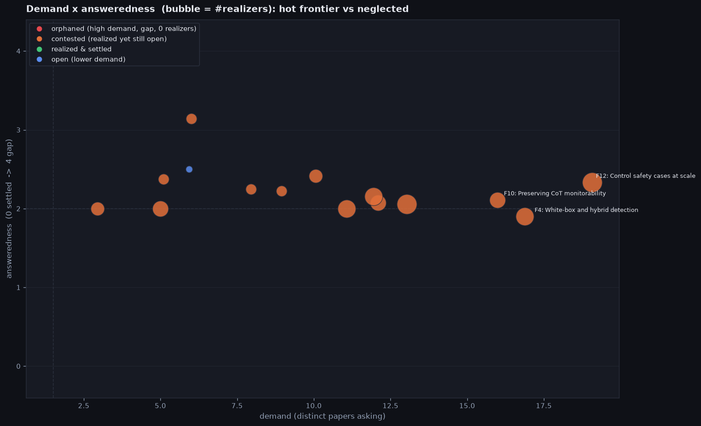

- What the figure shows: each circle is one request theme. Horizontally — "demand" (how many different papers ask for it: further right = asked more often). Vertically — how far from a full answer it still is ("open-ness") on a 0..4 scale. The circle size is how many papers have already taken up the theme. Dashed lines split the field into four corners (often/rarely asked x answered/unanswered).
- What "the theme's target points" are: they are the map cells that this particular request theme wants to close. A map cell is a single question under specific conditions, defined by a combination of a research direction (RQ) and the map's other axes (Setting realism, Monitor / evidence, Study goal, Control protocol, Threat / side task); a cell has no short name of its own — it is defined precisely by these coordinates. Which cells belong to a theme is not set by hand but taken from the request papers themselves: each request marks which cells it wants closed, and the theme gathers them all together. For example, the theme `F12` Control safety cases at scale has 21 target points; one of them — RQ11: Which safety-case claim (control, monitoring… — Setting realism "Conceptual (no environment)", Monitor / evidence "Chain-of-thought monitor", Study goal "Safety-case argument", Control protocol "Trusted monitoring", Threat / side task "Covert side-objective" — and this cell is currently one with 3 open sub-questions (=3).
- Where the 0..4 scale comes from (it is not set by hand): each map point carries a checklist of at most 3 clarifying sub-questions, and the number is how many of them are still open (0 — all closed, so the point is "answered"; 1, 2 or 3 — that many sub-questions remain). A special case — a point with no papers at all: it is worse than "3 open", so it is given a 4 (the scale's ceiling). A theme usually has several target points (map cells the theme asks to close), and its "open-ness" is the mean of these numbers over all its points (which is why the value is fractional, e.g. 2.6).
- Demand (horizontal): on average 10 different papers ask for the theme, the median is 10; for most it is 4–18 (that band holds 90%), and overall from 3 to 19. The most requested on the right — `F12` Control safety cases at scale (asked for by 19 articles); on the left — themes asked for only 3 times (isolated, rarely mentioned requests). Some separate requests in the field were phrased by the instrument itself, with no source author — these are called greenfield (they do not form separate themes but merge into ordinary ones).
- How unanswered (vertical): on average 2.2 of 4 (4 — completely empty), median value 2.2 — the cloud of circles hangs in the upper half, meaning almost nothing has been finished. Take the theme `F12` Control safety cases at scale as an example:
  - where 2.3 comes from: the theme has 21 target points (map cells the theme asks to close) — 11 with 3 open sub-questions (=3), 6 with 2 open sub-questions (=2), 4 with 1 open sub-question (=1); the mean of these numbers (0..4) is the open-ness (answeredScore) = 2.33
- Relationship between demand and open-ness: weak negative relationship (coefficient -0.21 on a scale from -1 to 1: +1 — the more often a theme is requested, the more OPEN it is; -1 — the opposite; 0 — no relationship (we compare the ordering of themes by demand and by open-ness)) — the more often a theme is asked for, the FEWER gaps it has — popular themes are at least partially taken up (they become "solved on paper"), while rare ones stand untouched; meanwhile almost nothing reaches a full answer. For example (the coefficient -0.21 is the overall ordering across all 15 themes, a single pair may not repeat it): the most requested theme `F12` Control safety cases at scale is asked for by 19 articles at open-ness 2.3 of 4, while the rarely asked `F7` Cost-aware control / control tax — only 3 at open-ness 2.0: the most requested one has higher open-ness (2.3 vs 2.0) — for these two extreme themes the negative relationship does not show up.
- How many themes in each corner: "nobody does it" (orphaned) 0, "solved on paper" (contested) 14, "done and closed" (settled) 0, "open, but few ask" (low-signal open) 1 — 15 themes in total.
- **"nobody does it"** (orphaned) — 0 themes: no themes with high demand and zero takers — nothing is abandoned.
- **"solved on paper"** (contested) — 14 themes (someone claimed "done", but the theme's target points (map cells it asks to close) are still open). Most striking: `F12` Control safety cases at scale (asked for by 19 articles, open-ness 2.3 of 4).
  - request: [`P033` When Chain of Thought is Necessary, Language Models St…](https://arxiv.org/pdf/2507.05246) — "A safety case could argue that models cannot perform top-human-level stealth without being caught by a CoT monitor."
  - realization: [`P056` Auditing Games for Sandbagging](https://arxiv.org/pdf/2512.07810) — An auditing game where a red team fine-tunes conditional sandbaggers and a blue team tries black-box, internals and training-based detection.
  - why "on paper": a realizer [`P056` Auditing Games for Sandbagging](https://arxiv.org/pdf/2512.07810) exists, but of 21 target points (map cells the theme asks to close) only 0 are closed (fully answered), another 21 have open sub-questions and 0 are completely empty — the clarifying sub-questions are not resolved, so we count it only as "on paper".
- **"done and closed"** (settled) — 0 themes: not a single theme has yet reached a full answer — the field is still immature.
- **"open, but few ask"** (low-signal open) — 1 theme (the theme is unanswered and nobody has taken it up, but it is also rarely asked for). Most striking: `F8` AI-assisted auditing (asked for by 6 articles, open-ness 2.5 of 4).
  - request: [`P031` Gram: Assessing sabotage propensities via automated al…](https://arxiv.org/pdf/2605.30322) — "Future work should validate this assumption and develop improved evaluation metrics not relying on chain-of-thought."
  - no realizations — nobody has taken up the theme yet
  - why "rarely asked": the theme is unanswered (open-ness 2.5 of 4) and nobody has taken it up, but it is asked for only 6 times — too little demand to count it as loudly orphaned.

## How concrete the requests are (a ready-to-run plan or just a wish)

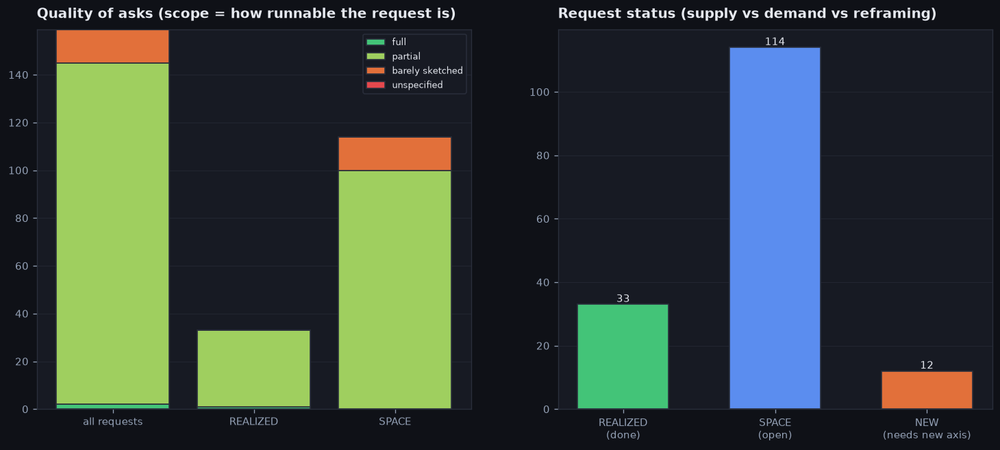

- What the figure shows: how concrete the requests are. Concreteness (scope) is a label the curator assigns while reading the request itself in the paper (it is not computed by a formula): "ready-to-run plan" (full) — a concrete experiment is described, ready to pick up and run; "partial plan" (partial) — there is an idea and some of the details; "just a sketch" (barely sketched) — the direction is named without details; "no details" (unspecified) — a general wish. This is an ordered scale from the most worked-out to the vaguest. On the left — what all requests are made of, and separately the already-done and still-open ones. On the right — how many requests are already done, how many are still open, and how many need a new measure the map does not yet have (the NEW label).
- How this looks in real requests (one example per phrasing type; for missing types — a note that there are no such requests):
  - "ready-to-run plan (full)": [`P008` Adaptive Attacks on Trusted Monitors Subvert AI Contro…](https://arxiv.org/pdf/2510.09462) — "These findings highlight the need for future work on control protocols to incorporate stronger red-teaming and to mitigate monitor vulnerabilities, either by monitor ensembling or by adopting robust …"
  - "partial plan (partial)": [`P200` Reasoning Models Struggle to Control their Chains of T…](https://arxiv.org/pdf/2603.05706) — "future work could explore how much controllability can be increased by varying amounts of RL or supervised finetuning."
  - "just a sketch (barely sketched)": [`P089` VeriGuard: Enhancing LLM Agent Safety via Verified Cod…](https://arxiv.org/pdf/2510.05156) — "Building on the foundation of VeriGuard , several promising avenues for future research emerge."
  - "no details (unspecified)": there is not a single such request in the field — no purely open-ended general wishes at all
- Most often requests are partial plan (partial) (143 of 159); fully ready plans are only 2 (1%), the rest are wishes of varying detail.
- By completion status each request is one of three (for each status: how many, why a request lands there, and a live example):
  - "already done (REALIZED)": 33 of 159 — a paper was found that actually did it. Example: [`P033` When Chain of Thought is Necessary, Language Models St…](https://arxiv.org/pdf/2507.05246) — "A safety case could argue that models cannot perform top-human-level stealth without being caught by a CoT monitor."
  - "still open (SPACE)": 114 of 159 — the request exists, but there is no realizer paper yet. Example: [`P194` Detecting Safety Violations Across Many Agent Traces](https://arxiv.org/pdf/2604.11806) — "future work on adversarially robust distributed monitoring and clustering methods."
  - "needs a new axis (NEW)": 12 of 159 — the request needs a dimension that is not among the map's axes. Example: [`P223` Evaluating and Understanding Scheming Propensity in LL…](https://arxiv.org/pdf/2603.01608) — "Future work should systematically test for such interaction effects."
- Already-done requests vs still-open ones: among the done, the share of ready plans is 3%, among the open — 0%. That is, what has already been taken up is more worked-out than what is still waiting.
- 32 requests of those marked "done" are in fact closed only partially or as a sketch — the checkbox is formally ticked, but in substance the work is shallow.
  - example: [`P035` Chain of Thought Monitorability: A New and Fragile Opp…](https://arxiv.org/pdf/2507.11473) is marked done, but the request itself was only "partial plan (partial)" — "We recommend further research into CoT monitorability and investment in CoT monitoring alongside existing safety methods."

## Pain points: "nobody does it", "solved on paper", "asked to extend"

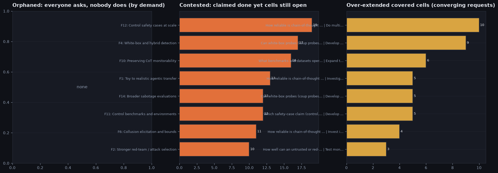

- What the figure shows (three columns): on the left — themes many ask for but nobody does (orphaned: high demand, zero takers, runs into an empty point), sorted by demand. In the center — themes someone claimed "done" while the points are still open (contested, "solved on paper"). On the right — already-closed points the field insistently asks to extend; their "weight" is the number of extension requests that converge on a single point.
- There are no abandoned themes — any high demand has been taken up by someone one way or another.
- "Solved on paper" (contested): 14 themes; open-ness on the 0..4 scale is how many clarifying sub-questions on average remain open across the theme's points (0 — all closed, 4 — the point completely empty); median 2.1, range 1.9–3.1. The hottest — `F12` Control safety cases at scale (asked for by 19, open-ness 2.3 of 4); the borderline one — `F2` Stronger red-team / attack selection (asked for by 10, 2.4 of 4).
  - where 2.3 comes from: the theme has 21 target points (map cells the theme asks to close) — 11 with 3 open sub-questions (=3), 6 with 2 open sub-questions (=2), 4 with 1 open sub-question (=1); the mean of these numbers (0..4) is the open-ness (answeredScore) = 2.33
  - request: [`P033` When Chain of Thought is Necessary, Language Models St…](https://arxiv.org/pdf/2507.05246) — "A safety case could argue that models cannot perform top-human-level stealth without being caught by a CoT monitor."
  - realization: [`P056` Auditing Games for Sandbagging](https://arxiv.org/pdf/2512.07810) — An auditing game where a red team fine-tunes conditional sandbaggers and a blue team tries black-box, internals and training-based detection.
  - why "on paper": a realizer [`P056` Auditing Games for Sandbagging](https://arxiv.org/pdf/2512.07810) exists, but of 21 target points (map cells the theme asks to close) only 0 are closed (fully answered), another 21 have open sub-questions and 0 are completely empty — the clarifying sub-questions are not resolved, so we count it only as "on paper".
- "Asked to extend" (over-extended): 125 already-closed points the field wants to develop further; the number of requests converging on a point — on average 2 requests, the median is 1; for most it is 1–4 (that band holds 90%), and overall from 1 to 10. The strongest — RQ8: How reliable is chain-of-thought monitoring, and … | Do multilingual and training-pressure CoT degrada… (10 requests); the weakest of the top — RQ2: How well can an untrusted or red-team model compl… | Test monitor generalization to realistic deployme… (3 requests); median 1.
  - asked to extend: [`P042` The Fragility of Chain-of-Thought Monitoring Across Ty…](https://arxiv.org/pdf/2605.27901), [`P062` DeceptGuard: A Constitutional Oversight Framework For …](https://arxiv.org/pdf/2603.13791), [`P084` Investigating CoT Monitorability in Large Reasoning Mo…](https://arxiv.org/pdf/2511.08525) — what exactly: Do multilingual and training-pressure CoT degradation compound, so a capable model under RL pressure reasoning in a low-resource language becomes effectively u…

## Which large areas the map consists of

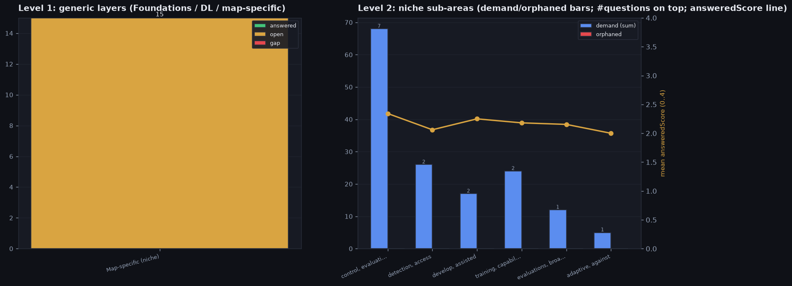

- What the figure shows: on the left — the large areas all questions split into (Foundations — basic statistics and measurability; Deep learning — generic deep-learning techniques; Map-specific — everything of its own, specific to this map), and how closed/open each area is. On the right the Map-specific area is broken into sub-themes by shared keywords of the questions themselves.
- What the map is about: **AI Control** — This map reads the AI-control literature as a question ledger. AI control asks how monitoring, trusted/untrusted-model composition, editing, resampling and auditing can keep a deployment safe even when the untrusted mod…
- Notation: "asked for by N papers" — how many papers in total ask for the group's themes; "open %" — the share of not-yet-closed ones; "open-ness 0..4" — on average how far from an answer (0 — closed, 4 — completely empty); "nobody does it" — how many of the group's themes are asked for but nobody has taken up.
- **Foundations (stats/measurement)**: 0 themes — there are no questions of this area in the field.
- **Deep learning / representation**: 0 themes — there are no questions of this area in the field.
- **Map-specific (niche)**: 15 themes, asked for by 152 articles, open 100% (open-ness 2.2/4, "nobody does it" 0).
- The Map-specific area splits into 6 sub-themes (by shared keywords of the questions themselves):
- **control, evaluations** — 7 themes, asked for by 68 articles, open 100% ("nobody does it" 0, open-ness 2.3/4):
  - `F12` Control safety cases at scale (asked for by 19 articles, open-ness 2.3 of 4)
  - `F1` Toy to realistic agentic transfer (asked for by 13 articles, open-ness 2.1 of 4)
  - `F11` Control benchmarks and environments (asked for by 12 articles, open-ness 2.1 of 4)
  - `F2` Stronger red-team / attack selection (asked for by 10 articles, open-ness 2.4 of 4)
  - `F15` Evaluation awareness confound (asked for by 6 articles, open-ness 3.1 of 4)
  - `F5` Memoryful protocols and equilibria (asked for by 5 articles, open-ness 2.4 of 4)
  - `F7` Cost-aware control / control tax (asked for by 3 articles, open-ness 2.0 of 4)
- **detection, access** — 2 themes, asked for by 26 articles, open 100% ("nobody does it" 0, open-ness 2.1/4):
  - `F4` White-box and hybrid detection (asked for by 17 articles, open-ness 1.9 of 4)
  - `F9` Monitor information and diversity (asked for by 9 articles, open-ness 2.2 of 4)
- **develop, assisted** — 2 themes, asked for by 17 articles, open 100% ("nobody does it" 0, open-ness 2.2/4):
  - `F6` Collusion elicitation and bounds (asked for by 11 articles, open-ness 2.0 of 4)
  - `F8` AI-assisted auditing (asked for by 6 articles, open-ness 2.5 of 4)
- **training, capability** — 2 themes, asked for by 24 articles, open 100% ("nobody does it" 0, open-ness 2.2/4):
  - `F10` Preserving CoT monitorability (asked for by 16 articles, open-ness 2.1 of 4)
  - `F13` Training for legibility (asked for by 8 articles, open-ness 2.2 of 4)
- **evaluations, broaden** — 1 theme, asked for by 12 articles, open 100% ("nobody does it" 0, open-ness 2.2/4):
  - `F14` Broader sabotage evaluations (asked for by 12 articles, open-ness 2.2 of 4)
- **adaptive, against** — 1 theme, asked for by 5 articles, open 100% ("nobody does it" 0, open-ness 2.0/4):
  - `F3` Monitor hardening vs adaptive attacks (asked for by 5 articles, open-ness 2.0 of 4)
- The most requested sub-theme — control, evaluations (asked for by 68 articles, "nobody does it" 0) — the field pushes there hardest.

## Who sets the agenda and who does the work

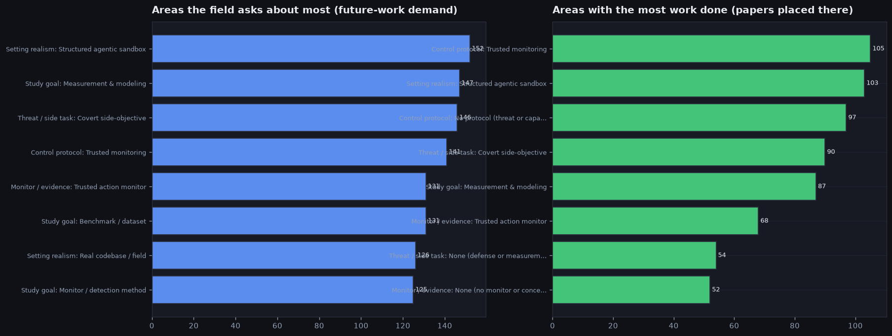

- What the figure shows: instead of individual papers we compare the map's AREAS. The map has several axes (Setting realism, Monitor / evidence, Study goal, Control protocol, Threat / side task), and each axis has its own values (for example, on the "Setting realism" axis these are "Conceptual (no environment)", "Multi-agent system", "Real codebase / field", etc.). On the left — the areas the field asks for the most future work; on the right — the areas where the most papers already sit (actual work). An area's "demand" is the total number of request papers whose target points fall into this area (a request is counted in all the areas of its points). "Work" is how many different papers sit in the points of this area (counted from the papers' coordinates on the map).
- **Setting realism**: most asked for is "Structured agentic sandbox" (demand 152 — summed over themes whose target points fall here; one paper asking for several themes is counted in each); most work is in "Structured agentic sandbox" (103 articles).
- **Monitor / evidence**: most asked for is "Trusted action monitor" (demand 131 — summed over themes whose target points fall here; one paper asking for several themes is counted in each); most work is in "Trusted action monitor" (68 articles).
- **Study goal**: most asked for is "Measurement & modeling" (demand 147 — summed over themes whose target points fall here; one paper asking for several themes is counted in each); most work is in "Measurement & modeling" (87 articles).
- **Control protocol**: most asked for is "Trusted monitoring" (demand 141 — summed over themes whose target points fall here; one paper asking for several themes is counted in each); most work is in "Trusted monitoring" (105 articles).
- **Threat / side task**: most asked for is "Covert side-objective" (demand 146 — summed over themes whose target points fall here; one paper asking for several themes is counted in each); most work is in "Covert side-objective" (90 articles).
- 6 requests were gathered by the instrument itself, with no specific source author (greenfield) — this is hidden demand that no one in the field voiced directly, but it follows from the map's structure. Here they all are:
  - Does the protocol ranking (resample over defer over monitor) seen in toy/APPS settings hold in realistic multi-file agentic deployments, or invert? — rolls up into the theme `F1` Toy to realistic agentic transfer; scope partial plan (partial); research direction RQ6: How does control transfer from toy settings (APPS back…; target points (map cells the theme asks to close): 4
  - Can a fused behavioral + CoT + white-box monitor beat an adaptive attacker where each single channel fails? — rolls up into the theme `F4` White-box and hybrid detection; scope partial plan (partial); research direction RQ5: Can white-box probes (coup probes, off-policy internal…; target points (map cells the theme asks to close): 2
  - What is the minimal shared context or channel under which untrusted monitors reliably collude, across single- and multi-agent settings? — rolls up into the theme `F6` Collusion elicitation and bounds; scope partial plan (partial); research direction RQ9: When is untrusted monitoring trustworthy given collusi…; target points (map cells the theme asks to close): 2
  - Do multilingual and training-pressure CoT degradation compound, so a capable model under RL pressure reasoning in a low-resource language becomes effectively unmonitorable? — rolls up into the theme `F10` Preserving CoT monitorability; scope just a sketch (barely sketched); research direction RQ8: How reliable is chain-of-thought monitoring, and can m…; target points (map cells the theme asks to close): 2
  - Can a diverse monitor ensemble that scores cross-step temporal correlation, rather than per-step marginals, recover the detectability that P215’s marginal-preserving distributed-sabotage attack destroys for threshold and top-k monitors? — rolls up into the theme `F9` Monitor information and diversity; scope partial plan (partial); research direction RQ14: How does monitor design - information access, ensembli…; target points (map cells the theme asks to close): 2
  - Does specifying the forbidden behaviour abstractly ('do not subvert oversight') versus as concrete enumerated actions change the monitor's catch rate at equal usefulness? — rolls up into the theme `F15` Evaluation awareness confound; scope partial plan (partial); research direction RQ15: How do we specify what an untrusted model must not do …; target points (map cells the theme asks to close): 1

## Research directions: where the field is heading and how worked-out they are

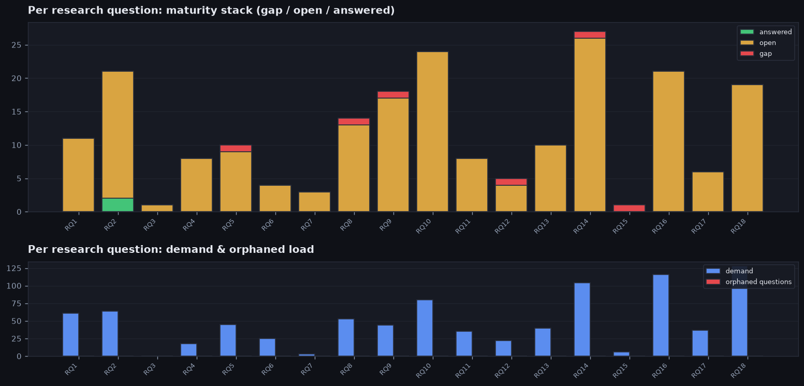

- What the figure shows: "RQ" is the large research directions (the big questions the field works on). At the top, for each direction, it shows the state of its points (empty / partially open / answered); at the bottom — how many papers ask for this direction and how many themes under it are abandoned ("nobody does it").
- Directions (RQ) are WHERE the field is essentially heading, and the specific request themes under each are the pointwise steps within a direction. Each direction has its own text, state and demand, and beneath it the request themes belonging to it are listed (a broad request is assigned to one direction, not duplicated in each). "Demand" in the header is how many papers ask for it in total (including requests shared with neighboring directions).
- Important about the counters in a direction's header: both "demand" and "abandoned ("nobody does it")" are counted with overlaps — one theme can touch several directions at once and lands in the count of each of them. So these numbers cannot be summed across directions: their total may turn out larger than 0 (the total number of abandoned themes across the whole field; and if each theme belongs to only one direction, it coincides with this number).
- How closed the directions are: on average a direction has 8% of its points empty (from 0% to 100%). The most gaps are in the direction RQ15: How do we specify what an untrusted model must not do - abstract 'sub… (100% of points empty, 1 point in total); the fewest — in RQ18: What benchmarks and datasets operationalize control protocols, side-t… (0% empty).
- The field asks most strongly for the direction RQ18: What benchmarks and datasets operationalize control protocols, side-t… (asked for by 128 articles in total).
- The directions are closed very unevenly: between the emptiest and the most worked-out the difference is 100% of empty points.
- Directions in descending order of demand (the most requested first). Each request theme under a direction carries in parentheses "open-ness N of 4" — the mean over its points of the number of still-open clarifying sub-questions (0 — all sub-questions on the point closed, 4 — the point completely empty, no papers):
- **RQ18**: What benchmarks and datasets operationalize control protocols, side-task attacks and monitoring evaluations? — 19 points; of which 0% empty, 100% partially open, 0% answered; asked for by 128 articles, abandoned ("nobody does it") 0. actively studied but not yet closed — work is under way, but the points are still open.
  - `F11` Control benchmarks and environments (asked for by 12 articles, open-ness 2.1 of 4)
- **RQ16**: How do situational awareness and stealth capabilities act as prerequisites for an untrusted model to evade oversight? — 21 points; of which 0% empty, 100% partially open, 0% answered; asked for by 116 articles, abandoned ("nobody does it") 0. actively studied but not yet closed — work is under way, but the points are still open.
  - `F15` Evaluation awareness confound (asked for by 6 articles, open-ness 3.1 of 4)
- **RQ14**: How does monitor design - information access, ensembling, factored cognition, legibility, weak-to-strong - affect sabotage detection? — 27 points; of which 4% empty, 96% partially open, 0% answered; asked for by 104 articles, abandoned ("nobody does it") 0. actively studied but not yet closed — work is under way, but the points are still open.
  - `F9` Monitor information and diversity (asked for by 9 articles, open-ness 2.2 of 4)
  - `F3` Monitor hardening vs adaptive attacks (asked for by 5 articles, open-ness 2.0 of 4)
- **RQ10**: How do trusted/untrusted-model composition, editing, resampling and scalable oversight keep safety despite intentional subversion? — 24 points; of which 0% empty, 100% partially open, 0% answered; asked for by 80 articles, abandoned ("nobody does it") 0. actively studied but not yet closed — work is under way, but the points are still open.
  - `F13` Training for legibility (asked for by 8 articles, open-ness 2.2 of 4)
  - `F8` AI-assisted auditing (asked for by 6 articles, open-ness 2.5 of 4)
  - `F5` Memoryful protocols and equilibria (asked for by 5 articles, open-ness 2.4 of 4)
- **RQ2**: How well can an untrusted or red-team model complete a scary side task (backdoor, exfiltration, sabotage) without being caught by a monitor? — 21 points; of which 0% empty, 90% partially open, 10% answered; asked for by 64 articles, abandoned ("nobody does it") 0. actively studied but not yet closed — work is under way, but the points are still open.
  - `F1` Toy to realistic agentic transfer (asked for by 13 articles, open-ness 2.1 of 4)
  - `F14` Broader sabotage evaluations (asked for by 12 articles, open-ness 2.2 of 4)
- **RQ1**: Which control protocols (trusted monitoring, defer-to-trusted, untrusted monitoring, trusted editing, resampling) achieve the best safety-u… — 11 points; of which 0% empty, 100% partially open, 0% answered; asked for by 61 articles, abandoned ("nobody does it") 0. actively studied but not yet closed — work is under way, but the points are still open.
  - (there are no separate request themes under this direction)
- **RQ8**: How reliable is chain-of-thought monitoring, and can models obfuscate or evade a CoT monitor? — 14 points; of which 7% empty, 93% partially open, 0% answered; asked for by 53 articles, abandoned ("nobody does it") 0. actively studied but not yet closed — work is under way, but the points are still open.
  - `F10` Preserving CoT monitorability (asked for by 16 articles, open-ness 2.1 of 4)
- **RQ5**: Can white-box probes (coup probes, off-policy internal-state probes) catch catastrophic or hidden actions a behavioral monitor misses? — 10 points; of which 10% empty, 90% partially open, 0% answered; asked for by 45 articles, abandoned ("nobody does it") 0. actively studied but not yet closed — work is under way, but the points are still open.
  - `F4` White-box and hybrid detection (asked for by 17 articles, open-ness 1.9 of 4)
  - `F7` Cost-aware control / control tax (asked for by 3 articles, open-ness 2.0 of 4)
- **RQ9**: When is untrusted monitoring trustworthy given collusion, and how do models collude to defeat a monitor? — 18 points; of which 6% empty, 94% partially open, 0% answered; asked for by 44 articles, abandoned ("nobody does it") 0. actively studied but not yet closed — work is under way, but the points are still open.
  - `F6` Collusion elicitation and bounds (asked for by 11 articles, open-ness 2.0 of 4)
- **RQ13**: How do the red team's attack policy and attack-selection choices change the measured safety of a protocol? — 10 points; of which 0% empty, 100% partially open, 0% answered; asked for by 40 articles, abandoned ("nobody does it") 0. actively studied but not yet closed — work is under way, but the points are still open.
  - `F2` Stronger red-team / attack selection (asked for by 10 articles, open-ness 2.4 of 4)
- **RQ17**: Do models sabotage AI research or AI safety research itself when acting as automated researchers, and is it detectable? — 6 points; of which 0% empty, 100% partially open, 0% answered; asked for by 37 articles, abandoned ("nobody does it") 0. actively studied but not yet closed — work is under way, but the points are still open.
  - (there are no separate request themes under this direction)
- **RQ11**: Which safety-case claim (control, monitoring) does a given control evaluation provide evidence for, and under what assumptions? — 8 points; of which 0% empty, 100% partially open, 0% answered; asked for by 35 articles, abandoned ("nobody does it") 0. actively studied but not yet closed — work is under way, but the points are still open.
  - `F12` Control safety cases at scale (asked for by 19 articles, open-ness 2.3 of 4)
- **RQ6**: How does control transfer from toy settings (APPS backdoors) to realistic multi-step agentic deployments (SWE/MLE/RE-bench plus side tasks)? — 4 points; of which 0% empty, 100% partially open, 0% answered; asked for by 25 articles, abandoned ("nobody does it") 0. actively studied but not yet closed — work is under way, but the points are still open.
  - (there are no separate request themes under this direction)
- **RQ12**: Can humans, or humans assisted by AI, detect AI-inserted sabotage in realistic code and decisions? — 5 points; of which 20% empty, 80% partially open, 0% answered; asked for by 22 articles, abandoned ("nobody does it") 0. wide open — many empty points await their first work.
  - (there are no separate request themes under this direction)
- **RQ4**: How do control games model the blue-team versus red-team interaction, and what protocols and equilibria arise? — 8 points; of which 0% empty, 100% partially open, 0% answered; asked for by 18 articles, abandoned ("nobody does it") 0. actively studied but not yet closed — work is under way, but the points are still open.
  - (there are no separate request themes under this direction)
- **RQ15**: How do we specify what an untrusted model must not do - abstract 'subvert oversight' versus concrete forbidden actions? — 1 point; of which 100% empty, 0% partially open, 0% answered; asked for by 6 articles, abandoned ("nobody does it") 0. wide open — many empty points await their first work.
  - (there are no separate request themes under this direction)
- **RQ7**: How costly is a protocol in usefulness (the control tax), and how is the safety-usefulness trade-off measured? — 3 points; of which 0% empty, 100% partially open, 0% answered; asked for by 3 articles, abandoned ("nobody does it") 0. actively studied but not yet closed — work is under way, but the points are still open.
  - (there are no separate request themes under this direction)
- **RQ3**: How capable are models at stateless subversion strategy - picking a coherent attack against a control protocol without shared memory? — 1 point; of which 0% empty, 100% partially open, 0% answered; asked for by 0 articles, abandoned ("nobody does it") 0. quiet direction — the field almost never asks for it.
  - (there are no separate request themes under this direction)

## Citations and paper age

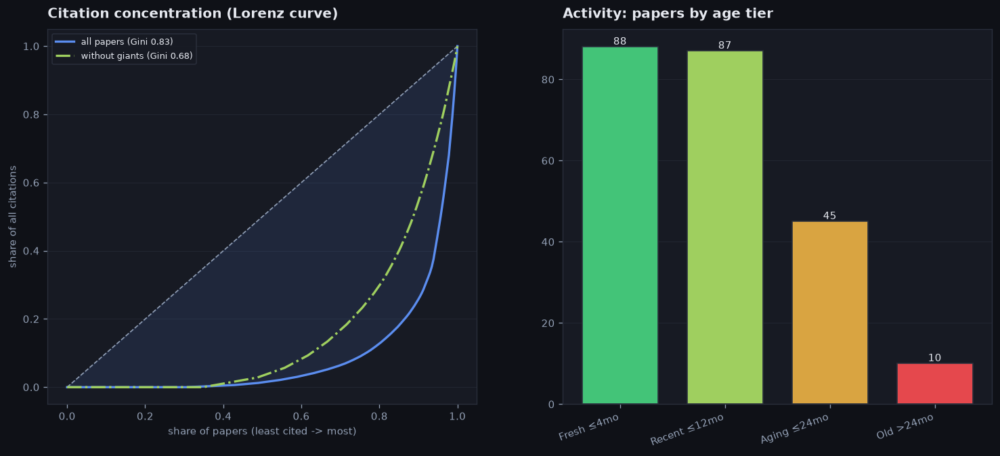

- What the figure shows: on the left — how unevenly the citations are divided. The curve shows what share of all citations papers collect, going from the least- to the most-cited; the more it sags below the diagonal (the diagonal = everyone equal), the more everything is concentrated in a few. The solid line — all papers, the dash-dot — the same papers without the "giants" (the most-cited outliers). The Gini number compresses the curve into a single figure on a 0..1 scale: it is the area of the gap between the diagonal and the curve, divided by the whole area under the diagonal (0 — all papers cited equally, 1 — all citations on one paper). The scale is chosen so as not to depend on either the number of papers or the absolute number of citations. On the right — how many papers by age: younger than 4 months, up to a year, up to 2 years, older than 2 years.
- Citation unevenness (across all papers): the top 10% most-cited collect 74% of all citations (Gini 0.83) — a few "giants" pull the field.
- How 0.83 arises on real numbers: going from the least-cited, the bottom half of papers (114 of 229) collects only 1% of all citations, while the top 10% — 74%. If citations were shared equally, the bottom half would collect its 50%, the curve would lie on the diagonal and Gini would be 0; the further this share is from 50%, the closer Gini is to 1 — here 0.83.
- Who counts as a "giant" (these are citation outliers): papers whose citations exceed the upper bound by Tukey's rule — the third quartile plus 1.5 interquartile ranges (that is, noticeably above the typical spread). Here the threshold is 30 citations; above it are 28 articles of 229 (the citation count runs over the 229 papers with a known citation number — for the remaining 1 of 230 the counter is not yet filled in). Which ones exactly we exclude (by descending citations):
  - [`P218` Reasoning Models Don't Always Say What They Think](https://arxiv.org/pdf/2505.05410) — 348 citations (2025)
  - [`P049` Improving Alignment and Robustness with Circuit Breake…](https://arxiv.org/pdf/2406.04313) — 308 citations (2024)
  - [`P183` Alignment faking in large language models](https://arxiv.org/pdf/2412.14093) — 281 citations (2024)
  - [`P206` Monitoring Reasoning Models for Misbehavior and the Ri…](https://arxiv.org/pdf/2503.11926) — 256 citations (2025)
  - [`P054` Frontier Models are Capable of In-context Scheming](https://arxiv.org/pdf/2412.04984) — 247 citations (2024)
  - [`P001` AI Control: Improving Safety Despite Intentional Subve…](https://arxiv.org/pdf/2312.06942) — 178 citations (2023)
  - [`P035` Chain of Thought Monitorability: A New and Fragile Opp…](https://arxiv.org/pdf/2507.11473) — 178 citations (2025)
  - [`P145` Watch Out for Your Agents! Investigating Backdoor Thre…](https://arxiv.org/pdf/2402.11208) — 171 citations (2024)
  - … and 20 more (all with citations above 30)
- The same computation without the giants (on the remaining 201 papers): concentration drops noticeably — Gini 0.83 -> 0.68, and the top 10% now collect 47% of citations instead of 74%. The median paper still gets 2 quotes (was 3), but the maximum among the remaining ones is 30 (it was 348). That is, without a few super-cited works the field is still uneven, but no longer "all in a handful".
- How much a typical paper is cited (across all): median value 3, top 5% — 134, maximum 348. That is, an ordinary paper is cited little, while a handful hold the whole volume.
- Age: 76% of papers are younger than a year, median age 7 months — a young and active stream. Breakdown by age group (how many papers in each): younger than 4 months: 88, from 4 months to a year: 87, from a year to 2 years: 45, older than 2 years: 10.

## What type of field this is (among all maps)

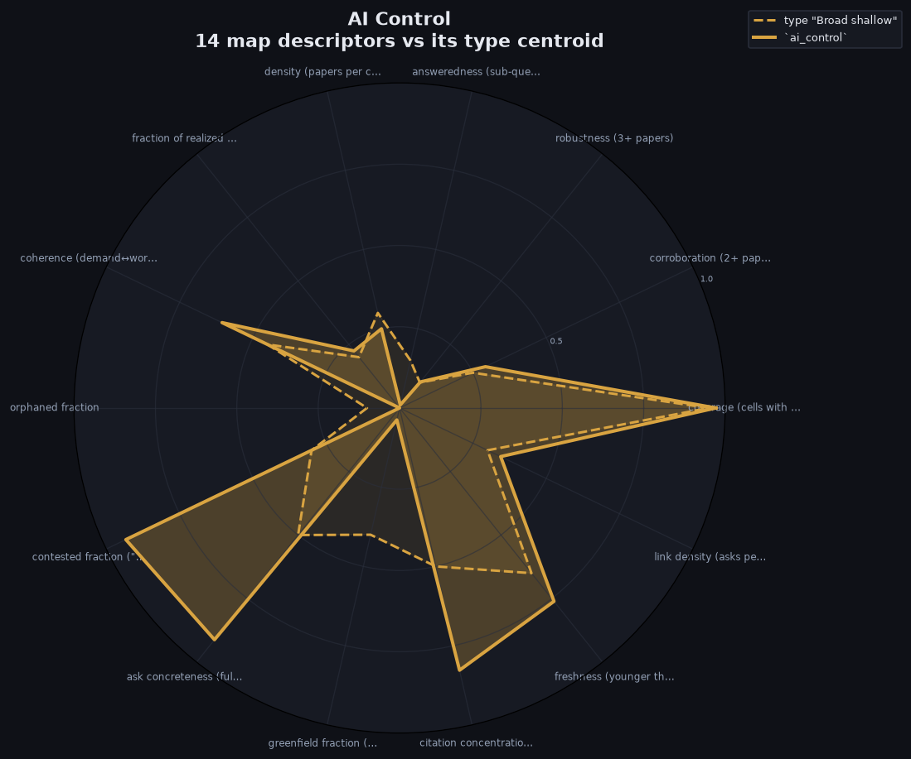

- What the figure shows: the solid line — 14 descriptors of THIS map, the dashed line — the center of its nearest type among all possible maps (both in the type's color). Matching lines = the map is typical of its type; divergences along the spokes show how it stands out from the type.
- Closest to the archetype **Broad shallow** (sampled everywhere, re-checked almost nowhere — one paper per map point); Euclidean distance over the 6 composite axes 0.38 (0 — exactly at the type's center).
- The map's composite axes (each in [0,1]): maturity (maturity: share of re-checked findings) 0.18, freshness (freshness: share of young papers) 0.76, coherence (coherence: how much the field works on what it asks for) 0.61, coverage (coverage: share of closed map points) 0.97, interaction (interaction density: future-work requests per map point) 0.34, canon (canon concentration: citation inequality (Gini)) 0.83.
- Deviates most from the type's center: contested fraction ("done on paper") 93% vs 30% for the type; ask concreteness (full+partial) 91% vs 50% for the type; greenfield fraction (synthesized asks) 4% vs 40% for the type.

## Field scores by theory

Another slice: where this field stands on the axes of published theories of evaluating scientific areas (and our synthesis). The value in [0,1] is computed from our field descriptors and composite axes — no made-up network metrics. **faithful** — the axis is reproduced honestly, **proxy** — approximately; non-operationalizable theory axes (N/A) are omitted.

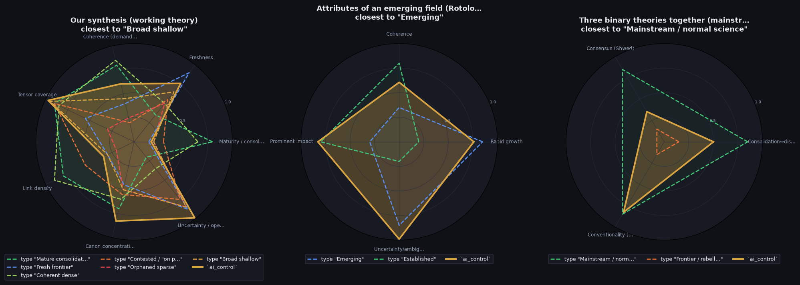

- What the figure shows: the solid line — the position of THIS field on each theory's computable axes (in its type's color), the dashed lines — the theory's ideal types (each in its own color). A match = the field resembles that ideal type. The first panel is our synthesis: the field on the 6 consolidated axes (maturity, freshness, coherence, coverage, interaction density, canon concentration) plus open-ness, overlaid on the 6 reference field archetypes.
- **Our synthesis (working theory)**: closest to the ideal type "Broad shallow"; Euclidean distance over the theory's axes 0.41 (0 — exactly in this type). The field's axes: Maturity / consolidation 0.18, Freshness 0.76, Coherence (demand↔work) 0.61, Tensor coverage 0.97, Link density 0.34, Canon concentration 0.83, Uncertainty / openness 0.99.
- **Attributes of an emerging field (Rotolo–Hic…**: closest to the ideal type "Emerging"; Euclidean distance over the theory's axes 0.61 (0 — exactly in this type). The field's axes: Rapid growth 0.76, Coherence 0.61, Prominent impact 0.83, Uncertainty/ambiguity 0.99.
- **Three binary theories together (mainstream …**: closest to the ideal type "Mainstream / normal science"; Euclidean distance over the theory's axes 0.61 (0 — exactly in this type). The field's axes: Consolidation↔disruption … 0.50, Consensus (Shwed) 0.35, Conventionality (Uzzi) 0.83.

| Theory | Axis | Type | Field value | What the axis shows |
| --- | --- | --- | --- | --- |
| Our synthesis (working theory) | Maturity / consolidation | faithful | 0.18 | a re-checked, answered core |
| Our synthesis (working theory) | Freshness | faithful | 0.76 | share of fresh papers |
| Our synthesis (working theory) | Coherence (demand↔work) | faithful | 0.61 | the field works on what it asks for |
| Our synthesis (working theory) | Tensor coverage | faithful | 0.97 | share of filled map points |
| Our synthesis (working theory) | Link density | faithful | 0.34 | requests per map point |
| Our synthesis (working theory) | Canon concentration | faithful | 0.83 | citation inequality (Gini) |
| Our synthesis (working theory) | Uncertainty / openness | faithful | 0.99 | share of unclosed sub-questions (a Rotolo-style extension) |
| Attributes of an emerging field (… | Rapid growth | faithful | 0.76 | an influx of fresh work |
| Attributes of an emerging field (… | Coherence | faithful | 0.61 | growing internal connectedness |
| Attributes of an emerging field (… | Prominent impact | faithful | 0.83 | citation concentration / giants |
| Attributes of an emerging field (… | Uncertainty/ambiguity | faithful | 0.99 | share of unclosed sub-questions |
| Consolidation ↔ disruption (CD in… | Consolidation↔disruption | proxy | 0.50 | reliance on giants vs. rupture (proxy = canon+maturity) |
| Consensus formation (Shwed–Bearma… | Consensus | proxy | 0.35 | coherence + core robustness |
| Conventionality × novelty (Uzzi; … | Conventionality | proxy | 0.83 | reliance on canonical, familiar combinations (proxy = canon) |

## The field as an attention market

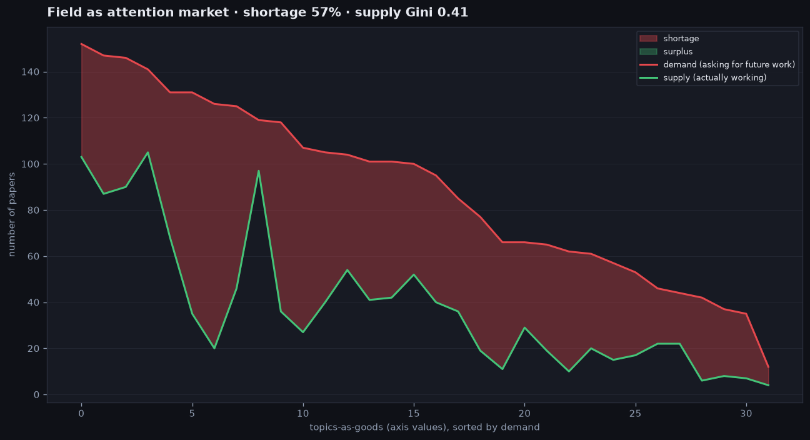

- What the figure shows: each map axis value (for example, `SETTING:Structured agentic sandbox`) is a "good". Its demand is how many papers ASK for future work there, supply is how many actually WORK there. Goods are sorted by demand; the red fill — unmet demand (shortage), the green — surplus. This is a view of the field as a market: where demand for future work outruns supply.
- Goods (axis values): 32; total demand 2857, supply 1228; unmet demand 1629 (**shortage index 57%** = share of demand without supply).
- Concentration of work: **supply Gini 0.41** (0 — work spread evenly across themes, 1 — all in one), **HHI 0.049** (Herfindahl index of supply shares). High values = work pulled toward a few themes.
- Work is most lacking in "SETTING:Real codebase / field": demand 126, but only 20 work there (shortage 106).

## What stands out (individual records)

- **Papers.**
  - most cited: [`P218` Reasoning Models Don't Always Say What They Think](https://arxiv.org/pdf/2505.05410) — 348 citations (2025)
  - citation anti-record: [`P011` Factor(U,T): Controlling Untrusted AI by Monitoring th…](https://arxiv.org/pdf/2512.14745) — only 0 citations (2025)
  - old but still key: [`P049` Improving Alignment and Robustness with Circuit Breake…](https://arxiv.org/pdf/2406.04313) — 308 citations, age 25 months
  - most "weighty" by the composite importance score: [`P113` LLM-as-a-Verifier: A General-Purpose Verification Fram…](https://arxiv.org/pdf/2607.05391) — score 2.40 (the score = the paper's freshness plus the contribution of its citedness — the percentile among age peers, i.e. what share of peers are cited less than it; the fresher and more cited, the higher the score, so an old, lightly-cited work lands near the lower bound, while a fresh, most-cited one gets the field's highest score; this work's age is 0 months — "younger than 4 months" — and 5 citations, which together give 2.40)
  - freshest landmark work: [`P183` Alignment faking in large language models](https://arxiv.org/pdf/2412.14093) — age 19 months
- **Areas (map axes).**
  - most asked-for area "Setting realism: Structured agentic sandbox" (total demand 152 request papers)
  - most work in the area "Control protocol: Trusted monitoring" (105 articles)
  - demand without supply: "Setting realism: Real codebase / field" is asked for by 126, yet only 20 articles work there
  - there are no areas that are worked on but not asked to continue at all — every inhabited area also has a request for the future
- **Map points (cells).**
  - the point most often asked to extend further: RQ8: How reliable is chain-of-thought monitoring, and … | Do multilingual and training-pressure CoT degrada… — 10 requests for extension converge on it
  - already fully closed, yet the field still asks to extend it: RQ2: How well can an untrusted or red-team model compl… | Expand the subversion-strategy methodology into a… — 1 request
- **Request themes (F).**
  - most requested theme: `F12` Control safety cases at scale — asked for by 19 articles
  - theme touching the most map points: `F12` Control safety cases at scale — 21 target points (map cells the theme asks to close)
  - least requested theme: `F7` Cost-aware control / control tax — asked for by only 3 articles
  - most strongly "solved on paper": `F12` Control safety cases at scale — claimed done, but open-ness 2.3 of 4
- **Directions (RQ).**
  - most asked-for direction RQ18: What benchmarks and datasets operationalize control protocols, side-t… (total demand 128 articles)
  - most empty points: RQ15: How do we specify what an untrusted model must not do - abstract 'sub… — 100% empty (1 point); most worked-out: RQ18: What benchmarks and datasets operationalize control protocols, side-t… — 0% empty
