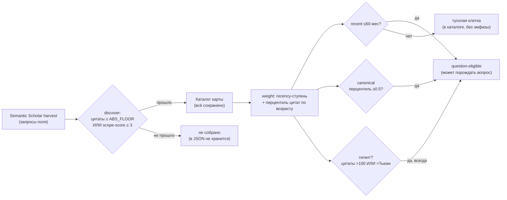

# Пространство карт: как выглядят возможные карты и где на нём наши

## На какие вопросы отвечает этот отчёт

| Вопрос | Где ответ |
| --- | --- |
| Сколько последних лет допустимо (не для гигантов)? Трешхолд? | «Как собирались и фильтровались статьи» → `fig_collection_funnel.png` (ступень Recent ≤60 мес) + `fig_recency_by_map.png` |
| Как взвешиваем статьи? | «Как собирались и фильтровались» (текст + схема), деталь по одной карте — per-map `pipeline.md` → `fig_weighting.png` |
| Что в итоге отсеивается? Старые гиганты сохраняются? | `fig_collection_funnel.png` (отбор МЯГКИЙ; подпись «гигантов сохранено / старых») + `fig_citation_filter.png` |
| Из цитирования пришло с константой на гигантах? | `fig_citation_filter.png` (абс. пол 100 + порог Тьюки на карту) |
| Их сроки выхода? | `fig_recency_by_map.png` |
| Как разбиваем на оси / вопросы / канонические запросы / аспекты? | «Как область разбивается на структуру» → `fig_structure.png` |
| Как рисуются связи и размещения? | `fig_structure.png` (клетки, Fk, просьбы) + per-map `pipeline.md` → `fig_tensor_heatmaps.png` |
| У какой карты глубже перепроверенное ядро (зрелость)? | «Сравнение полей» → `fig_maturity_funnel.png` |
| Где больше брошенных тем / «решили на словах» (болевые точки)? | «Сравнение полей» → `fig_painpoints.png` |
| Чьи просьбы конкретнее (готовый план vs пожелание)? | «Сравнение полей» → `fig_ask_scope.png` |
| Где спрос расходится с реальной работой? Много ли скрытого спроса? | «Сравнение полей» → `fig_agenda_work.png`, `fig_realize_greenfield.png` |
| Разбиение по 14 дескрипторам (сырые характеристики)? | «Теории оценки областей» → Часть 2 → «Our synthesis (working theory)» → «Разбиение по 14 дескрипторам»: `fig_descriptor_archetype_radar.png`, `fig_descriptor_archetype_gallery.png` + `fig_radar.png` (карта vs центр типа) |
| Наполненная / свежая / когерентная / другая область (свёртка в 6 осей)? | «Теории оценки областей» → Часть 2 → «Our synthesis (working theory)» → «Свёртка в 6 композитных осей»: `fig_archetype_radar.png`, `fig_archetype_gallery.png`, `fig_type_radars.png` |
| Какие вообще бывают типы карт, куда попала наша? | «Теории оценки областей» → Часть 2 → «Our synthesis (working theory)» (таблица сигнатур 6 типов + распределение карт по типам) |
| Пространство карт и где на нём наша карта? | «Теории оценки областей» → Часть 2 → «Our synthesis (working theory)» → «Пространство карт» (6 плоскостей + SPLOM + PCA) + «Где находятся наши карты» |
| Достаточно ли 6 осей? На какой теории основаны? | «Теории оценки областей» → Часть 1 — оси всех 5 теорий: что показывают + как вычислены из данных (со ссылками + faithful/proxy/N/A) |
| Какие идеальные типы у ДРУГИХ теорий и где мы относительно них? | «Теории оценки областей» → Часть 2: Rotolo — `fig_rotolo_types.png` → `fig_rotolo_maps.png` → `fig_rotolo_matrix.png` → `fig_rotolo_pca.png`; три бинарные вместе — `fig_binaries_types.png` → `fig_binaries_maps.png` → `fig_binaries_matrix.png` → `fig_binaries_pca.png` + таблицы «идеальные типы + ближайшая карта» |
| Спрос vs существующая работа по темам (экономика)? | «Экономика области» → `fig_supply_demand_curves.png`, `fig_supply_demand_sorted.png`, `fig_attention_lorenz.png`, `fig_market_map.png` |

Глубокий разбор ОДНОЙ карты (воронка цитат×возраст, кривая веса, тензорные хитмапы) — в её per-map конвейере: [`refusal_geometry`](../refusal_geometry/pipeline.md); [`vcrc`](../vcrc/pipeline.md).

Отдельный `report.md` отвечает «что происходит в ЭТОМ поле». Здесь мы отступаем на шаг и спрашиваем: как поле-карта может выглядеть ВООБЩЕ, и где на этом множестве находится каждая наша карта. Каждую карту сжимаем в вектор из 14 интерпретируемых дескрипторов, сворачиваем их в 6 композитных осей и рисуем теоретическое пространство, которое они образуют.

Три сущности на картинках пространства: (1) серое **облако допустимых карт** — Монте-Карло выборка дескрипторных векторов при структурных ограничениях, которые реальная карта не может нарушить (устойчивость ≤ подтверждённость ≤ покрытие; решённость ≤ покрытие; четыре угла спроса делят темы; все доли в [0,1]); это математически достижимая область, а не выдуманные данные. (2) цветные **архетип-зоны** — осмысленные именованные области (зрелая, свежий фронтир, когерентная плотная, contested, orphaned-разреженная, широкая мелкая). (3) **наши карты** — отмеченные точки-звёзды.

Карт в сравнении: 2. Облако: 4000 сэмплов (seed 20260703).

## Дескрипторы карт (сводка)

| Карта | покрытие | подтв. 2+ | устойч. 3+ | решено | согласов. | orphaned | contested | свежесть | связи | Gini |
| --- | --- | --- | --- | --- | --- | --- | --- | --- | --- | --- |
| `refusal_geometry` | 58% | 21% | 8% | 1% | 0.58 | 72% | 24% | 63% | 2.1 | 0.85 |
| `vcrc` | 100% | 36% | 21% | 0% | 0.41 | 5% | 32% | 54% | 2.7 | 0.90 |

- Что в таблице: доли клеток/тем в [0,1] и пара абсолютных (связи — рёбер просьба→клетка на закрытую клетку). «согласованность» = насколько поле работает над тем, что просит (1 — идеально: чем громче спрос, тем решённее; 0 — просят громче всего то, что забросили).

## Как собирались и фильтровались статьи (по каждой карте)

Ключевая оговорка: отбор В КАТАЛОГ мягкий — после сбора ничего не выкидывается. Стадийные пороги СБОРА (harvest в Semantic Scholar по запросам поля; `discover`: цитаты ≥ ABS_FLOOR ИЛИ scope-score ≥ 3) отсекают кандидатов ДО каталога, и такие кандидаты в JSON карты не сохраняются — поэтому «сколько отсеялось на сборе» показать графиком нельзя, это дано схемой ниже. Всё, что попало в каталог, остаётся; вес лишь решает ЭМФАЗУ и право статьи порождать вопрос будущей работы.

### Воронка мягкого отбора (по каждой карте)

- Что на картинке: по одной воронке на карту. Верхняя полоса — весь каталог (100%, ничего не выброшено), ниже — сколько статей проходят каждый порог эмфазы: question-eligible (может породить вопрос), из них recent (≤60 мес) и canonical (перцентиль цитат по возрасту ≥0.5), и «тусклые» — в каталоге, но без эмфазы.
- Подпись каждой воронки отвечает «что отсеивается / старые гиганты»: гигантов сохранено (>100 цитат ИЛИ выше порога Тьюки), из них старых (>60 мес). По всем картам сохранено 257 гигантов, из них 36 старых — старые гиганты действительно НЕ выкидываются.

### Сроки выхода статей (по каждой карте)

- Что на картинке: нормированные стековые бары — доля статей по возрасту (свежие ≤4 мес, ≤12, ≤24, старше 24) на каждую карту; над баром — серединный возраст. Отвечает «их сроки выхода»: видно, поле собрано на свежаке или тянет длинный исторический хвост.
- Порог recency (60 мес) — это тот самый «сколько последних лет допустимо не для гигантов»: статьи свежее него question-eligible по одной свежести; старше — только если каноничны или гиганты.

### Цитаты и пороги гигантов (по каждой карте)

- Что на картинке: лог-strip цитат по каждой карте (точки — статьи). Пунктир — абсолютный пол гиганта = 100 (общий для всех), оранжевые чёрточки — порог Тьюки (Q3+1.5·IQR) ЭТОЙ карты. Всё выше любого из них — гигант, он сохраняется как канонический. Это и есть «из цитирования пришло с константой на гигантах».
- Подпись у каждой карты: серединные/макс цитаты, число гигантов, Gini (неравенство цитирования). Высокий Gini + мало гигантов = поле с несколькими доминирующими работами и длинным малоцитируемым хвостом.

## Как область разбивается на структуру

- Что на картинке: слева — во сколько осей и направлений (значений RQ) разложена каждая карта; справа (лог шкала) — сколько получилось точек-клеток, канонических тем `Fk`, отдельных просьб (будущая работа) и клеток, подтверждённых 2+ источниками. Это путь «оси → вопросы → канонические запросы → аспекты → размещения/связи».
- Клетка — пересечение значений осей (куда садится статья); канонический запрос `Fk` — тема будущей работы; просьба — конкретное ребро «источник → клетка»; подтверждённость 2+ — сколько клеток закрыты не одной работой. Больше просьб и Fk при том же числе клеток = плотнее сеть открытых направлений.

## Сравнение полей: зрелость, спрос и болевые точки

Каждое поле уже разобрано «изнутри» в своём `report.md`. Здесь мы кладём эти внутренние профили рядом: у кого глубже перепроверенное ядро, у кого больше брошенных тем, у кого просьбы конкретнее и где спрос расходится с реальной работой — всё из тех же реальных клеток и рёбер карт.

### Воронка зрелости по картам

- Что на картинке: по одной линии на карту вдоль лестницы покрыто (≥1 статья) → подтв. 2+ → устойч. 3+ → решено, в долях ОТ ВСЕХ клеток карты. Линия, которая держится высоко, — глубокое перепроверенное ядро; линия, обрушивающаяся сразу после «покрыто», — тонкое поле с одной статьёй на клетку.
- Это кросс-картовый двойник per-map «воронки зрелости»: там она про одну карту, здесь — сравнение, у кого ядро доведено дальше.

### Профиль болевых точек

- Что на картинке: стековые бары — сколько канонических тем `Fk` каждой карты попадает в один из четырёх углов спрос×решённость: «никто не делает» (orphaned: много просят, никто не взялся, упирается в пустоту), «решили на словах» (contested: реализатор есть, но точки открыты), «сделано» (settled) и «открыто, мало спроса» (low-signal). Считается тем же `_quadrants`, что и в per-map отчёте.
- Высокая доля contested = поле склонно объявлять сделанным недоведённое; высокая доля orphaned = громкий спрос упирается в дыры тензора.

### Конкретность просьб

- Что на картинке: нормированные стековые бары — доля просьб каждой карты по конкретности: готовый план (full) → частичный (partial) → набросок (barely) → без деталей (unspecified). Над баром — доля «плана» (full+partial). Показывает, чьи заявки на будущую работу можно брать и делать, а чьи — расплывчатые пожелания.

### Повестка vs работа

- Что на картинке: по одному бару на карту — доля не-RQ осей, где САМОЕ востребованное значение НЕ совпадает с тем, где больше всего реальной работы (спрос и работа смотрят в разные стороны). Над баром — N/всего осей.
- `refusal_geometry`: рассинхрон на 1/13 осях (Public code). Например по оси «Public code» громче всего просят «not-released» (207), а больше всего работают в «released» (74).
- `vcrc`: рассинхрон на 4/5 осях (Measurement instrument, evaluation-chain stage, Validity threat, Research subject). Например по оси «Measurement instrument» громче всего просят «none / theoretical» (1746), а больше всего работают в «statistical / metric» (806).

### Выполнено и скрытый спрос

- Что на картинке: пара баров на карту — доля выполненных просьб (нашлась статья, реально сделавшая) и доля greenfield (просьбы, синтезированные инструментом без статьи-автора = скрытый спрос). Низкая реализуемость при высоком greenfield = поле просит куда больше, чем успевает делать, и в нём много невысказанной вслух пустоты.

## Теории оценки областей (что показывает каждая ось и как мы её считаем)

Наши 6 композитных осей — это НАША рабочая теория. Чтобы не обосновывать их «из головы», мы выражаем несколько реальных опубликованных рамок как их собственные оси-линзы, размещаем карты на каждой и честно помечаем каждую ось: **faithful** — есть настоящая метрика из наших данных; **proxy** — только приближение; **N/A** — наших данных (авторский тензор + счётчики цитат по статьям) не хватает для конструкта (например, нужен граф со-цитирований), и мы это НЕ выдумываем.

Структура раздела: **Часть 1** — оси ВСЕХ теорий: что каждая показывает и как именно вычислена из наших данных. **Часть 2** — для каждой теории сначала её ИДЕАЛЬНЫЕ типы (полюса), потом НАШИ карты на них, и (где осей ≥3) 2D-матрица (SPLOM) и PCA пространства этой теории. Начинаем с нашего синтеза, затем Rotolo, затем три бинарные теории.

### Часть 1 — оси всех теорий: что показывают и как вычислены

Сначала — САМИ оси каждой теории: что ось должна показывать и как именно мы получаем её значение для наших карт (та же формула, что в коде `theory_axis_value`). Все значения на радарах, SPLOM и PCA из Части 2 посчитаны ровно этими формулами — ни одна точка не подгоняется вручную, поэтому каждый график обоснован.

#### Our synthesis (working theory)

6 композитных осей + расширение «неопределённость/открытость»; свёртка идей из теорий ниже.

Источник: Наша рабочая теория поля-карты (синтез рамок ниже)

| Ось | Тип | Что показывает | Как вычислено из наших данных / почему N/A |
| --- | --- | --- | --- |
| Maturity / consolidation | faithful | перепроверенное решённое ядро | среднее 5 дескрипторов «твёрдости ядра»: подтверждённость (2+ источника), устойчивость (3+), решённость, реализуемость, плотность связей |
| Freshness | faithful | доля свежих статей | дескриптор fresh_share — доля недавно активных тем |
| Coherence (demand↔work) | faithful | поле работает над тем, что просит | дескриптор согласованности = (1 − ρ)/2, где ρ = корреляция «громкость спроса ↔ решённость темы» (1 — поле решает именно то, что громче всего просит) |
| Tensor coverage | faithful | доля закрытых клеток | дескриптор coverage — доля закрытых клеток тензора |
| Link density | faithful | просьб на клетку | дескриптор interaction_norm — нормированная плотность связей просьба→клетка |
| Canon concentration | faithful | неравенство цитат (Gini) | дескриптор cit_gini — Gini неравенства цитат между статьями (насколько есть «гиганты»-канон) |
| Uncertainty / openness | faithful | доля незакрытых под-вопросов (расширение по Rotolo) | 1 − решённость (answered): какая доля ядра ещё открыта |

#### Attributes of an emerging field (Rotolo–Hicks–Martin)

Пять атрибутов возникновения: радикальная новизна, быстрый рост, когерентность, заметное влияние, неопределённость/неоднозначность.

Источник: Rotolo D., Hicks D., Martin B. R. (2015). What is an emerging technology? Research Policy 44(10): 1827–1843. DOI: [10.1016/j.respol.2015.06.006](https://doi.org/10.1016/j.respol.2015.06.006)

| Ось | Тип | Что показывает | Как вычислено из наших данных / почему N/A |
| --- | --- | --- | --- |
| Radical novelty | N/A | принципиально новые сущности/комбинации | нужен анализ атипичных комбинаций/новых терминов, которого нет в наших данных |
| Rapid growth | faithful | приток свежих работ | дескриптор fresh_share — доля недавно активных тем |
| Coherence | faithful | растущая внутренняя связность | дескриптор согласованности = (1 − ρ)/2, где ρ = корреляция «громкость спроса ↔ решённость темы» (1 — поле решает именно то, что громче всего просит) |
| Prominent impact | faithful | концентрация цитат/гиганты | дескриптор cit_gini — Gini неравенства цитат между статьями (насколько есть «гиганты»-канон) |
| Uncertainty/ambiguity | faithful | доля незакрытых под-вопросов | 1 − решённость (answered): какая доля ядра ещё открыта |

#### Consolidation ↔ disruption (CD index)

Работа консолидирующая (опирается на предшественников, «на плечах гигантов») или дизруптивная (обесценивает их). У нас — только ПРОКСИ: настоящий CD-индекс требует графа цитирований.

Источник: Park M., Leahey E., Funk R. J. (2023). Papers and patents are becoming less disruptive over time. Nature 613: 138–144 (индекс: Funk & Owen-Smith 2017; Wu, Wang & Evans 2019). DOI: [10.1038/s41586-022-05543-x](https://doi.org/10.1038/s41586-022-05543-x)

| Ось | Тип | Что показывает | Как вычислено из наших данных / почему N/A |
| --- | --- | --- | --- |
| Consolidation↔disruption | proxy | опора на гигантов vs слом (прокси = канон+зрелость) | (канон + зрелость) / 2 |
| Team size | N/A | малые команды дизраптят, большие — развивают | нет данных об авторах/командах в наших JSON |

#### Consensus formation (Shwed–Bearman)

Консенсус = падение модулярности (значимости сообществ) в сети цитирований, нормированное на размер литературы. У нас — только ПРОКСИ через согласованность+устойчивость.

Источник: Shwed U., Bearman P. S. (2010). The temporal structure of scientific consensus formation. American Sociological Review 75(6): 817–840. DOI: [10.1177/0003122410388488](https://doi.org/10.1177/0003122410388488)

| Ось | Тип | Что показывает | Как вычислено из наших данных / почему N/A |
| --- | --- | --- | --- |
| Modularity / community salience | N/A | разбиение сети цитирований на кластеры | нужен граф со-цитирований и детекция сообществ, которых нет в наших данных |
| Consensus | proxy | согласованность + устойчивость ядра | (согласованность + устойчивость) / 2 |

#### Conventionality × novelty (Uzzi; Science of science)

Влиятельная работа = высокая конвенциональность (опора на привычные комбинации) с вкраплениями атипичной новизны. Конвенциональность — ПРОКСИ через канон; новизна — не операционализируема.

Источник: Uzzi B., Mukherjee S., Stringer M., Jones B. (2013). Atypical combinations and scientific impact. Science 342: 468–472; Fortunato S. et al. (2018). Science of science. Science 359: eaao0185. DOI: [10.1126/science.1240474](https://doi.org/10.1126/science.1240474)

| Ось | Тип | Что показывает | Как вычислено из наших данных / почему N/A |
| --- | --- | --- | --- |
| Conventionality | proxy | опора на канонические привычные комбинации (прокси = канон) | дескриптор cit_gini — Gini неравенства цитат между статьями (насколько есть «гиганты»-канон) |
| Atypical novelty | N/A | необычные комбинации ссылок | нужны z-оценки пар ссылок по всему корпусу, которых нет в наших данных |

### Часть 2 — архетипы типов и где на них наши карты

Каждая теория — в одном порядке: сначала её идеальные типы (полюса), затем наши карты на них. Значения всех осей — по формулам из Части 1.

#### Our synthesis (working theory): архетипы, карты, пространство

«Тип» карты — это ближайший **архетип**: осмысленная опорная точка в пространстве наших композитных осей. Важная честная оговорка: это НЕ кластеры, найденные алгоритмом по данным (карт слишком мало для настоящей кластеризации) — это отобранные вручную обоснованные ориентиры-центры, каждый со своей сигнатурой и половинной шириной зоны (±0.16 по каждой оси).

Порядок рассказа — такой же, как у остальных теорий: сначала ОПИСАНИЕ шести типов (их сигнатуры и какие наши карты в какой тип попали), затем их АРХЕТИПЫ и наши карты поверх — сперва по 14 дескрипторам, затем в свёртке в 6 композитных осей (именно по этим 6 осям, по евклидову расстоянию до центра, карте и назначается тип), — и в конце само пространство карт (2D-плоскости → SPLOM → PCA).

##### Шесть типов: сигнатура и обоснование

| Тип | Сигнатура (сильные композитные оси) | Смысл |
| --- | --- | --- |
| **Mature consolidated** | tensor 0.90, maturity 0.80, coherence 0.80 | re-checked dense core; the field works on what it asks for |
| **Fresh frontier** | freshness 0.90, tensor 0.55, canon 0.45 | young stream; the core is still thin, almost nothing carried to completion |
| **Coherent dense** | link 0.90, coherence 0.85, tensor 0.85 | dense interaction among participants; demand and work point the same way |
| **Contested / "on paper"** | tensor 0.90, freshness 0.55, link 0.55 | broadly covered but declared "done" while sub-questions are still open |
| **Orphaned sparse** | freshness 0.50, canon 0.50, tensor 0.30 | leaky tensor; high demand runs into empty cells, nobody takes up the themes |
| **Broad shallow** | tensor 0.95, freshness 0.65, canon 0.50 | sampled everywhere, re-checked almost nowhere — one paper per cell |

##### Какие карты в какой тип попали

- **Mature consolidated**: — (пока нет карт этого типа)
- **Fresh frontier**: — (пока нет карт этого типа)
- **Coherent dense**: — (пока нет карт этого типа)
- **Contested / "on paper"**: `refusal_geometry`, `vcrc`
- **Orphaned sparse**: — (пока нет карт этого типа)
- **Broad shallow**: — (пока нет карт этого типа)

##### Разбиение по 14 дескрипторам

Каждая карта — это вектор из 14 дескрипторов (покрытие, подтверждённость, устойчивость, решённость, свежесть, доля брошенных тем orphaned, «на словах» contested, канон и т.д.). Вот полное разбиение типов по ним — самый детальный взгляд, до всякой свёртки. Он показывает то, что 6 осей позже прячут: например, тип «Orphaned разреженная» узнаётся по пику orphaned, а «Contested» — по пику contested.

###### Все типы на одном радаре (14 дескрипторов)

- Что на картинке: центры всех 6 типов на одном 14-лучевом радаре (каждый в своём цвете). Самый детальный профиль каждого типа — по всем сырым дескрипторам.

###### Галерея типов (14 дескрипторов, по одному радару на тип)

- Что на картинке: по одному 14-лучевому радару на тип — полная дескрипторная сигнатура каждого типа отдельно.

###### Наши карты относительно центров своих типов (14 дескрипторов)

- Что на картинке: по одному радару на карту, 14 лучей — дескрипторы (0 в центре, 1 на ободе), цвет = тип карты. Сплошная — сама карта, ПУНКТИР — центр её типа: видно, чем карта отличается от «эталона» своего типа.
- Так «наполненная зрелая» карта — большой ровный многоугольник с сильными подтверждённость/устойчивость/решённость; «свежая» — тянется к свежести при тонком ядре; «orphaned» — торчит доля брошенных тем при низком покрытии.

##### Свёртка в 6 композитных осей

Те же 14 дескрипторов, свёрнутые в 6 композитных осей (зрелость, свежесть, согласованность, охват, плотность связей, канон). Свёртка детерминирована: дескрипторная сигнатура каждого типа по построению сворачивается ровно в его композитный центр (один источник истины). Именно в этом 6-мерном пространстве карта относится к типу, к центру которого она ближе всего по евклидовому расстоянию.

###### Все типы на одном радаре

- Что на картинке: центры всех 6 типов, наложенные на один радар из 6 композитных осей (каждый в своём цвете). Видно, чем типы различаются: где у одного пик, у другого провал.

###### Галерея типов (по одному радару на тип)

- Что на картинке: тот же набор, но по одному радару на тип — чтобы прочитать профиль каждого типа отдельно. Заменяет прежнюю запутанную «тензор-галерею».

###### Наши карты относительно центров своих типов

- Что на картинке: по одному радару на реальную карту (сплошная, в цвете её типа), а пунктиром — центр её типа. `d` в подписи — расстояние до центра: чем меньше, тем «типичнее» карта для своего типа.

##### Пространство карт нашего синтеза (2D-плоскости, SPLOM, PCA)

Те же 6 композитных осей, но теперь как непрерывное пространство: серое — облако структурно допустимых карт, цветные зоны — архетипы, звёзды — наши карты.

###### Пространство карт в 2D-плоскостях

- Что на картинке: шесть плоскостей из пар композитных осей (2×3). Серые точки — облако допустимых карт (что вообще возможно); цветные круги с подписями — зоны типов; звёзды — наши карты. Где звезда попадает в цветную зону, там её характер.
- Пары осей: свежесть×зрелость, связи×согласованность, охват×зрелость, охват×согласованность, связи×охват, канон×свежесть. Пустые части облака — сочетания, которые структурно почти недостижимы.

###### Матрица всех плоскостей (SPLOM)

- Что на картинке: все 15 пар из 6 композитных осей сразу — нижнетреугольная матрица мини-панелей. В каждой: облако допустимых карт, зоны типов, наши карты-звёзды. Имена осей — по краям. Обзор «все плоскости за раз», чтобы не упустить ни одной проекции.

###### PCA пространства карт

- Что на картинке: 6 композитных осей сжаты методом главных компонент (PCA) в 2 оси PC1/PC2 так, чтобы развернуть облако максимально широко. Серое — облако, цветные круги — архетипы, звёзды — наши карты. Синие стрелки — вклады композитных осей (куда растёт каждая).
- Проценты на осях — сколько разброса объясняет каждая компонента. Близкие точки = похожие по всему профилю карты.

#### Rotolo: идеальные типы → карты → SPLOM → PCA

У Rotolo четыре вычислимые оси (свежесть, когерентность, влияние, неопределённость), поэтому теорию можно показать так же полно, как наше пространство: сперва её полюса «возникающая ↔ устоявшаяся», затем наши карты, затем все 2D-пары и PCA.

Идеальные типы этой теории (обоснованные полюса) и ближайшая к каждому наша карта:

| Идеальный тип | Сигнатура (по вычислимым осям) | Ближайшая наша карта |
| --- | --- | --- |
| **Emerging** (молодая, быстро растёт, ещё не когерентна, влияние копится, высокая неопределённость) | rapid growth 0.85, coherence 0.35, prominent impact 0.30, uncertainty/ambig… 0.85 | `refusal_geometry` (d=0.65) |
| **Established** (рост замедлился, когерентна, влияние высокое, неопределённость мала) | rapid growth 0.20, coherence 0.80, prominent impact 0.80, uncertainty/ambig… 0.20 | `refusal_geometry` (d=0.92) |

##### Rotolo: идеальные типы

- Что на картинке: сначала САМИ идеальные типы теории (пунктир, каждый в своём цвете) на радаре из её вычислимых осей — прежде чем накладывать наши карты. Полюса задаёт сама рамка, они НЕ подогнаны под данные.

##### Rotolo: где на них наши карты

- Что на картинке: по одному радару на КАЖДУЮ нашу карту (сплошная, цвет = тип карты) на фоне идеальных типов теории (пунктир, каждый в своём цвете) — видно, к какому полюсу теории каждая карта ближе.

##### Rotolo: все пары осей (SPLOM)

- Что на картинке: все пары вычислимых осей теории (нижнетреугольная матрица). В каждой мини-панели — облако допустимых карт, спроецированное на оси теории, кружки идеальных типов и звёзды наших карт.

##### Rotolo: PCA

- Что на картинке: оси теории сжаты методом главных компонент в 2 оси PC1/PC2. Серое — облако, кружки — идеальные типы, звёзды — наши карты, синие стрелки — вклад осей теории.

#### Three binary theories together (mainstream ↔ frontier)

CD-индекс, Shwed–Bearman и Uzzi каждая дают ровно ОДНУ вычислимую ось (консолидация↔дизрупция, консенсус, конвенциональность). По отдельности это лишь точки на прямой, поэтому мы кладём их три оси на ОДИН радар. Важная честная оговорка: каждая рамка определяет только свою ось, поэтому идеальные типы здесь — наш СИНТЕЗ из двух согласованных полюсов: «мейнстрим/нормальная наука» (высоко по всем трём) и «фронтир/бунтарская» (низко по всем трём). Это осмысленная связка (нормальная наука vs революция/фронтир), а не подгонка под данные.

Идеальные полюса объединённого пространства и ближайшая к каждому наша карта:

| Идеальный тип | Сигнатура (по вычислимым осям) | Ближайшая наша карта |
| --- | --- | --- |
| **Mainstream / normal science** (консолидирует, консенсус достигнут, конвенциональна — «нормальная наука») | consolidation↔dis… 0.85, consensus (shwed) 0.85, conventionality (… 0.85 | `vcrc` (d=0.63) |
| **Frontier / rebellious** (дизруптивна, спорна, неконвенциональна — фронтир/революция) | consolidation↔dis… 0.15, consensus (shwed) 0.15, conventionality (… 0.15 | `refusal_geometry` (d=0.80) |

##### Three binary theories: идеальные типы

- Что на картинке: сначала САМИ идеальные типы теории (пунктир, каждый в своём цвете) на радаре из её вычислимых осей — прежде чем накладывать наши карты. Полюса задаёт сама рамка, они НЕ подогнаны под данные.

##### Three binary theories: где на них наши карты

- Что на картинке: по одному радару на КАЖДУЮ нашу карту (сплошная, цвет = тип карты) на фоне идеальных типов теории (пунктир, каждый в своём цвете) — видно, к какому полюсу теории каждая карта ближе.

##### Three binary theories: все пары осей (SPLOM)

- Что на картинке: все пары вычислимых осей теории (нижнетреугольная матрица). В каждой мини-панели — облако допустимых карт, спроецированное на оси теории, кружки идеальных типов и звёзды наших карт.

##### Three binary theories: PCA

- Что на картинке: оси теории сжаты методом главных компонент в 2 оси PC1/PC2. Серое — облако, кружки — идеальные типы, звёзды — наши карты, синие стрелки — вклад осей теории.

## Где на пространстве находятся наши карты

- `refusal_geometry` (Refusal directions, harm schemas, evasion and…) — ближе всего к архетипу **Contested / "on paper"** (broadly covered but declared "done" while sub-questions are still open). Композитные оси: зрелость 0.12, свежесть 0.63, согласованность 0.58, охват 0.58, плотность связей 0.69, канон 0.85.
- `vcrc` (VCRC) — ближе всего к архетипу **Contested / "on paper"** (broadly covered but declared "done" while sub-questions are still open). Композитные оси: зрелость 0.17, свежесть 0.54, согласованность 0.41, охват 1.00, плотность связей 0.90, канон 0.90.

Это первый шаг теории таких карт: реальные карты — точки на множестве всех ответов, которые могли бы дать вопросы сбора/фильтрации статей и вопросы аналитического отчёта. Двигаясь по осям (добирая свежий фронт, уплотняя связи, доводя под-вопросы до решения), карту можно осознанно перемещать между архетипами.

## Экономика области (спрос ↔ предложение внимания)

Ещё один взгляд: поле как **рынок внимания**. Каждое значение оси (тема, например `MODELS:multi`) — это «товар». Его **спрос** — сколько разных статей ПРОСЯТ там будущей работы (`area_demand`), его **предложение** — сколько статей там реально РАБОТАЮТ (`area_supply`). Всё из реальных рёбер карты, без выдуманных чисел.

| Карта | тем-товаров | спрос Σ | предложение Σ | незакрытый спрос | индекс дефицита | Gini предложения | HHI |
| --- | --- | --- | --- | --- | --- | --- | --- |
| `refusal_geometry` | 57 | 5507 | 1989 | 3519 | 64% | 0.67 | 0.052 |
| `vcrc` | 35 | 60128 | 13086 | 47042 | 78% | 0.39 | 0.044 |

Глоссарий: **индекс дефицита** = доля спроса без предложения (Σ max(спрос−предложение,0) / Σ спрос); **Gini предложения** — неравенство распределения работы по темам (0 — ровно, 1 — вся работа в одной теме); **HHI** (индекс Херфиндаля) — сумма квадратов долей предложения, мера концентрации.

### Кривые спроса и предложения

- Что на картинке: по карте — две убывающие ступенчатые кривые: спрос D(p) = число тем с спросом ≥ p и предложение S(p) = число тем с предложением ≥ p, где p — порог внимания. Пересечение — «равновесная цена внимания»: интенсивность, при которой спрос и предложение уравновешиваются по числу тем.

### Дефицит и профицит по темам

- Что на картинке: темы отсортированы по спросу; линии спроса и предложения, красная заливка — незакрытый спрос (дефицит), зелёная — профицит. Прямо видно, где поле просят больше, чем делают.

### Концентрация внимания (кривые Лоренца)

- Что на картинке: по одной кривой Лоренца на карту — накопленная доля работы против доли тем. Диагональ — идеальное равенство; чем сильнее провисает линия, тем больше работа стянута к немногим темам (выше Gini/HHI).

### Рынок внимания по картам

- Что на картинке: одна точка на карту — индекс дефицита (X) против концентрации работы (Y, Gini предложения), цвет = тип карты. Квадранты называют вид рынка: дефицитный/насыщенный × концентрированный/ровный.
