# Map space: what possible maps look like and where ours sit on it

## What questions this report answers

| Question | Where it is answered |
| --- | --- |
| How many recent years are allowed (for non-giants)? Threshold? | "How papers were harvested and filtered" → `fig_collection_funnel.png` (the Recent ≤60 mo rung) + `fig_recency_by_map.png` |
| How do we weight papers? | "How papers were harvested and filtered" (text + diagram), per-map detail — per-map `pipeline.md` → `fig_weighting.png` |
| What ends up filtered out? Are old giants retained? | `fig_collection_funnel.png` (selection is SOFT; caption 'giants retained / old ones') + `fig_citation_filter.png` |
| Did it come from citations, with the giant constant? | `fig_citation_filter.png` (abs. floor 100 + per-map Tukey fence) |
| Their release timing? | `fig_recency_by_map.png` |
| How do we split into axes / questions / canonical requests / aspects? | "How the field splits into structure" → `fig_structure.png` |
| How are links and placements drawn? | `fig_structure.png` (cells, Fk, asks) + per-map `pipeline.md` → `fig_tensor_heatmaps.png` |
| Which map has the deeper re-checked core (maturity)? | "Field comparison" → `fig_maturity_funnel.png` |
| Where are there more abandoned themes / 'declared done on paper' (pain points)? | "Field comparison" → `fig_painpoints.png` |
| Whose asks are more concrete (ready plan vs wish)? | "Field comparison" → `fig_ask_scope.png` |
| Where does demand diverge from actual work? How much hidden demand is there? | "Field comparison" → `fig_agenda_work.png`, `fig_realize_greenfield.png` |
| Breakdown over the 14 descriptors (raw characteristics)? | "Theories of field evaluation" → Part 2 → "Our synthesis (working theory)" → "Breakdown over the 14 descriptors": `fig_descriptor_archetype_radar.png`, `fig_descriptor_archetype_gallery.png` + `fig_radar.png` (map vs type center) |
| Is the field mature / fresh / coherent / other (the fold into 6 axes)? | "Theories of field evaluation" → Part 2 → "Our synthesis (working theory)" → "The fold into 6 composite axes": `fig_archetype_radar.png`, `fig_archetype_gallery.png`, `fig_type_radars.png` |
| What map types exist at all, and where does ours fall? | "Theories of field evaluation" → Part 2 → "Our synthesis (working theory)" (table of the 6 type signatures + distribution of maps across types) |
| The map space and where our map sits on it? | "Theories of field evaluation" → Part 2 → "Our synthesis (working theory)" → "Map space" (6 planes + SPLOM + PCA) + "Where our maps sit" |
| Are 6 axes enough? What theory are they based on? | "Theories of field evaluation" → Part 1 — the axes of all 5 theories: what they show + how they are computed from the data (with references + faithful/proxy/N/A) |
| What ideal types do OTHER theories have, and where are we relative to them? | "Theories of field evaluation" → Part 2: Rotolo — `fig_rotolo_types.png` → `fig_rotolo_maps.png` → `fig_rotolo_matrix.png` → `fig_rotolo_pca.png`; the three binary theories together — `fig_binaries_types.png` → `fig_binaries_maps.png` → `fig_binaries_matrix.png` → `fig_binaries_pca.png` + the 'ideal types + nearest map' tables |
| Demand vs existing work by topic (economics)? | "Field economics" → `fig_supply_demand_curves.png`, `fig_supply_demand_sorted.png`, `fig_attention_lorenz.png`, `fig_market_map.png` |

A deep dive into a SINGLE map (the citations×age funnel, the weight curve, the tensor heatmaps) — in its per-map pipeline: [`refusal_geometry`](../refusal_geometry/pipeline.md); [`vcrc`](../vcrc/pipeline.md).

A separate `report.md` answers 'what is happening in THIS field'. Here we step back and ask: what can a field map look like AT ALL, and where in this set does each of our maps sit. We compress each map into a vector of 14 interpretable descriptors, fold them into 6 composite axes, and draw the theoretical space they form.

Three entities in the space figures: (1) the gray **cloud of admissible maps** — a Monte-Carlo sample of descriptor vectors under structural constraints that a real map cannot violate (robustness ≤ corroboration ≤ coverage; answeredness ≤ coverage; the four demand corners partition the topics; all fractions in [0,1]); this is a mathematically reachable region, not made-up data. (2) the colored **archetype zones** — meaningful named regions (mature, fresh frontier, coherent dense, contested, orphaned-sparse, broad shallow). (3) **our maps** — marked star points.

Maps compared: 2. Cloud: 4000 samples (seed 20260703).

## Map descriptors (summary)

| Map | coverage | corrob. 2+ | robust 3+ | answered | coherence | orphaned | contested | freshness | links | Gini |
| --- | --- | --- | --- | --- | --- | --- | --- | --- | --- | --- |
| `refusal_geometry` | 58% | 21% | 8% | 1% | 0.58 | 72% | 24% | 63% | 2.1 | 0.85 |
| `vcrc` | 100% | 36% | 21% | 0% | 0.41 | 5% | 32% | 54% | 2.7 | 0.90 |

- What is in the table: fractions of cells/topics in [0,1] and a couple of absolutes (links — ask→cell edges per closed cell). "coherence" = how much the field works on what it asks for (1 — ideal: the louder the demand, the more answered; 0 — the loudest asks are for what was abandoned).

## How papers were harvested and filtered (per map)

Key caveat: selection INTO THE CATALOG is soft — nothing is discarded after harvesting. The staged HARVEST thresholds (harvest from Semantic Scholar by field queries; `discover`: citations ≥ ABS_FLOOR OR scope-score ≥ 3) cut candidates off BEFORE the catalog, and such candidates are not saved into the map JSON — so 'how many were filtered out at harvest' cannot be shown as a chart; it is given by the diagram below. Everything that made it into the catalog stays; weight only decides EMPHASIS and a paper's right to spawn a future-work question.

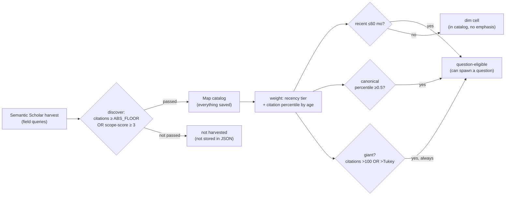
```mermaid
flowchart LR
  H["Semantic Scholar harvest<br/>(field queries)"] --> D{"discover:<br/>citations ≥ ABS_FLOOR<br/>OR scope-score ≥ 3"}
  D -->|passed| C["Map catalog<br/>(everything saved)"]
  D -->|not passed| X["not harvested<br/>(not stored in JSON)"]
  C --> W["weight: recency tier<br/>+ citation percentile by age"]
  W --> R{"recent ≤60 mo?"}
  W --> K{"canonical<br/>percentile ≥0.5?"}
  W --> G{"giant?<br/>citations >100 OR >Tukey"}
  R -->|yes| E["question-eligible<br/>(can spawn a question)"]
  K -->|yes| E
  G -->|yes, always| E
  R -->|no| M["dim cell<br/>(in catalog, no emphasis)"]
```

### Soft-filter funnel (per map)

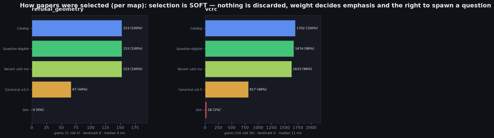

- What the figure shows: one funnel per map. The top bar is the whole catalog (100%, nothing discarded); below it, how many papers clear each emphasis threshold: question-eligible (can spawn a question), of those recent (≤60 mo) and canonical (citation percentile by age ≥0.5), and 'dim' — in the catalog but without emphasis.
- Each funnel's caption answers 'what is filtered out / old giants': giants retained (>100 citations OR above the Tukey fence), of those old ones (>60 mo). Across all maps 257 giants are retained, of which 36 are old — old giants are genuinely NOT discarded.

### Paper release timing (per map)

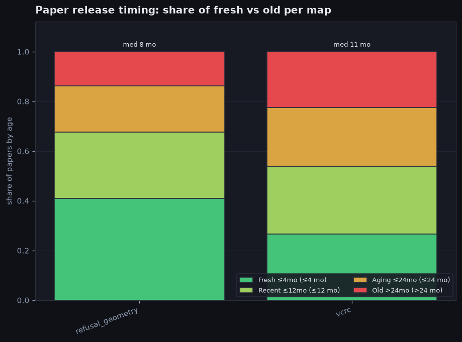

- What the figure shows: normalized stacked bars — the share of papers by age (fresh ≤4 mo, ≤12, ≤24, older than 24) per map; above each bar, the median age. Answers 'their release timing': shows whether the field is built on fresh work or drags a long historical tail.
- The recency threshold (60 mo) is exactly the 'how many recent years are allowed for non-giants': papers fresher than it are question-eligible on freshness alone; older ones only if canonical or giants.

### Citations and giant thresholds (per map)

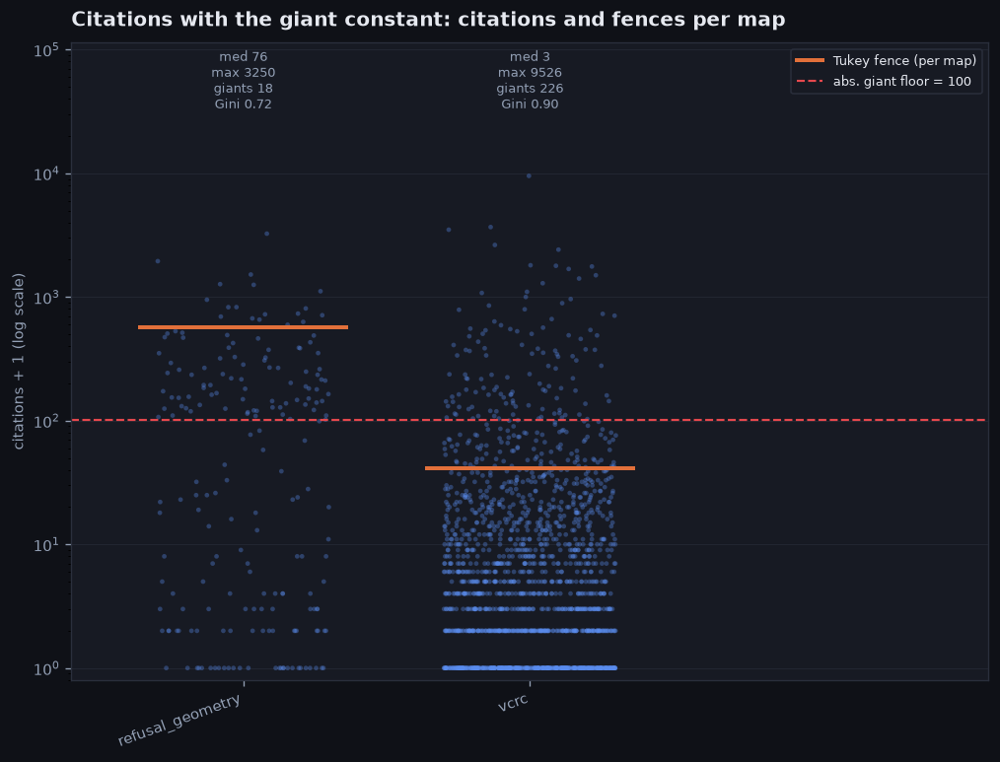

- What the figure shows: a log strip of citations per map (points — papers). The dashed line is the absolute giant floor = 100 (shared by all), the orange dashes are THIS map's Tukey fence (Q3+1.5·IQR). Anything above either is a giant and is retained as canonical. This is exactly 'it came from citations, with the giant constant'.
- Each map's caption: median/max citations, number of giants, Gini (citation inequality). High Gini + few giants = a field with a few dominant works and a long low-citation tail.

## How the field splits into structure

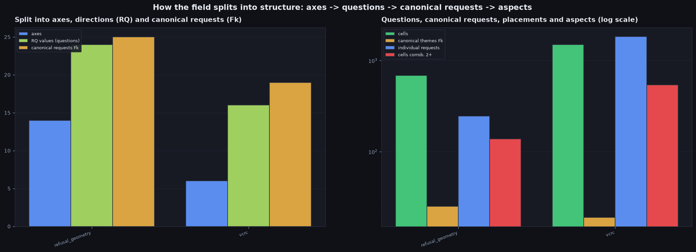

- What the figure shows: on the left, into how many axes and directions (RQ values) each map is split; on the right (log scale), how many cell points, canonical themes `Fk`, individual asks (future work) and cells corroborated by 2+ sources result. This is the path 'axes → questions → canonical requests → aspects → placements/links'.
- A cell is the intersection of axis values (where a paper lands); a canonical request `Fk` is a future-work theme; an ask is a concrete edge 'source → cell'; corroboration 2+ is how many cells are closed by more than one work. More asks and Fk at the same number of cells = a denser network of open directions.

## Field comparison: maturity, demand and pain points

Each field is already analyzed 'from the inside' in its own `report.md`. Here we place these internal profiles side by side: who has the deeper re-checked core, who has more abandoned themes, whose asks are more concrete, and where demand diverges from actual work — all from the same real cells and edges of the maps.

### Maturity funnel across maps

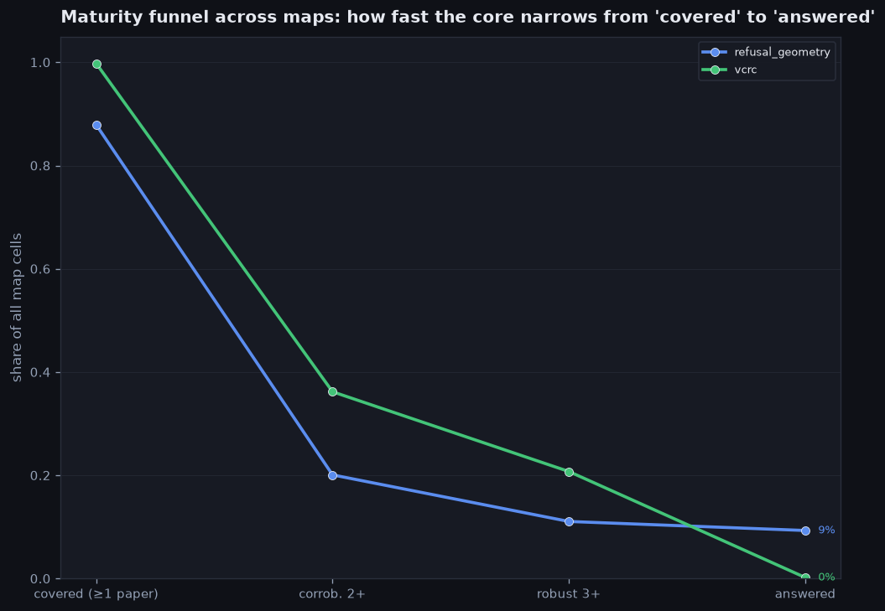

- What the figure shows: one line per map along the ladder covered (≥1 paper) → corrob. 2+ → robust 3+ → answered, as fractions of ALL the map's cells. A line that stays high is a deep re-checked core; a line that collapses right after 'covered' is a thin field with one paper per cell.
- This is the cross-map twin of the per-map 'maturity funnel': there it is about one map, here it is a comparison of whose core is pushed further.

### Pain-point profile

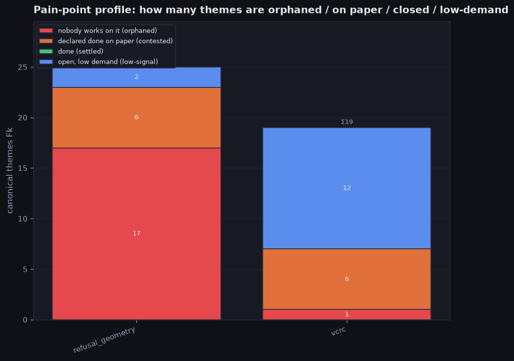

- What the figure shows: stacked bars — how many of each map's canonical themes `Fk` fall into one of the four demand×answeredness corners: 'nobody works on it' (orphaned: much asked, nobody took it up, hits a void), 'declared done on paper' (contested: a realizer exists but the points are open), 'done' (settled) and 'open, low demand' (low-signal). Computed by the same `_quadrants` as the per-map report.
- A high contested share = the field tends to declare unfinished work done; a high orphaned share = loud demand hits holes in the tensor.

### Ask concreteness

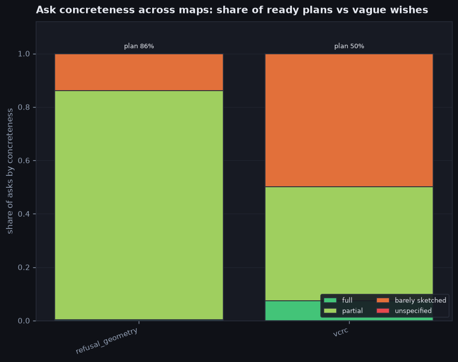

- What the figure shows: normalized stacked bars — the share of each map's asks by concreteness: ready plan (full) → partial (partial) → sketch (barely) → no detail (unspecified). Above each bar, the share of 'plan' (full+partial). Shows whose future-work requests can be taken and done, and whose are vague wishes.

### Agenda vs work

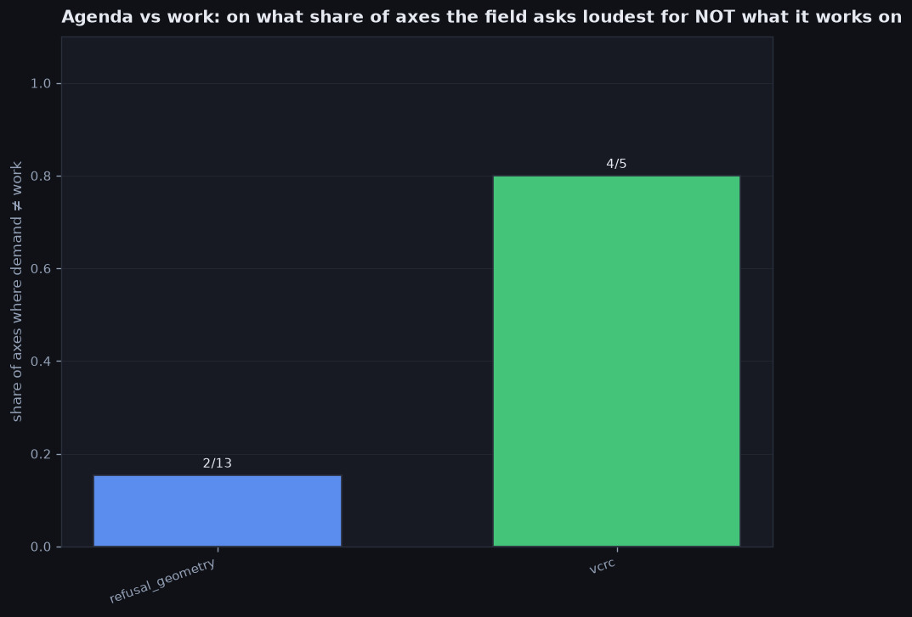

- What the figure shows: one bar per map — the share of non-RQ axes where the MOST-demanded value does NOT coincide with where most of the actual work is (demand and work point in different directions). Above each bar, N/total axes.
- `refusal_geometry`: misalignment on 1/13 axes (Public code). For example, on the "Public code" axis the loudest demand is for "not-released" (207), while most of the work is in "released" (74).
- `vcrc`: misalignment on 4/5 axes (Measurement instrument, evaluation-chain stage, Validity threat, Research subject). For example, on the "Measurement instrument" axis the loudest demand is for "none / theoretical" (1746), while most of the work is in "statistical / metric" (806).

### Delivered and hidden demand

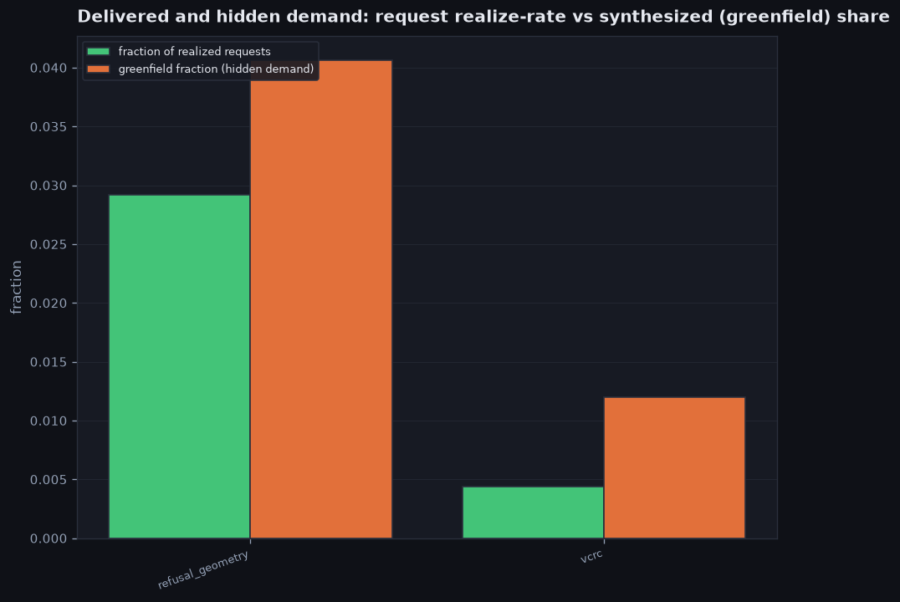

- What the figure shows: a pair of bars per map — the share of delivered asks (a paper that actually did the work was found) and the greenfield share (asks synthesized by the instrument with no author paper = hidden demand). Low realize-rate with high greenfield = a field that asks far more than it manages to do, with much unvoiced emptiness.

## Theories of field evaluation (what each axis shows and how we compute it)

Our 6 composite axes are OUR working theory. So as not to justify them 'off the top of our head', we express several real published frameworks as their own lens-axes, place the maps on each, and honestly label every axis: **faithful** — there is a real metric from our data; **proxy** — only an approximation; **N/A** — our data (the author tensor + per-paper citation counts) is not enough for the construct (e.g. a co-citation graph is needed), and we do NOT make it up.

Section structure: **Part 1** — the axes of ALL theories: what each shows and exactly how it is computed from our data. **Part 2** — for each theory, first its IDEAL types (poles), then OUR maps on them, and (where there are ≥3 axes) the 2D matrix (SPLOM) and PCA of that theory's space. We begin with our synthesis, then Rotolo, then the three binary theories.

### Part 1 — the axes of all theories: what they show and how they are computed

First, the axes of each theory THEMSELVES: what an axis is meant to show and exactly how we obtain its value for our maps (the same formula as in the `theory_axis_value` code). All the values on the radars, SPLOM and PCA in Part 2 are computed by exactly these formulas — not a single point is fitted by hand, so every chart is grounded.

#### Our synthesis (working theory)

6 composite axes + an "uncertainty/openness" extension; a fold of the ideas from the theories below.

Source: Our working field-map theory (a synthesis of the frameworks below)

| Axis | Type | What it shows | How it is computed from our data / why N/A |
| --- | --- | --- | --- |
| Maturity / consolidation | faithful | a re-checked, answered core | mean of the 5 "core solidity" descriptors: corroboration (2+ sources), robustness (3+), answeredness, realize rate, link density |
| Freshness | faithful | share of fresh papers | the fresh_share descriptor — the share of recently active topics |
| Coherence (demand↔work) | faithful | the field works on what it asks for | the coherence descriptor = (1 − ρ)/2, where ρ = the correlation between demand loudness and how answered a topic is (1 = the field works on exactly what it asks loudest for) |
| Tensor coverage | faithful | share of filled cells | the coverage descriptor — the share of filled tensor cells |
| Link density | faithful | requests per cell | the interaction_norm descriptor — normalized density of request→cell links |
| Canon concentration | faithful | citation inequality (Gini) | the cit_gini descriptor — Gini of citation inequality across papers (how much of a "giant" canon exists) |
| Uncertainty / openness | faithful | share of unclosed sub-questions (a Rotolo-style extension) | 1 − answeredness: what share of the core is still open |

#### Attributes of an emerging field (Rotolo–Hicks–Martin)

Five attributes of emergence: radical novelty, rapid growth, coherence, prominent impact, uncertainty/ambiguity.

Source: Rotolo D., Hicks D., Martin B. R. (2015). What is an emerging technology? Research Policy 44(10): 1827–1843. DOI: [10.1016/j.respol.2015.06.006](https://doi.org/10.1016/j.respol.2015.06.006)

| Axis | Type | What it shows | How it is computed from our data / why N/A |
| --- | --- | --- | --- |
| Radical novelty | N/A | fundamentally new entities/combinations | needs an analysis of atypical combinations / new terms, which our data lacks |
| Rapid growth | faithful | an influx of fresh work | the fresh_share descriptor — the share of recently active topics |
| Coherence | faithful | growing internal connectedness | the coherence descriptor = (1 − ρ)/2, where ρ = the correlation between demand loudness and how answered a topic is (1 = the field works on exactly what it asks loudest for) |
| Prominent impact | faithful | citation concentration / giants | the cit_gini descriptor — Gini of citation inequality across papers (how much of a "giant" canon exists) |
| Uncertainty/ambiguity | faithful | share of unclosed sub-questions | 1 − answeredness: what share of the core is still open |

#### Consolidation ↔ disruption (CD index)

Work is either consolidating (it builds on predecessors, "on the shoulders of giants") or disruptive (it eclipses them). We have only a PROXY: a true CD index needs a citation graph.

Source: Park M., Leahey E., Funk R. J. (2023). Papers and patents are becoming less disruptive over time. Nature 613: 138–144 (index: Funk & Owen-Smith 2017; Wu, Wang & Evans 2019). DOI: [10.1038/s41586-022-05543-x](https://doi.org/10.1038/s41586-022-05543-x)

| Axis | Type | What it shows | How it is computed from our data / why N/A |
| --- | --- | --- | --- |
| Consolidation↔disruption | proxy | reliance on giants vs. rupture (proxy = canon+maturity) | (canon + maturity) / 2 |
| Team size | N/A | small teams disrupt, large teams develop | no author/team data in our JSON |

#### Consensus formation (Shwed–Bearman)

Consensus = a drop in modularity (community salience) in the citation network, normalized by literature size. We have only a PROXY via coherence+robustness.

Source: Shwed U., Bearman P. S. (2010). The temporal structure of scientific consensus formation. American Sociological Review 75(6): 817–840. DOI: [10.1177/0003122410388488](https://doi.org/10.1177/0003122410388488)

| Axis | Type | What it shows | How it is computed from our data / why N/A |
| --- | --- | --- | --- |
| Modularity / community salience | N/A | partition of the citation network into clusters | needs a co-citation graph and community detection, which our data lacks |
| Consensus | proxy | coherence + core robustness | (coherence + robustness) / 2 |

#### Conventionality × novelty (Uzzi; Science of science)

Influential work = high conventionality (reliance on familiar combinations) with flecks of atypical novelty. Conventionality is a PROXY via canon; novelty is not operationalizable.

Source: Uzzi B., Mukherjee S., Stringer M., Jones B. (2013). Atypical combinations and scientific impact. Science 342: 468–472; Fortunato S. et al. (2018). Science of science. Science 359: eaao0185. DOI: [10.1126/science.1240474](https://doi.org/10.1126/science.1240474)

| Axis | Type | What it shows | How it is computed from our data / why N/A |
| --- | --- | --- | --- |
| Conventionality | proxy | reliance on canonical, familiar combinations (proxy = canon) | the cit_gini descriptor — Gini of citation inequality across papers (how much of a "giant" canon exists) |
| Atypical novelty | N/A | unusual reference combinations | needs z-scores of reference pairs across the whole corpus, which our data lacks |

### Part 2 — type archetypes and where our maps sit on them

Each theory in the same order: first its ideal types (poles), then our maps on them. All axis values follow the formulas from Part 1.

#### Our synthesis (working theory): archetypes, maps, space

A map's "type" is its nearest **archetype**: a meaningful anchor point in the space of our composite axes. An important honest caveat: these are NOT clusters found by an algorithm from the data (there are too few maps for real clustering) — they are hand-picked, justified reference centers, each with its own signature and half-width zone (±0.16 per axis).

The order of the story is the same as for the other theories: first a DESCRIPTION of the six types (their signatures and which of our maps fell into each), then their ARCHETYPES with our maps on top — first over the 14 descriptors, then in the fold into 6 composite axes (it is by these 6 axes, by euclidean distance to the center, that a map is assigned its type) — and finally the map space itself (2D planes → SPLOM → PCA).

##### The six types: signature and rationale

| Type | Signature (strong composite axes) | Meaning |
| --- | --- | --- |
| **Mature consolidated** | tensor 0.90, maturity 0.80, coherence 0.80 | re-checked dense core; the field works on what it asks for |
| **Fresh frontier** | freshness 0.90, tensor 0.55, canon 0.45 | young stream; the core is still thin, almost nothing carried to completion |
| **Coherent dense** | link 0.90, coherence 0.85, tensor 0.85 | dense interaction among participants; demand and work point the same way |
| **Contested / "on paper"** | tensor 0.90, freshness 0.55, link 0.55 | broadly covered but declared "done" while sub-questions are still open |
| **Orphaned sparse** | freshness 0.50, canon 0.50, tensor 0.30 | leaky tensor; high demand runs into empty cells, nobody takes up the themes |
| **Broad shallow** | tensor 0.95, freshness 0.65, canon 0.50 | sampled everywhere, re-checked almost nowhere — one paper per cell |

##### Which maps fell into which type

- **Mature consolidated**: — (no maps of this type yet)
- **Fresh frontier**: — (no maps of this type yet)
- **Coherent dense**: — (no maps of this type yet)
- **Contested / "on paper"**: `refusal_geometry`, `vcrc`
- **Orphaned sparse**: — (no maps of this type yet)
- **Broad shallow**: — (no maps of this type yet)

##### Breakdown over the 14 descriptors

Each map is a vector of 14 descriptors (coverage, corroboration, robustness, answeredness, freshness, orphaned share, contested 'on paper', canon, etc.). Here is the full breakdown of the types over them — the most detailed view, before any fold. It shows what the 6 axes later hide: for example, the "Orphaned sparse" type is recognized by its orphaned peak, and "Contested" by its contested peak.

###### All types on one radar (14 descriptors)

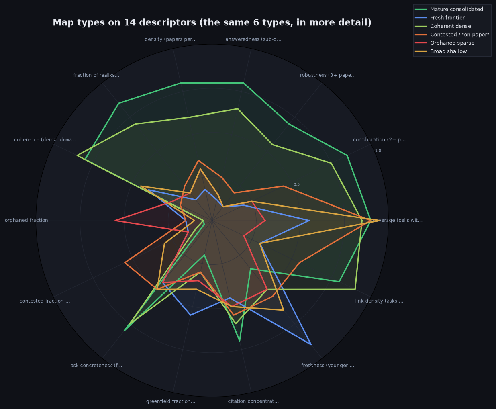

- What the figure shows: the centers of all 6 types on one 14-spoke radar (each in its own color). The most detailed profile of each type — over all raw descriptors.

###### Type gallery (14 descriptors, one radar per type)

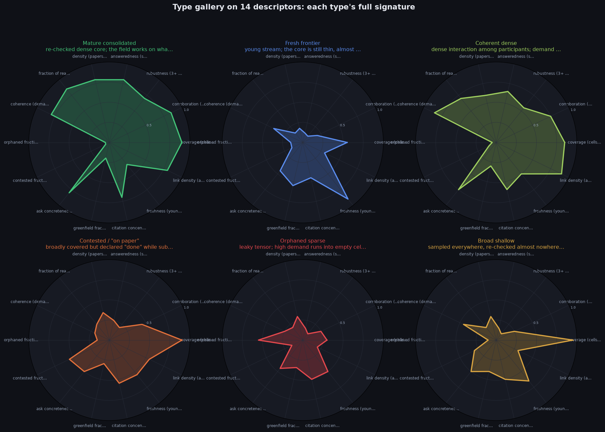

- What the figure shows: one 14-spoke radar per type — each type's full descriptor signature on its own.

###### Our maps relative to their type centers (14 descriptors)

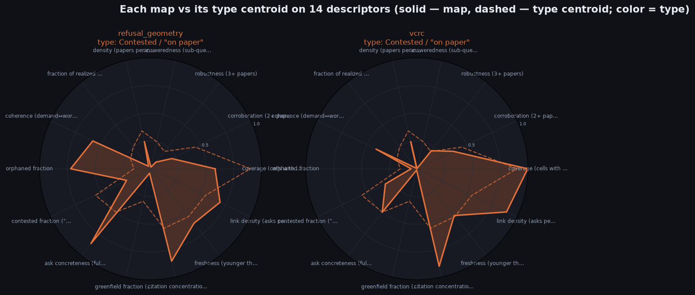

- What the figure shows: one radar per map, 14 spokes — descriptors (0 at the center, 1 at the rim), color = map type. Solid is the map itself, DASHED is its type center: shows how the map differs from its type's 'reference'.
- Thus a "mature, well-filled" map is a large even polygon with strong corroboration/robustness/answeredness; a "fresh" one stretches toward freshness with a thin core; an "orphaned" one has a protruding orphaned share at low coverage.

##### The fold into 6 composite axes

The same 14 descriptors, folded into 6 composite axes (maturity, freshness, coherence, coverage, link density, canon). The fold is deterministic: each type's descriptor signature folds by construction exactly into its composite center (a single source of truth). It is in this 6-dimensional space that a map is assigned to the type whose center it is closest to by euclidean distance.

###### All types on one radar

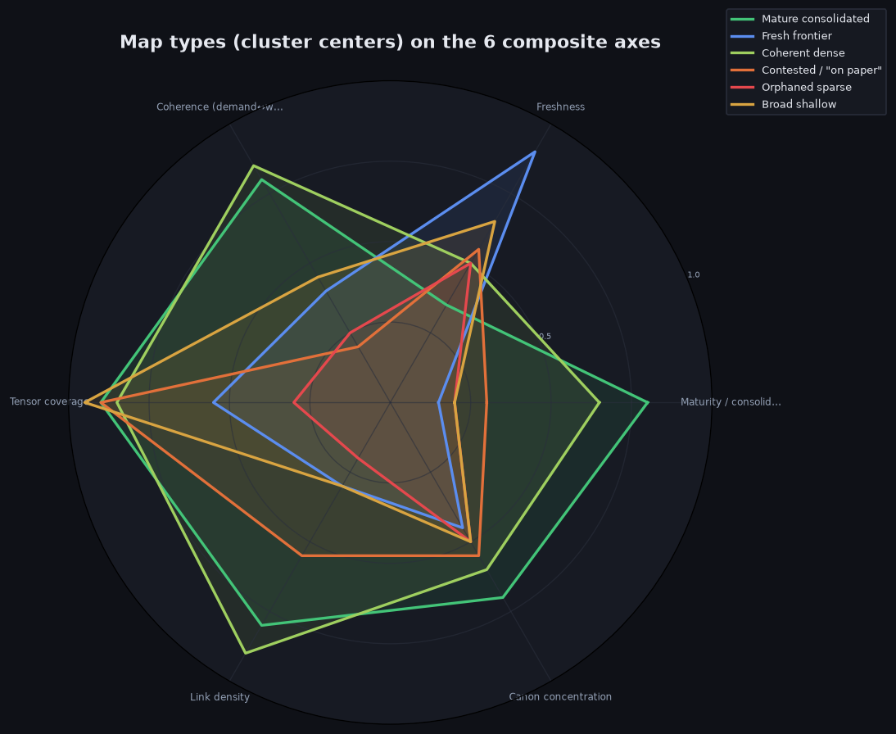

- What the figure shows: the centers of all 6 types overlaid on one radar of the 6 composite axes (each in its own color). Shows how the types differ: where one has a peak, another has a dip.

###### Type gallery (one radar per type)

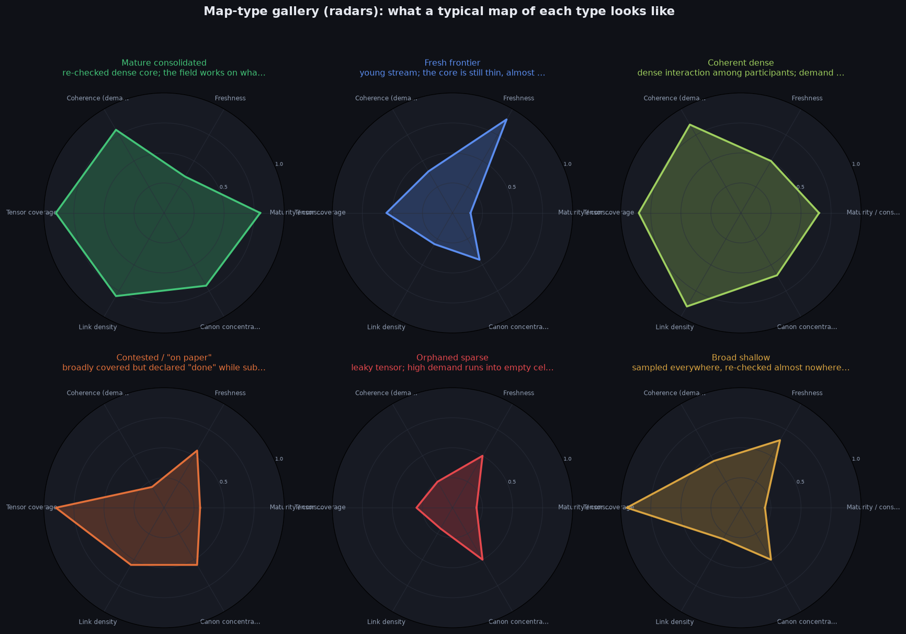

- What the figure shows: the same set, but one radar per type — to read each type's profile on its own. Replaces the old confusing 'tensor gallery'.

###### Our maps relative to their type centers

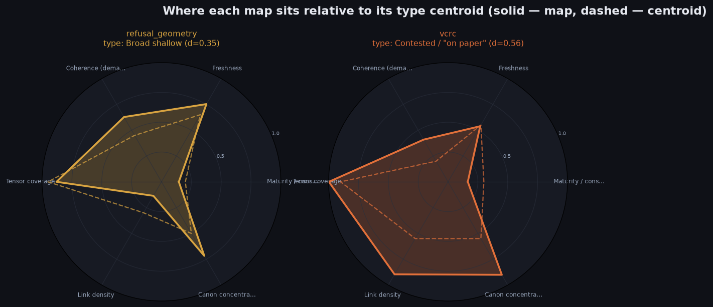

- What the figure shows: one radar per real map (solid, in its type color), with the dashed line as its type center. `d` in the title is the distance to the center: the smaller it is, the more 'typical' the map is for its type.

##### The map space of our synthesis (2D planes, SPLOM, PCA)

The same 6 composite axes, but now as a continuous space: gray is the cloud of structurally admissible maps, colored zones are archetypes, stars are our maps.

###### Map space in 2D planes

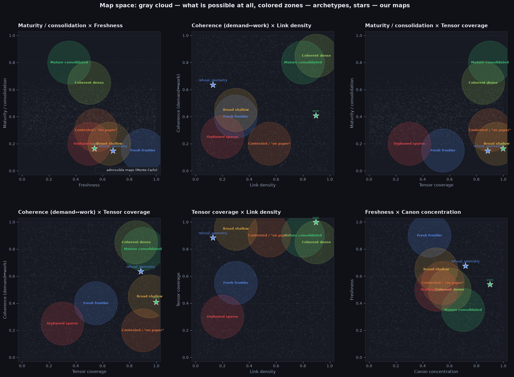

- What the figure shows: six planes of pairs of composite axes (2×3). Gray points are the cloud of admissible maps (what is possible at all); labeled colored circles are type zones; stars are our maps. Where a star falls into a colored zone is its character.
- The axis pairs: freshness×maturity, links×coherence, coverage×maturity, coverage×coherence, links×coverage, canon×freshness. Empty parts of the cloud are combinations that are structurally nearly unreachable.

###### Matrix of all planes (SPLOM)

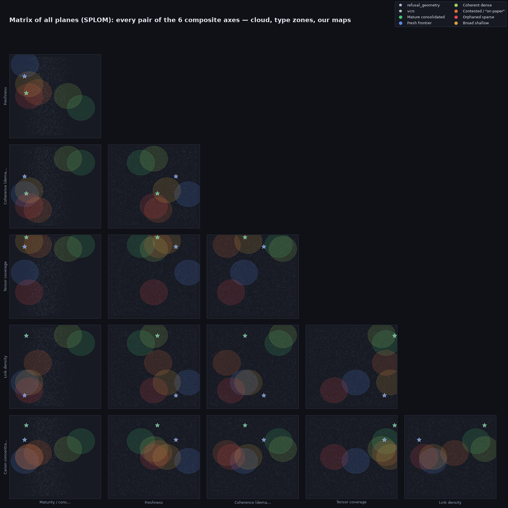

- What the figure shows: all 15 pairs of the 6 composite axes at once — a lower-triangular matrix of mini-panels. In each: the cloud of admissible maps, type zones, our maps as stars. Axis names are on the edges. An 'all planes at once' overview so no projection is missed.

###### PCA of the map space

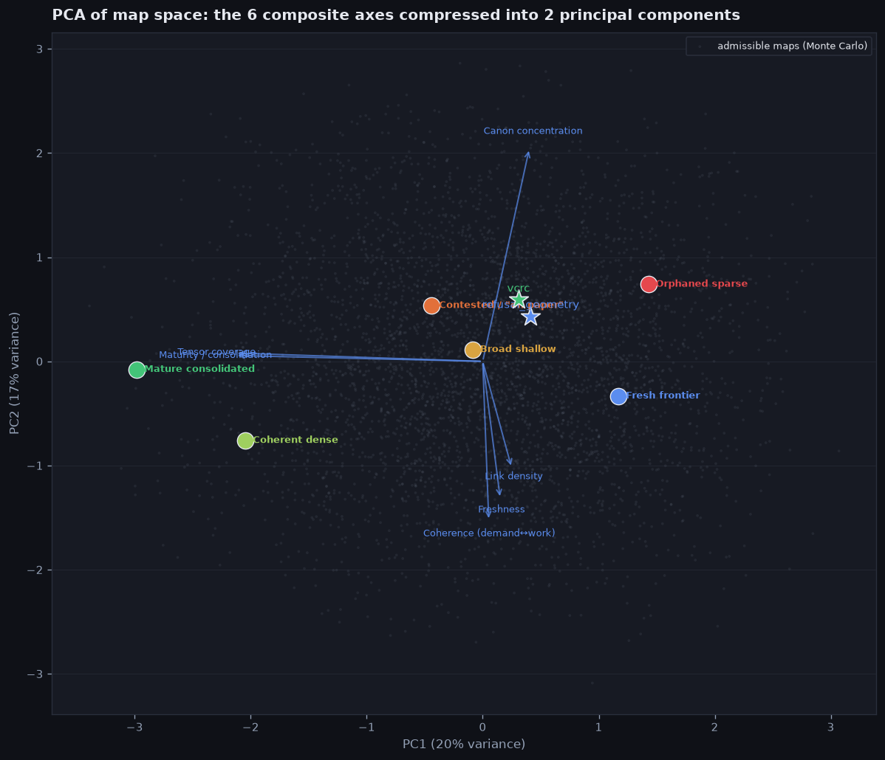

- What the figure shows: the 6 composite axes are compressed by principal component analysis (PCA) into 2 axes PC1/PC2 so as to spread the cloud as widely as possible. Gray is the cloud, colored circles are archetypes, stars are our maps. Blue arrows are the composite-axis loadings (which way each grows).
- The percentages on the axes are how much variance each component explains. Close points = maps similar across their whole profile.

#### Rotolo: ideal types → maps → SPLOM → PCA

Rotolo has four computable axes (freshness, coherence, impact, uncertainty), so the theory can be shown as fully as our own space: first its poles "emerging ↔ established", then our maps, then all 2D pairs and the PCA.

This theory's ideal types (justified poles) and the map of ours nearest to each:

| Ideal type | Signature (over computable axes) | Nearest map of ours |
| --- | --- | --- |
| **Emerging** (young, growing fast, not yet coherent, impact accruing, high uncertainty) | rapid growth 0.85, coherence 0.35, prominent impact 0.30, uncertainty/ambig… 0.85 | `refusal_geometry` (d=0.65) |
| **Established** (growth has slowed, coherent, high impact, low uncertainty) | rapid growth 0.20, coherence 0.80, prominent impact 0.80, uncertainty/ambig… 0.20 | `refusal_geometry` (d=0.92) |

##### Rotolo: ideal types

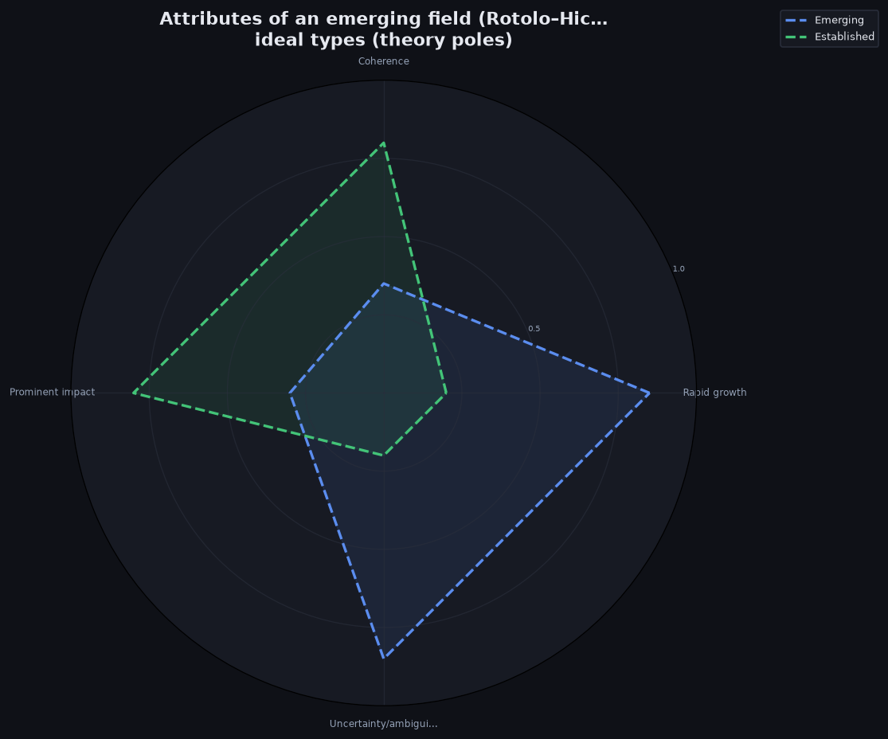

- What the figure shows: first the theory's ideal types THEMSELVES (dashed, each in its own color) on a radar of its computable axes — before overlaying our maps. The poles are set by the framework itself; they are NOT fitted to the data.

##### Rotolo: where our maps sit on them

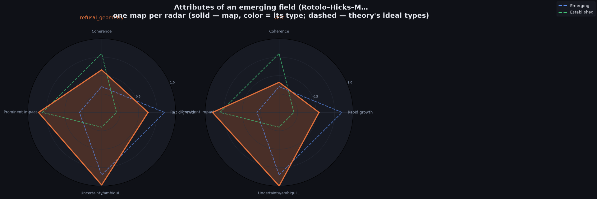

- What the figure shows: one radar per EACH of our maps (solid, color = map type) against the theory's ideal types (dashed, each in its own color) — shows which theory pole each map is closer to.

##### Rotolo: all axis pairs (SPLOM)

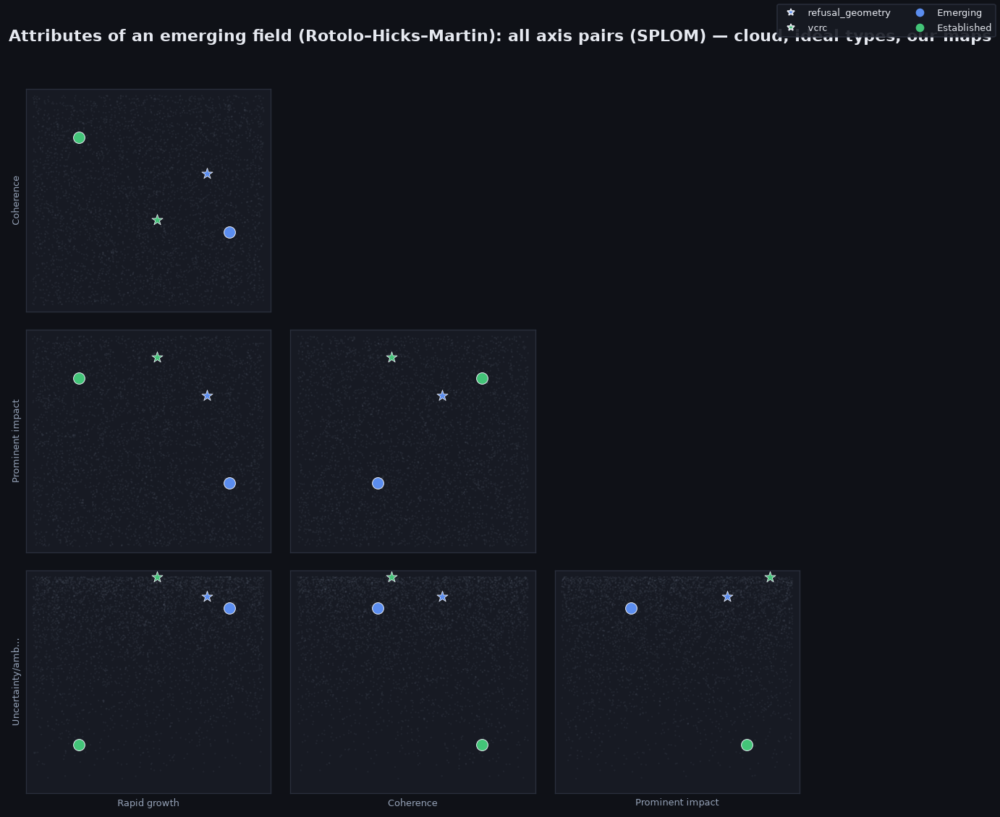

- What the figure shows: all pairs of the theory's computable axes (lower-triangular matrix). In each mini-panel — the cloud of admissible maps projected onto the theory axes, circles for the ideal types and stars for our maps.

##### Rotolo: PCA

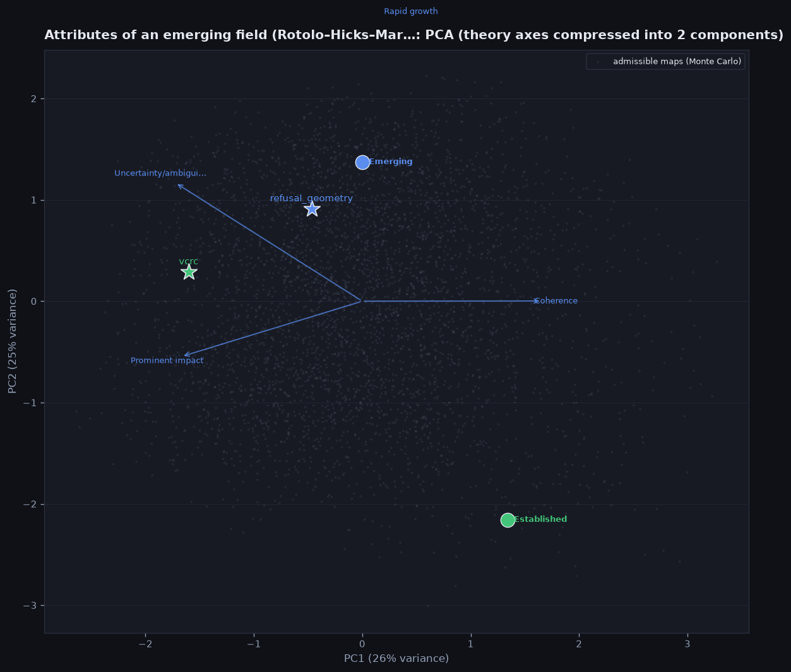

- What the figure shows: the theory axes are compressed by principal component analysis into 2 axes PC1/PC2. Gray is the cloud, circles are ideal types, stars are our maps, blue arrows are the theory-axis loadings.

#### Three binary theories together (mainstream ↔ frontier)

The CD-index, Shwed–Bearman and Uzzi each give exactly ONE computable axis (consolidation↔disruption, consensus, conventionality). Individually these are just points on a line, so we put their three axes on ONE radar. An important honest caveat: each framework defines only its own axis, so the ideal types here are our SYNTHESIS from two coherent poles: "mainstream / normal science" (high on all three) and "frontier / rebellious" (low on all three). This is a meaningful pairing (normal science vs revolution/frontier), not a fit to the data.

The ideal poles of the combined space and the map of ours nearest to each:

| Ideal type | Signature (over computable axes) | Nearest map of ours |
| --- | --- | --- |
| **Mainstream / normal science** (consolidates, consensus reached, conventional — "normal science") | consolidation↔dis… 0.85, consensus (shwed) 0.85, conventionality (… 0.85 | `vcrc` (d=0.63) |
| **Frontier / rebellious** (disruptive, contested, unconventional — frontier/revolution) | consolidation↔dis… 0.15, consensus (shwed) 0.15, conventionality (… 0.15 | `refusal_geometry` (d=0.80) |

##### Three binary theories: ideal types

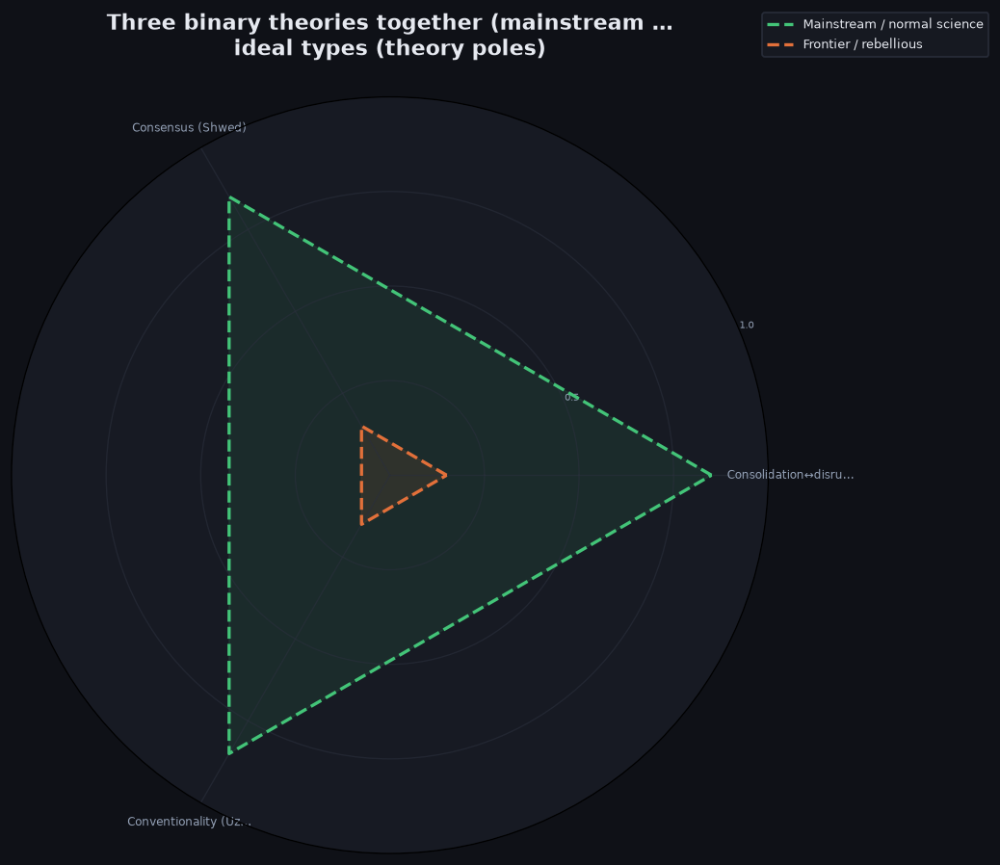

- What the figure shows: first the theory's ideal types THEMSELVES (dashed, each in its own color) on a radar of its computable axes — before overlaying our maps. The poles are set by the framework itself; they are NOT fitted to the data.

##### Three binary theories: where our maps sit on them

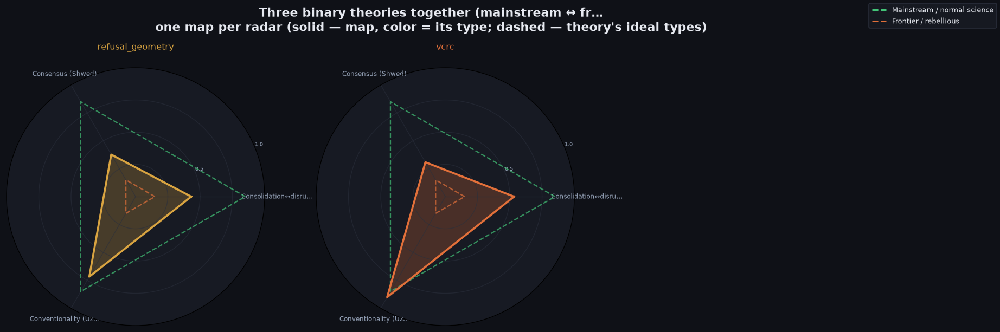

- What the figure shows: one radar per EACH of our maps (solid, color = map type) against the theory's ideal types (dashed, each in its own color) — shows which theory pole each map is closer to.

##### Three binary theories: all axis pairs (SPLOM)

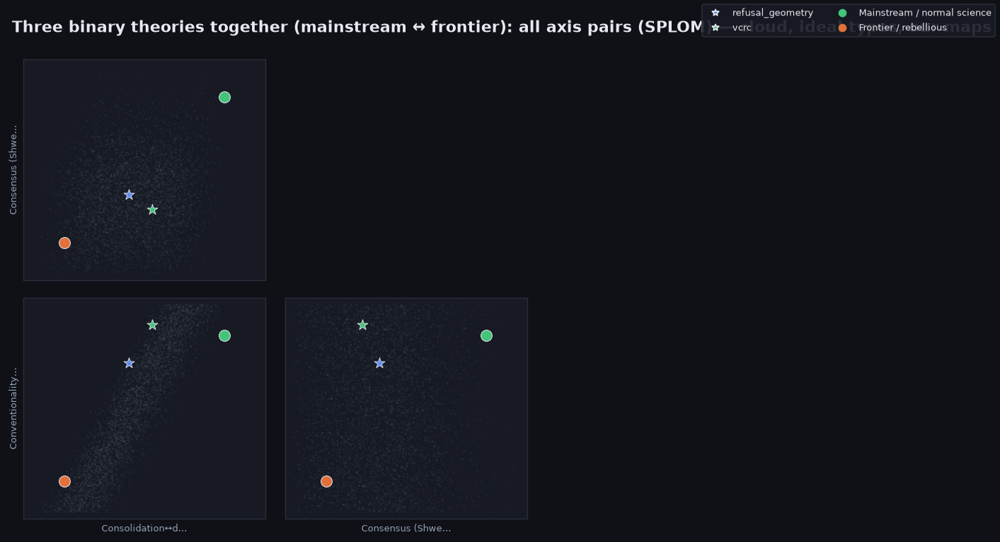

- What the figure shows: all pairs of the theory's computable axes (lower-triangular matrix). In each mini-panel — the cloud of admissible maps projected onto the theory axes, circles for the ideal types and stars for our maps.

##### Three binary theories: PCA

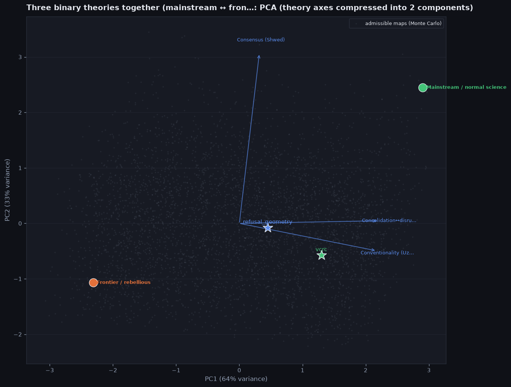

- What the figure shows: the theory axes are compressed by principal component analysis into 2 axes PC1/PC2. Gray is the cloud, circles are ideal types, stars are our maps, blue arrows are the theory-axis loadings.

## Where our maps sit in the space

- `refusal_geometry` (Refusal directions, harm schemas, evasion and…) — closest to archetype **Contested / "on paper"** (broadly covered but declared "done" while sub-questions are still open). Composite axes: maturity 0.12, freshness 0.63, coherence 0.58, coverage 0.58, link density 0.69, canon 0.85.
- `vcrc` (VCRC) — closest to archetype **Contested / "on paper"** (broadly covered but declared "done" while sub-questions are still open). Composite axes: maturity 0.17, freshness 0.54, coherence 0.41, coverage 1.00, link density 0.90, canon 0.90.

This is the first step of a theory of such maps: the real maps are points on the set of all answers that the paper collection/filtering questions and the analytical report questions could produce. By moving along the axes (adding a fresh frontier, densifying links, driving sub-questions to resolution), a map can be deliberately moved between archetypes.

## Field economics (demand ↔ supply of attention)

Another lens: the field as an **attention market**. Each axis value (a topic, e.g. `MODELS:multi`) is a "good". Its **demand** is how many distinct papers ASK for future work there (`area_demand`); its **supply** is how many papers actually DO the work there (`area_supply`). All from the map's real edges, with no made-up numbers.

| Map | topic-goods | demand Σ | supply Σ | unmet demand | shortage index | supply Gini | HHI |
| --- | --- | --- | --- | --- | --- | --- | --- |
| `refusal_geometry` | 57 | 5507 | 1989 | 3519 | 64% | 0.67 | 0.052 |
| `vcrc` | 35 | 60128 | 13086 | 47042 | 78% | 0.39 | 0.044 |

Glossary: **shortage index** = the share of demand with no supply (Σ max(demand−supply,0) / Σ demand); **supply Gini** — the inequality of how work is distributed across topics (0 — even, 1 — all work in one topic); **HHI** (Herfindahl index) — the sum of squared supply shares, a measure of concentration.

### Demand and supply curves

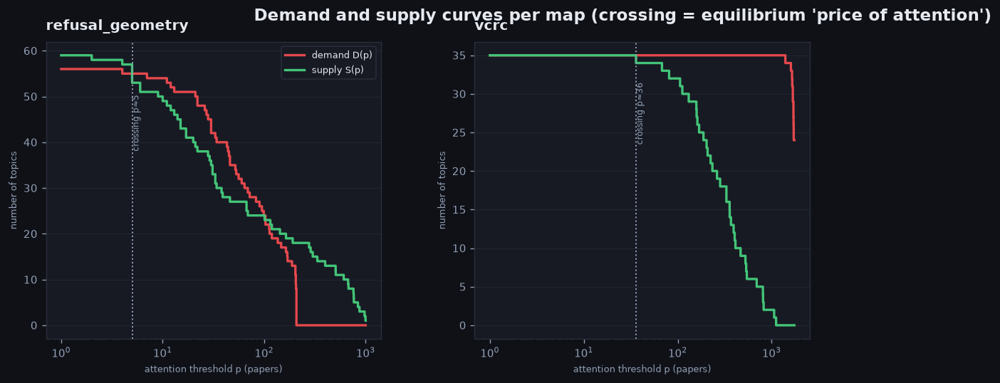

- What the figure shows: per map, two decreasing step curves: demand D(p) = the number of topics with demand ≥ p and supply S(p) = the number of topics with supply ≥ p, where p is the attention threshold. Their crossing is the 'equilibrium price of attention': the intensity at which demand and supply balance by number of topics.

### Shortage and surplus by topic

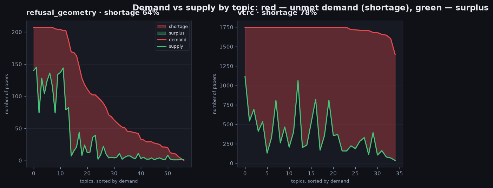

- What the figure shows: topics are sorted by demand; demand and supply lines, red fill is unmet demand (shortage), green is surplus. Directly shows where the field is asked for more than it does.

### Attention concentration (Lorenz curves)

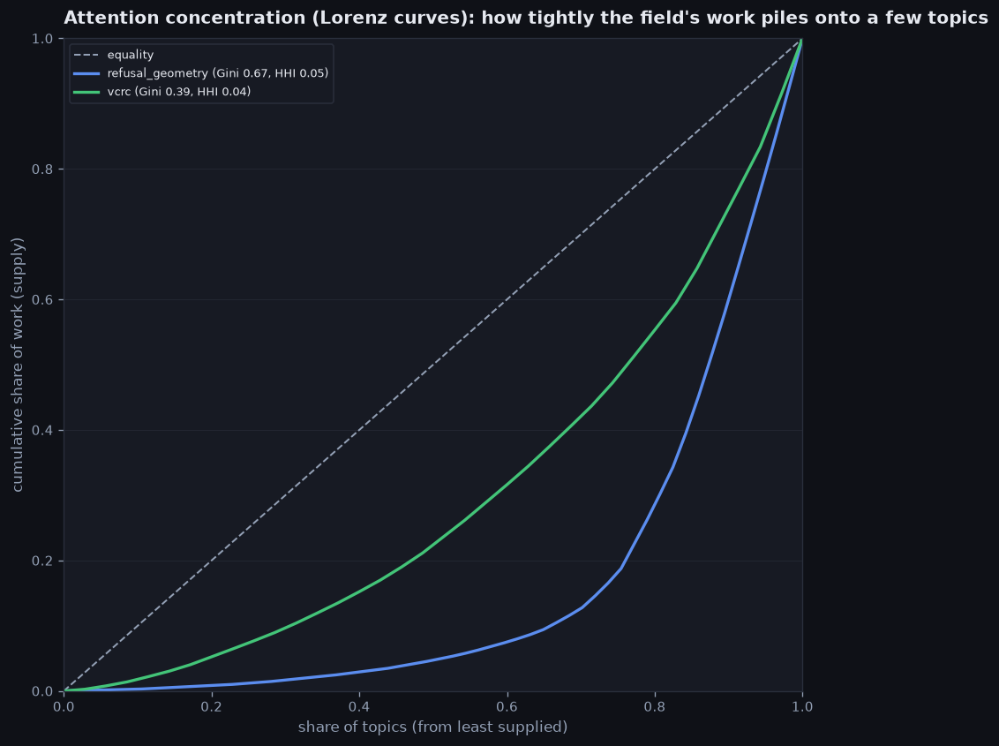

- What the figure shows: one Lorenz curve per map — the cumulative share of work against the share of topics. The diagonal is perfect equality; the more a line sags, the more work is pulled onto a few topics (higher Gini/HHI).

### Attention market across maps

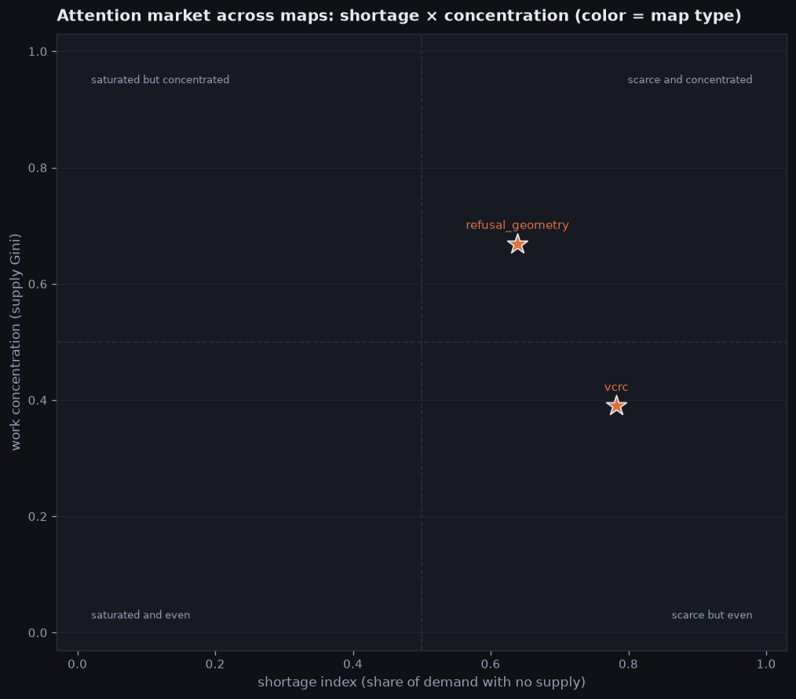

- What the figure shows: one point per map — shortage index (X) against work concentration (Y, supply Gini), color = map type. The quadrants name the market kind: scarce/saturated × concentrated/even.
