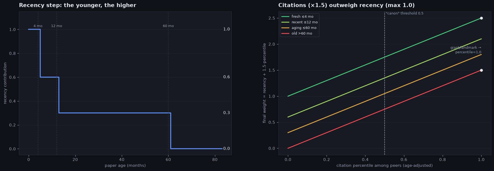
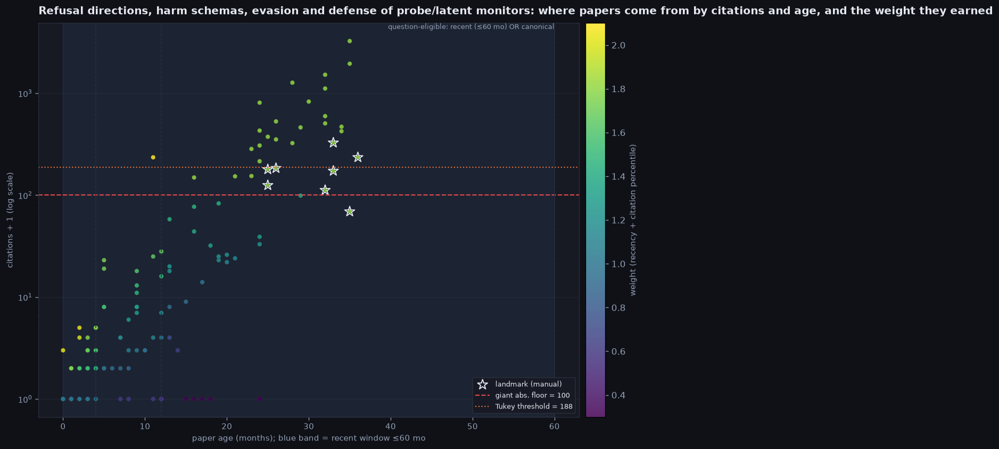
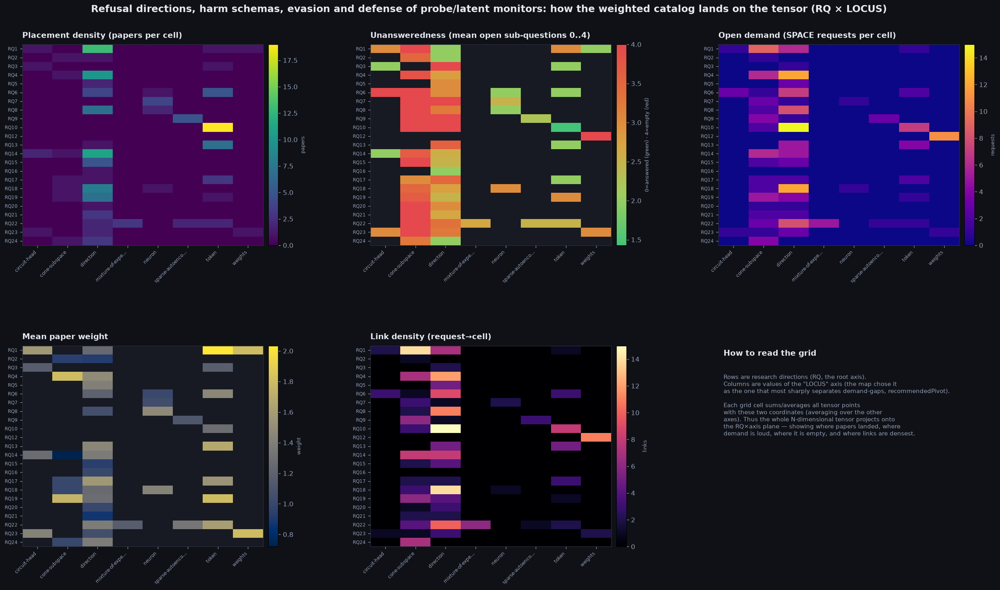
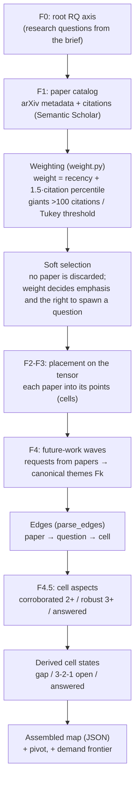

# How the map is filled and built: Refusal directions, harm schemas, evasion and defense of probe/latent monitors

This report is about the MACHINE that assembled the map, not about its content (for content see `report.md`). Three steps: how a paper earns its WEIGHT from recency and citations; how the weighted catalog LANDS on the tensor (grid heatmaps); and the overall build pipeline. Selection into the catalog is soft: no paper is discarded by weight or age; weight affects only emphasis (node size/color) and a paper's right to SPAWN a future-work question.

Build anchor (as_of): 2026-06. Papers in catalog: 153; points on the map: 203; closed by ≥1 paper: 118. Future-work requests: 246. Citation "giants": 23 (Tukey threshold 188 citations, absolute floor 100).

## The weighting and filtering instrument

- What the figure shows: on the left, the RECENCY contribution as a step function of paper age in months (≤4 mo → 1.0, ≤12 mo → 0.6, ≤60 mo → 0.3, older → 0); on the right, the final weight = recency + 1.5·citation percentile, one line per recency tier.
- The citation percentile is the fraction of the catalog whose citations-per-year (age-adjusted) is LOWER than this paper's: [0,1], where 1 is the most cited. Age-adjusted so older papers do not gain an edge just for their age.
- The canon multiplier 1.5 is larger than the maximum recency 1.0: citations OUTWEIGH recency — an old but heavily cited paper still earns a high weight.
- A giant (>100 citations or above the Tukey threshold) and a manual landmark are set to percentile 1.0 (effective canon) regardless of age — their weight sits on the top line.
- The "canon" threshold 0.5: an old paper (older than 60 mo, whose recency is already 0) spawns questions and earns full emphasis only if its percentile ≥ 0.5; otherwise it stays a dim node in the catalog (it is not discarded).

## Where papers come from by citations and age, and the weight they earned

- What the figure shows: each point is a paper; the horizontal axis is its age in months, the vertical axis is citations (+1, log scale), and color is the earned weight. The blue band is the "recent" window (age ≤60 mo). The stars are manual landmarks.
- The two horizontal lines are the "giant" thresholds: the absolute floor of 100 citations (red dashed) and the relative Tukey threshold Q3+1.5·IQR = 188 citations for THIS catalog (orange dashed). Above either one is a giant, which must survive a rebuild.
- A paper's right to spawn a question (question-eligible) = recent (in the blue band) OR canonical (percentile ≥ 0.5). A fresh paper with 0 citations is still eligible; an old one with low citations is not.
- The vertical dashed lines are the recency-tier boundaries (4 / 12 / 60 months).

## How the weighted catalog lands on the tensor (RQ × LOCUS)

- What the figure shows: five grid heatmaps. Rows are RQ directions (the root axis), columns are values of the "LOCUS" axis (the map itself chose it as the one that most sharply separates demand-gaps). Each grid cell aggregates all tensor points with these two coordinates (averaging over the other axes), so the whole N-dimensional tensor projects onto the plane.
- "Placement density" is how many papers sit in the grid cells; "Unansweredness 0..4" is how many sub-questions are open on average (0 = all answered, 4 = completely empty); "Open demand" is how many not-yet-fulfilled requests (SPACE) target the cells; "Mean weight" is how heavy (fresh/cited) the papers sitting there are; "Link density" is how many request→cell edges arrive.
- This reveals the heterogeneity of the field: where work is dense, where demand is loud amid emptiness, and where the interaction between participants (links) is densest.

## The full build pipeline

From the brief to the assembled JSON. Weighting is the shared provider of emphasis and the right to spawn a question; selection into the catalog remains soft (manually curated), while cell states and edges are derived deterministically.

