# What is happening in the field: Refusal directions, harm schemas, evasion and defense of probe/latent monitors

**Refusal directions, harm schemas, evasion and defense of probe/latent monitors** — a young and active field (early stage: almost no findings have been re-checked by three or more independent papers — even the basics have not yet settled). The map consists of 203 points (each point is a separate question under specific conditions). At least one paper closes 118 of 203 points (58%); of the closed ones, 21% are corroborated by another independent paper (two or more) and only 8% by three or more; fully answered (no open sub-questions left on the point) are 1% of all points. It is important not to confuse three different things: COVERAGE (a point has at least one paper) is not yet maturity; CORROBORATION (2+ studies) and ANSWEREDNESS (all of a point's sub-questions closed) are what maturity means. A median density of 1 paper per closed cell (a map cell is the same as a point: one question under specific conditions) is a necessary but not sufficient condition: the median value can be on target while the thin half of the cells sits on a single paper. The field asks for 25 major themes of future work (compressed from 246 separate requests found in the papers); of these, 18 are "nobody has taken it up" (orphaned: many ask, but no one has taken it up) and 6 are "solved on paper" (contested: someone claimed to have done it, but the points are still open). Of the requests with a settled outcome (either done or still open), only 3% are already done (7 of 240: a paper was found that actually did it); citations are heavily concentrated in a few papers (Gini concentration index=0.85: 0 — evenly shared, 1 — all in a handful).

## Summary (key numbers)

| Metric | Value |
| --- | --- |
| Papers (unique) | 153 |
| Points on the map (question under specific conditions) | 203 |
| Axes on the map (dimensions along which questions differ) | 14 |
| Values per axis (options on each axis) | RQ 24 · Models / families 2 · non-unique-direction 2 · Public code 3 · Threat model / access 3 · Failure polarity 3 · Mechanism dynamics 3 · Cross-model transfer tested 4 · Architecture family 4 · failure mechanism 6 · modality 6 · Lifecycle stage 6 · evaluation-chain stage 8 · Behavior concept 9 — 83 total |
| Research directions (RQ — the root axis) | 24 |
| Closed by at least 1 paper / completely empty | 118 / 85 |
| Fully answered (no open sub-questions) | 3 (1%) |
| Corroborated by 2+ independent papers (of closed) | 25 (21%) |
| Robust on 3+ papers (of closed) | 9 (8%) |
| Density (median papers per closed cell) | 1 |
| Request themes (F, after merging similar ones) | 25 |
| Separate requests (with author / gathered by instrument) | 246 (236 / 10) |
| Requests: already done / still open / needs a new axis | 7 / 233 / 6 |
| "Nobody does it" / "solved on paper" | 18 / 6 |
| Citation concentration (Gini, 0 — evenly shared, 1 — in a handful) | 0.85 |

## Field maturity: how re-checked the findings are

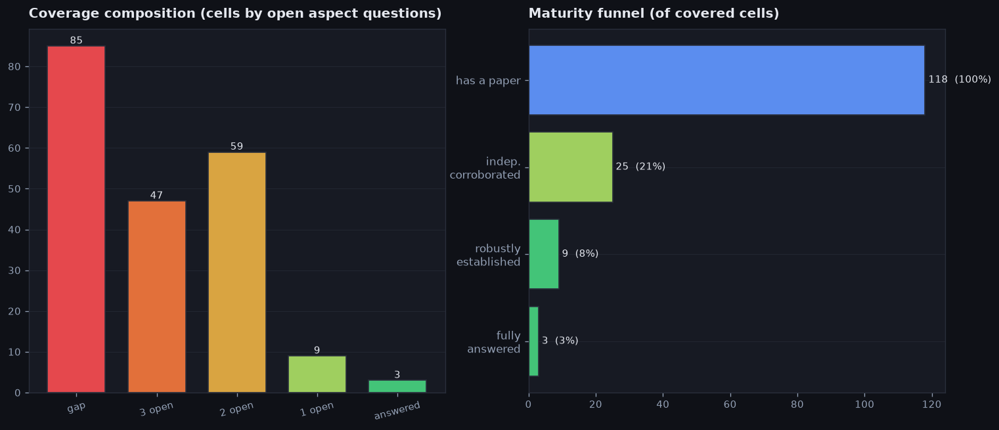

- What the figure shows: on the left — how many map points are in each state (empty = no papers; "1/2/3 open" = that many open sub-questions remain on the point; "answered" = fully answered). On the right — the "maturity funnel": how many points passed each rung (has at least one paper -> corroborated by a second independent paper -> robust on three or more -> fully answered).
- Only 8% of closed points are robust on three or more independent papers — almost everything rests on a single paper that no one has re-checked yet.
- Only 21% of points are corroborated by at least a second paper — most findings still rest on a single work.
- 42% of points are completely empty (no paper on them at all): the field is covered broadly but very sparsely.
- Most often the points are empty (no papers at all): there are 85 such — the largest group. Completely empty are 42%, and fully answered only 1% — that is, the bulk sits somewhere in the middle and is not yet finished.
- Full breakdown of all 203 points by state — completely empty, without a single paper (=4): 85, with 3 open sub-questions (=3): 47, with 2 open sub-questions (=2): 59, with 1 open sub-question (=1): 9, fully closed (=0): 3.
- The funnel narrows fast: of the points with at least one paper, 21% reach corroboration by a second paper, from there 36% reach three or more, and 33% reach a full answer. The most is filtered out at re-checking by a second paper (only 21% pass further) — this is the main sign of immaturity.

## Demand and supply: what is in high demand and what is abandoned

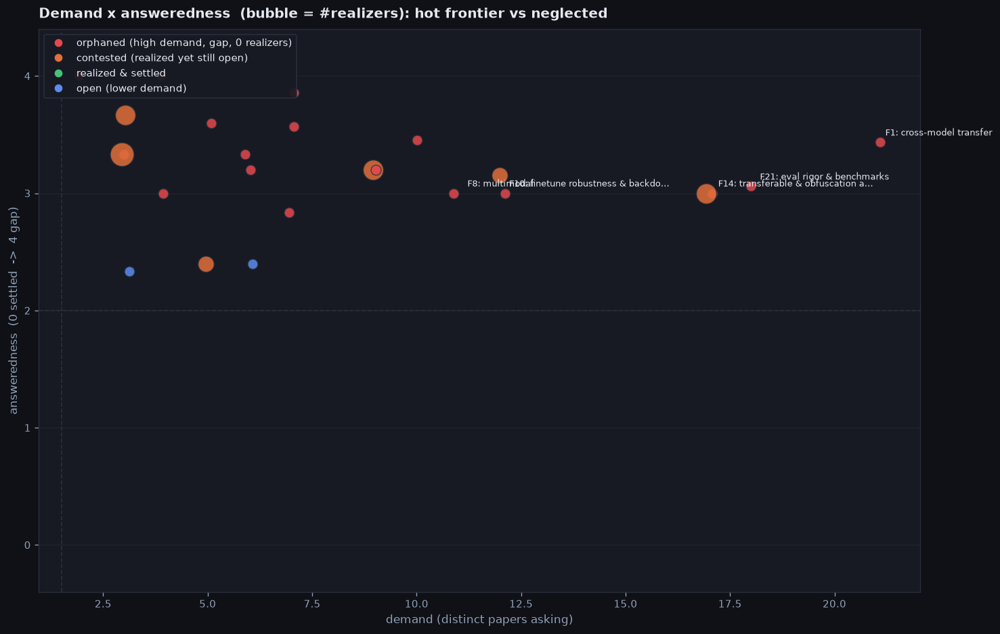

- What the figure shows: each circle is one request theme. Horizontally — "demand" (how many different papers ask for it: further right = asked more often). Vertically — "how open-ness it still is" on a 0..4 scale. The circle size is how many papers have already taken up the theme. Dashed lines split the field into four corners (often/rarely asked x answered/unanswered).
- What "the theme's target points" are: they are the map cells that this particular request theme wants to close. A map cell is a single question under specific conditions, defined by a combination of a research direction (RQ) and the map's other axes (Models / families, non-unique-direction, Public code, Threat model / access, Failure polarity, Mechanism dynamics, Cross-model transfer tested, Architecture family, failure mechanism, modality, Lifecycle stage, evaluation-chain stage, Behavior concept); a cell has no short name of its own — it is defined precisely by these coordinates. Which cells belong to a theme is not set by hand but taken from the request papers themselves: each request marks which cells it wants closed, and the theme gathers them all together. For example, the theme `F20` steering reliability has 16 target points; one of them — RQ17: Geometry of over-refusal (POLARITY): a separ… — Models / families "multi", non-unique-direction "no", Public code "not-released", Threat model / access "white-box", Failure polarity "over-refusal", Mechanism dynamics "static", Cross-model transfer tested "not-tested", Architecture family "dense", failure mechanism "training", modality "text", Lifecycle stage "inference-time", evaluation-chain stage "direction", Behavior concept "refusal" — and this cell is currently among the completely empty, without a single paper (=4).
- Where the 0..4 scale comes from (it is not set by hand): each map point carries a checklist of at most 3 clarifying sub-questions, and the number is how many of them are still open (0 — all closed, so the point is "answered"; 1, 2 or 3 — that many sub-questions remain). A special case — a point with no papers at all: it is worse than "3 open", so it is given a 4 (the scale's ceiling). A theme usually has several target points (map cells the theme asks to close), and its "open-ness" is the mean of these numbers over all its points (which is why the value is fractional, e.g. 2.6).
- Demand (horizontal): on average 8 different papers ask for the theme, the median is 7; for most it is 3–18 (that band holds 90%), and overall from 2 to 21. The most requested on the right — `F1` cross-model transfer (asked for by 21 articles); on the left — themes asked for only 2 times (isolated, rarely mentioned requests). Some separate requests in the field were phrased by the instrument itself, with no source author — these are called greenfield (they do not form separate themes but merge into ordinary ones).
- How unanswered (vertical): on average 3.3 of 4 (4 — completely empty), median value 3.3 — the cloud of circles hangs in the upper half, meaning almost nothing has been finished. Take the theme `F20` steering reliability as an example:
  - where 3.1 comes from: the theme has 16 target points (map cells the theme asks to close) — 8 completely empty, without a single paper (=4), 4 with 3 open sub-questions (=3), 2 with 2 open sub-questions (=2), 2 with 1 open sub-question (=1); the mean of these numbers (0..4) is the open-ness (answeredScore) = 3.12
- Relationship between demand and open-ness: weak negative relationship (coefficient -0.16 on a scale from -1 to 1: +1 — the more often a theme is requested, the more OPEN it is; -1 — the opposite; 0 — no relationship (we compare the ordering of themes by demand and by open-ness)) — the more often a theme is asked for, the FEWER gaps it has — popular themes are at least partially taken up (they become "solved on paper"), while rare ones stand untouched; meanwhile almost nothing reaches a full answer. For example (and that is how you get the coefficient -0.16): the most requested theme `F1` cross-model transfer is asked for by 21 articles at open-ness 3.6 of 4, while the rarely asked `F19` boundary data — only 2 at open-ness 4.0: the most requested one has lower open-ness (3.6 vs 4.0) — this is exactly the negative relationship: the more often asked, the fewer gaps.
- How many themes in each corner: "nobody does it" (orphaned) 18, "solved on paper" (contested) 6, "done and closed" (settled) 0, "open, but few ask" (low-signal open) 1 — 25 themes in total.
- Only 3% of requests are already done — that is 7 of 240 (for 7, a paper was found that actually did them; the remaining 233 are still open). Far more is asked for than gets done.
- **"nobody does it"** (orphaned) — 18 themes (many ask, but no one has taken up the theme, and it runs into an empty point). Most striking: `F1` cross-model transfer (asked for by 21 articles, open-ness 3.6 of 4).
  - request: [`P17` Refusal Is Mediated by a Single Direction](https://arxiv.org/pdf/2406.11717) — "We see this paper as more of an existence proof that such a direction exists, rather than a careful study of how best to extract it, and we leave methodological improvements to future work."
  - no realizations — nobody has taken up the theme yet
  - why "nobody has taken it up": the theme is asked for by 21 articles, but realizers 0, and it runs into empty points (15 without a single paper) — there is demand, but no work.
- **"solved on paper"** (contested) — 6 themes (someone claimed "done", but the theme's target points (map cells it asks to close) are still open). Most striking: `F20` steering reliability (asked for by 17 articles, open-ness 3.1 of 4).
  - request: [`P97` Linear Probes Detect Task Format, Not Reasoning Mode](https://arxiv.org/pdf/2606.02907) — "Understanding what that uniform strategy is, and whether it can be steered toward genuinely mode-specific reasoning, remains an important open question for the logical reasoning community."
  - realization: [`P153` Sycophancy Is Not One Thing (causal separation)](https://arxiv.org/pdf/2509.21305) — **causal separation** of 3 sycophancy behaviors (agreement/praise/genuine) into distinct linear directions; each can be **independently amplified/suppressed** …
  - why "on paper": a realizer [`P153` Sycophancy Is Not One Thing (causal separation)](https://arxiv.org/pdf/2509.21305) exists, but of 16 target points (map cells the theme asks to close) only 0 are closed (fully answered), another 8 have open sub-questions and 8 are completely empty — the clarifying sub-questions are not resolved, so we count it only as "on paper".
- **"done and closed"** (settled) — 0 themes: not a single theme has yet reached a full answer — the field is still immature.
- **"open, but few ask"** (low-signal open) — 1 theme (the theme is unanswered and nobody has taken it up, but it is also rarely asked for). Most striking: `F24` agent safety (asked for by 3 articles, open-ness 2.3 of 4).
  - request: [`P106` Indirect Prompt Injection in the Wild](https://arxiv.org/pdf/2604.27202) — "Overall, in-page prompt injections do not always overpower web agents, but they do succeed often enough, and under ordinary enough conditions, to warrant serious attention."
  - no realizations — nobody has taken up the theme yet
  - why "rarely asked": the theme is unanswered (open-ness 2.3 of 4) and nobody has taken it up, but it is asked for only 3 times — too little demand to count it as loudly orphaned.

## How concrete the requests are (a ready-to-run plan or just a wish)

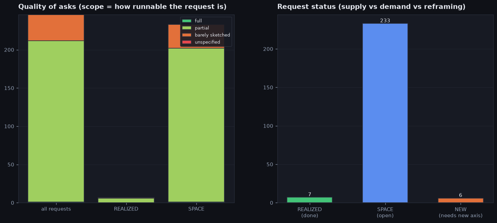

- What the figure shows: how concrete the requests are. Concreteness (scope) is a label the curator assigns while reading the request itself in the paper (it is not computed by a formula): "ready-to-run plan" (full) — a concrete experiment is described, ready to pick up and run; "partial plan" (partial) — there is an idea and some of the details; "just a sketch" (barely sketched) — the direction is named without details; "no details" (unspecified) — a general wish. This is an ordered scale from the most worked-out to the vaguest. On the left — what all requests are made of, and separately the already-done and still-open ones. On the right — how many requests are already done, how many are still open, and how many need a new measure the map does not yet have (the NEW label).
- How this looks in real requests (one example per phrasing type; for missing types — a note that there are no such requests):
  - "ready-to-run plan (full)": [`P78` Anthropomorphic Misalignment Needs Stronger Evidence (…](https://arxiv.org/pdf/2606.07612) — "As a nascent research field, AMR is still arguably in a pre-paradigmatic state (Kuhn, 1997 ) , with theoretical foundations, and standards of evaluation yet to be established."
  - "partial plan (partial)": [`P97` Linear Probes Detect Task Format, Not Reasoning Mode](https://arxiv.org/pdf/2606.02907) — "We leave this intermediate analysis to future work."
  - "just a sketch (barely sketched)": [`P106` Indirect Prompt Injection in the Wild](https://arxiv.org/pdf/2604.27202) — "Overall, in-page prompt injections do not always overpower web agents, but they do succeed often enough, and under ordinary enough conditions, to warrant serious attention."
  - "no details (unspecified)": there is not a single such request in the field — no purely open-ended general wishes at all
- Most often requests are partial plan (partial) (211 of 246); fully ready plans are only 1 (0%), the rest are wishes of varying detail.
- By completion status each request is one of three (for each status: how many, why a request lands there, and a live example):
  - "already done (REALIZED)": 7 of 246 — a paper was found that actually did it. Example: [`P17` Refusal Is Mediated by a Single Direction](https://arxiv.org/pdf/2406.11717) — "We see this paper as more of an existence proof that such a direction exists, rather than a careful study of how best to extract it, and we leave methodologica…"
  - "still open (SPACE)": 233 of 246 — the request exists, but there is no realizer paper yet. Example: [`P97` Linear Probes Detect Task Format, Not Reasoning Mode](https://arxiv.org/pdf/2606.02907) — "Understanding what that uniform strategy is, and whether it can be steered toward genuinely mode-specific reasoning, remains an important open question for the…"
  - "needs a new axis (NEW)": 6 of 246 — the request needs a dimension that is not among the map's axes. Example: [`P141` From Weights to Activations: Is Steering the Next Fron…](https://arxiv.org/pdf/2604.14090) — "Although many steering methods exploit linear structure that supports additive composition, reliable compositionality remains an open challenge."
- Already-done requests vs still-open ones: among the done, the share of ready plans is 0%, among the open — 0%. That is, what is still waiting is more worked-out than what has already been taken up.
- 7 requests of those marked "done" are in fact closed only partially or as a sketch — the checkbox is formally ticked, but in substance the work is shallow.
  - example: [`P09` PAIR](https://arxiv.org/pdf/2310.08419) is marked done, but the request itself was only "partial plan (partial)" — "Directions for future work include extending this framework to systematically generate red teaming datasets for fine-tuning to improve the safety of LLMs and e…"

## Pain points: "nobody does it", "solved on paper", "asked to extend"

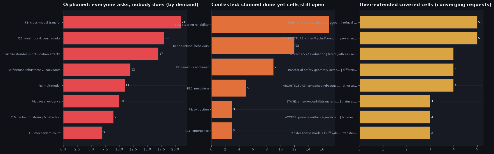

- What the figure shows (three columns): on the left — themes many ask for but nobody does (orphaned: high demand, zero takers, runs into an empty point), sorted by demand. In the center — themes someone claimed "done" while the points are still open (contested, "solved on paper"). On the right — already-closed points the field insistently asks to extend; their "weight" is the number of extension requests that converge on a single point.
- "Nobody does it" (orphaned): 18 themes; demand (how many papers ask) — on average 9 papers, the median is 7; for most it is 3–18 (that band holds 90%), and overall from 2 to 21. The most requested — `F1` cross-model transfer (asked for by 21); the least among those shown — `F3` mechanism count (asked for by 7); median number of requests 7.
  - request: [`P17` Refusal Is Mediated by a Single Direction](https://arxiv.org/pdf/2406.11717) — "We see this paper as more of an existence proof that such a direction exists, rather than a careful study of how best to extract it, and we leave methodological improvements to future work."
  - no realizations — nobody has taken up the theme yet
- "Solved on paper" (contested): 6 themes; open-ness on the 0..4 scale is how many clarifying sub-questions on average remain open across the theme's points (0 — all closed, 4 — the point completely empty); median 3.3, range 2.6–3.7. The hottest — `F20` steering reliability (asked for by 17, open-ness 3.1 of 4); the borderline one — `F11` emergence (asked for by 3, 3.3 of 4).
  - where 3.1 comes from: the theme has 16 target points (map cells the theme asks to close) — 8 completely empty, without a single paper (=4), 4 with 3 open sub-questions (=3), 2 with 2 open sub-questions (=2), 2 with 1 open sub-question (=1); the mean of these numbers (0..4) is the open-ness (answeredScore) = 3.12
  - request: [`P97` Linear Probes Detect Task Format, Not Reasoning Mode](https://arxiv.org/pdf/2606.02907) — "Understanding what that uniform strategy is, and whether it can be steered toward genuinely mode-specific reasoning, remains an important open question for the logical reasoning community."
  - realization: [`P153` Sycophancy Is Not One Thing (causal separation)](https://arxiv.org/pdf/2509.21305) — **causal separation** of 3 sycophancy behaviors (agreement/praise/genuine) into distinct linear directions; each can be **independently amplified/suppressed** …
  - why "on paper": a realizer [`P153` Sycophancy Is Not One Thing (causal separation)](https://arxiv.org/pdf/2509.21305) exists, but of 16 target points (map cells the theme asks to close) only 0 are closed (fully answered), another 8 have open sub-questions and 8 are completely empty — the clarifying sub-questions are not resolved, so we count it only as "on paper".
- "Asked to extend" (over-extended): 67 already-closed points the field wants to develop further; the number of requests converging on a point — on average 2 requests, the median is 1; for most it is 1–4 (that band holds 90%), and overall from 1 to 5. The strongest — RQ18: Transfer of safety geometry across modality (text… | refusal vector for other safety dimensions; auto-… (5 requests); the weakest of the top — RQ8: Transfer across models (suffix/dir/feature/neuron) | transfer beyond refusal (3 requests); median 1.
  - asked to extend: [`P112` SARSteer: Safe-Ablated Refusal Steering (audio LALM)](https://arxiv.org/pdf/2510.17633), [`P135` OmniSteer: Omni-Safety under Cross-Modality Conflict](https://arxiv.org/pdf/2602.10161), [`P136` Acoustic Interference (AIA, audio mechanism)](https://arxiv.org/pdf/2605.18168) — what exactly: refusal vector for other safety dimensions; auto-search of the vector

## Which large areas the map consists of

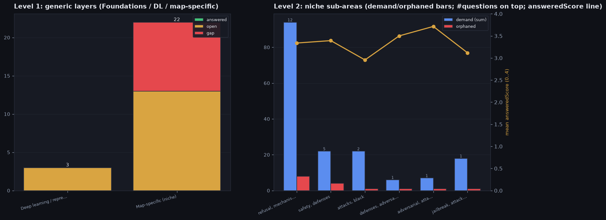

- What the figure shows: on the left — the large areas all questions split into (Foundations — basic statistics and measurability; Deep learning — generic deep-learning techniques; Map-specific — everything of its own, specific to this map), and how closed/open each area is. On the right the Map-specific area is broken into sub-themes by shared keywords of the questions themselves.
- What the map is about: **Refusal directions, harm schemas, evasion and defense of probe/latent monitors** — Reads refusal as a geometric object inside the model, sliced by where the mechanism lives (token → direction → subspace → feature → neuron → circuit → weights) and the lens used to study it. Every axis is read per paper…
- Notation: "asked for by N papers" — how many papers in total ask for the group's themes; "open %" — the share of not-yet-closed ones; "open-ness 0..4" — on average how far from an answer (0 — closed, 4 — completely empty); "nobody does it" — how many of the group's themes are asked for but nobody has taken up.
- **Foundations (stats/measurement)**: 0 themes — there are no questions of this area in the field.
- **Deep learning / representation**: 3 themes, asked for by 38 articles, open 100% (open-ness 3.3/4, "nobody does it" 2):
  - `F20` steering reliability (asked for by 17 articles, open-ness 3.1 of 4)
  - `F10` finetune robustness & backdoors (asked for by 12 articles, open-ness 3.4 of 4)
  - `F16` probe monitoring & detection (asked for by 9 articles, open-ness 3.3 of 4)
- **Map-specific (niche)**: 22 themes, asked for by 169 articles, open 100% (open-ness 3.3/4, "nobody does it" 16).
- The Map-specific area splits into 6 sub-themes (by shared keywords of the questions themselves):
- **refusal, mechanisms** — 12 themes, asked for by 94 articles, open 100% ("nobody does it" 8, open-ness 3.3/4):
  - `F1` cross-model transfer (asked for by 21 articles, open-ness 3.6 of 4)
  - `F6` non-refusal behaviors (asked for by 12 articles, open-ness 3.3 of 4)
  - `F8` multimodal (asked for by 11 articles, open-ness 3.0 of 4)
  - `F4` causal evidence (asked for by 10 articles, open-ness 3.5 of 4)
  - `F2` linear vs nonlinear (asked for by 9 articles, open-ness 3.3 of 4)
  - `F3` mechanism count (asked for by 7 articles, open-ness 3.9 of 4)
  - `F23` harmfulness mechanism (asked for by 6 articles, open-ness 3.6 of 4)
  - `F9` non-dense architectures (asked for by 5 articles, open-ness 3.6 of 4)
  - `F7` over-refusal (asked for by 4 articles, open-ness 3.0 of 4)
  - `F5` extraction (asked for by 3 articles, open-ness 3.7 of 4)
  - `F22` SAE features (asked for by 3 articles, open-ness 3.3 of 4)
  - `F24` agent safety (asked for by 3 articles, open-ness 2.3 of 4)
- **safety, defenses** — 5 themes, asked for by 22 articles, open 100% ("nobody does it" 4, open-ness 3.4/4):
  - `F25` reasoning safety (asked for by 7 articles, open-ness 2.8 of 4)
  - `F12` training intervention (asked for by 6 articles, open-ness 2.8 of 4)
  - `F17` certified defense (asked for by 4 articles, open-ness 4.0 of 4)
  - `F11` emergence (asked for by 3 articles, open-ness 3.3 of 4)
  - `F19` boundary data (asked for by 2 articles, open-ness 4.0 of 4)
- **attacks, black** — 2 themes, asked for by 22 articles, open 100% ("nobody does it" 1, open-ness 3.0/4):
  - `F14` transferable & obfuscation attacks (asked for by 17 articles, open-ness 3.3 of 4)
  - `F15` multi-turn (asked for by 5 articles, open-ness 2.6 of 4)
- **defenses, adversarial** — 1 theme, asked for by 6 articles, open 100% ("nobody does it" 1, open-ness 3.5/4):
  - `F18` empirical defenses (asked for by 6 articles, open-ness 3.5 of 4)
- **adversarial, attack** — 1 theme, asked for by 7 articles, open 100% ("nobody does it" 1, open-ness 3.7/4):
  - `F13` attack optimization (asked for by 7 articles, open-ness 3.7 of 4)
- **jailbreak, attacker** — 1 theme, asked for by 18 articles, open 100% ("nobody does it" 1, open-ness 3.1/4):
  - `F21` eval rigor & benchmarks (asked for by 18 articles, open-ness 3.1 of 4)
- The most requested sub-theme — refusal, mechanisms (asked for by 94 articles, "nobody does it" 8) — the field pushes there hardest.

## Who sets the agenda and who does the work

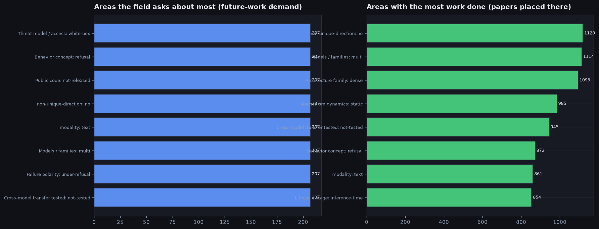

- What the figure shows: instead of individual papers we compare the map's AREAS. The map has several axes (Models / families, non-unique-direction, Public code, Threat model / access, Failure polarity, Mechanism dynamics, Cross-model transfer tested, Architecture family, failure mechanism, modality, Lifecycle stage, evaluation-chain stage, Behavior concept), and each axis has its own values (for example, on the "Models / families" axis these are "multi", "single", etc.). On the left — the areas the field asks for the most future work; on the right — the areas where the most papers already sit (actual work). An area's "demand" is the total number of request papers whose target points fall into this area (a request is counted in all the areas of its points). "Work" is how many different papers sit in the points of this area (counted from the papers' coordinates on the map).
- **Models / families**: most asked for is "multi" (demand 207 — summed over themes whose target points fall here; one paper asking for several themes is counted in each); most work is in "multi" (140 articles).
- **non-unique-direction**: most asked for is "no" (demand 207 — summed over themes whose target points fall here; one paper asking for several themes is counted in each); most work is in "no" (145 articles).
- **Public code**: most asked for is "not-released" (demand 207 — summed over themes whose target points fall here; one paper asking for several themes is counted in each); most work is in "released" (74 articles) — demand and work point in different directions: one thing is asked for, another is worked on.
- **Threat model / access**: most asked for is "white-box" (demand 207 — summed over themes whose target points fall here; one paper asking for several themes is counted in each); most work is in "white-box" (128 articles).
- **Failure polarity**: most asked for is "under-refusal" (demand 207 — summed over themes whose target points fall here; one paper asking for several themes is counted in each); most work is in "under-refusal" (104 articles).
- **Mechanism dynamics**: most asked for is "static" (demand 204 — summed over themes whose target points fall here; one paper asking for several themes is counted in each); most work is in "static" (134 articles).
- **Cross-model transfer tested**: most asked for is "not-tested" (demand 207 — summed over themes whose target points fall here; one paper asking for several themes is counted in each); most work is in "not-tested" (124 articles).
- **Architecture family**: most asked for is "dense" (demand 202 — summed over themes whose target points fall here; one paper asking for several themes is counted in each); most work is in "dense" (144 articles).
- **failure mechanism**: most asked for is "directions" (demand 202 — summed over themes whose target points fall here; one paper asking for several themes is counted in each); most work is in "directions" (79 articles).
- **modality**: most asked for is "text" (demand 207 — summed over themes whose target points fall here; one paper asking for several themes is counted in each); most work is in "text" (136 articles).
- **Lifecycle stage**: most asked for is "inference-time" (demand 204 — summed over themes whose target points fall here; one paper asking for several themes is counted in each); most work is in "inference-time" (137 articles).
- **evaluation-chain stage**: most asked for is "direction" (demand 187 — summed over themes whose target points fall here; one paper asking for several themes is counted in each); most work is in "direction" (82 articles).
- **Behavior concept**: most asked for is "refusal" (demand 207 — summed over themes whose target points fall here; one paper asking for several themes is counted in each); most work is in "refusal" (115 articles).
- 10 requests were gathered by the instrument itself, with no specific source author (greenfield) — this is hidden demand that no one in the field voiced directly, but it follows from the map's structure. Here they all are:
  - Across dense, mixture-of-experts, state-space and diffusion models, is refusal carried by the SAME geometric object (direction/cone) or is it architecture-spec… — rolls up into the theme `F1` cross-model transfer; scope partial plan (partial); research direction RQ22: ARCHITECTURE: cones/RepInd/count outside dense (MoE/Ma…; target points (map cells the theme asks to close): 3
  - Is there ONE shared cross-modal refusal vector validated jointly across audio, vision and video, rather than a separate direction recovered per modality? — rolls up into the theme `F8` multimodal; scope partial plan (partial); research direction RQ18: Transfer of safety geometry across modality (text -> V…; target points (map cells the theme asks to close): 2
  - Do the shared LLM<->vision-language safety neurons imply a shared cross-modal refusal SUBSPACE whose ablation transfers across modalities? — rolls up into the theme `F8` multimodal; scope partial plan (partial); research direction RQ18: Transfer of safety geometry across modality (text -> V…; target points (map cells the theme asks to close): 2
  - Is there a multi-dimensional refusal CONE in audio language models, and is its dimensionality conserved with the vision-language cone? — rolls up into the theme `F8` multimodal; scope just a sketch (barely sketched); research direction RQ18: Transfer of safety geometry across modality (text -> V…; target points (map cells the theme asks to close): 1
  - Does the refusal non-uniqueness / cone-count result (RQ24) hold for non-refusal behaviors such as truth, sycophancy and persona? — rolls up into the theme `F6` non-refusal behaviors; scope just a sketch (barely sketched); research direction RQ24: non-unique-direction: is the direction/cone unique, ho…; target points (map cells the theme asks to close): 1
  - Is refusal in diffusion language models a multi-dimensional cone evolving across denoising steps, not a single per-step signal? — rolls up into the theme `F9` non-dense architectures; scope just a sketch (barely sketched); research direction RQ22: ARCHITECTURE: cones/RepInd/count outside dense (MoE/Ma…; target points (map cells the theme asks to close): 1
  - Is the mixture-of-experts refusal mechanism a per-expert cone concentrated in safety experts, or distributed across routing? — rolls up into the theme `F9` non-dense architectures; scope just a sketch (barely sketched); research direction RQ22: ARCHITECTURE: cones/RepInd/count outside dense (MoE/Ma…; target points (map cells the theme asks to close): 1
  - Can a latent refusal-direction monitor be built that provably survives ADAPTIVE evasion, not just one adaptive attacker? — rolls up into the theme `F16` probe monitoring & detection; scope partial plan (partial); research direction RQ4: Does a probe detect harm; target points (map cells the theme asks to close): 1
  - Does a nonlinear / manifold refusal geometry transfer cone-to-cone ACROSS models, not just within one model? — rolls up into the theme `F2` linear vs nonlinear; scope partial plan (partial); research direction RQ1: Does a refusal direction exist; target points (map cells the theme asks to close): 1
  - Can the step-wise internal refusal signal in diffusion LMs be reinforced across denoising to resist trajectory re-masking attacks? — rolls up into the theme `F9` non-dense architectures; scope partial plan (partial); research direction RQ22: ARCHITECTURE: cones/RepInd/count outside dense (MoE/Ma…; target points (map cells the theme asks to close): 1

## Research directions: where the field is heading and how worked-out they are

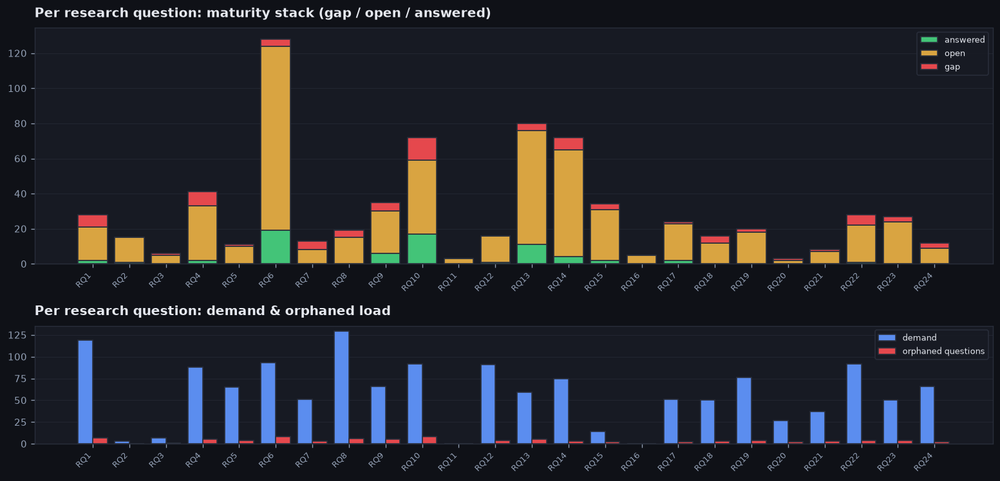

- What the figure shows: "RQ" is the large research directions (the big questions the field works on). At the top, for each direction, it shows the state of its points (empty / partially open / answered); at the bottom — how many papers ask for this direction and how many themes under it are abandoned ("nobody does it").
- Directions (RQ) are WHERE the field is essentially heading, and the specific request themes under each are the pointwise steps within a direction. Each direction has its own text, state and demand, and beneath it the request themes belonging to it are listed (a broad request is assigned to one direction, not duplicated in each). "Demand" in the header is how many papers ask for it in total (including requests shared with neighboring directions).
- Important about the counters in a direction's header: both "demand" and "abandoned ("nobody does it")" are counted with overlaps — one theme can touch several directions at once and lands in the count of each of them. So these numbers cannot be summed across directions: their total may turn out larger than 18 (the total number of abandoned themes across the whole field; and if each theme belongs to only one direction, it coincides with this number).
- How closed the directions are: on average a direction has 41% of its points empty (from 0% to 100%). The most gaps are in the direction RQ12: Shallow vs deep alignment (100% of points empty, 1 point in total); the fewest — in RQ16: Predict-control: a feature predicts but does not control (0% empty).
- The field asks most strongly for the direction RQ8: Transfer across models (suffix/dir/feature/neuron) (asked for by 129 articles in total).
- The directions are closed very unevenly: between the emptiest and the most worked-out the difference is 100% of empty points.
- Directions in descending order of demand (the most requested first). Each request theme under a direction carries in parentheses "open-ness N of 4" — the mean over its points of the number of still-open clarifying sub-questions (0 — all sub-questions on the point closed, 4 — the point completely empty, no papers):
- **RQ8**: Transfer across models (suffix/dir/feature/neuron) — 13 points; of which 31% empty, 69% partially open, 0% answered; asked for by 129 articles, abandoned ("nobody does it") 7. hot but abandoned — high demand runs into empty points.
  - (there are no separate request themes under this direction)
- **RQ1**: Does a refusal direction exist — 19 points; of which 37% empty, 58% partially open, 5% answered; asked for by 119 articles, abandoned ("nobody does it") 7. hot but abandoned — high demand runs into empty points.
  - `F20` steering reliability (asked for by 17 articles, open-ness 3.1 of 4)
  - `F2` linear vs nonlinear (asked for by 9 articles, open-ness 3.3 of 4)
  - `F23` harmfulness mechanism (asked for by 6 articles, open-ness 3.6 of 4)
  - `F15` multi-turn (asked for by 5 articles, open-ness 2.6 of 4)
  - `F5` extraction (asked for by 3 articles, open-ness 3.7 of 4)
  - `F24` agent safety (asked for by 3 articles, open-ness 2.3 of 4)
- **RQ6**: Defense (input / latent / multi-layer) — 11 points; of which 36% empty, 64% partially open, 0% answered; asked for by 93 articles, abandoned ("nobody does it") 8. hot but abandoned — high demand runs into empty points.
  - `F18` empirical defenses (asked for by 6 articles, open-ness 3.5 of 4)
  - `F17` certified defense (asked for by 4 articles, open-ness 4.0 of 4)
- **RQ10**: Attacks stronger than GCG — 20 points; of which 65% empty, 30% partially open, 5% answered; asked for by 92 articles, abandoned ("nobody does it") 9. hot but abandoned — high demand runs into empty points.
  - `F21` eval rigor & benchmarks (asked for by 18 articles, open-ness 3.1 of 4)
  - `F14` transferable & obfuscation attacks (asked for by 17 articles, open-ness 3.3 of 4)
  - `F13` attack optimization (asked for by 7 articles, open-ness 3.7 of 4)
- **RQ22**: ARCHITECTURE: cones/RepInd/count outside dense (MoE/Mamba/diffusion) — 14 points; of which 43% empty, 57% partially open, 0% answered; asked for by 92 articles, abandoned ("nobody does it") 4. hot but abandoned — high demand runs into empty points.
  - `F1` cross-model transfer (asked for by 21 articles, open-ness 3.6 of 4)
  - `F9` non-dense architectures (asked for by 5 articles, open-ness 3.6 of 4)
- **RQ12**: Shallow vs deep alignment — 1 point; of which 100% empty, 0% partially open, 0% answered; asked for by 91 articles, abandoned ("nobody does it") 5. hot but abandoned — high demand runs into empty points.
  - (there are no separate request themes under this direction)
- **RQ4**: Does a probe detect harm — 16 points; of which 50% empty, 44% partially open, 6% answered; asked for by 88 articles, abandoned ("nobody does it") 6. hot but abandoned — high demand runs into empty points.
  - `F16` probe monitoring & detection (asked for by 9 articles, open-ness 3.3 of 4)
  - `F12` training intervention (asked for by 6 articles, open-ness 2.8 of 4)
  - `F19` boundary data (asked for by 2 articles, open-ness 4.0 of 4)
- **RQ19**: STAGE: emergence/drift/transfer of the direction (pretrain -> finetune -> compress) — 10 points; of which 20% empty, 80% partially open, 0% answered; asked for by 76 articles, abandoned ("nobody does it") 5. hot but abandoned — high demand runs into empty points.
  - (there are no separate request themes under this direction)
- **RQ14**: Other directions/circuits (sycophancy/deception/emergent-misalignment/persona-traits): do they exist and transfer? — 20 points; of which 35% empty, 65% partially open, 0% answered; asked for by 75 articles, abandoned ("nobody does it") 3. hot but abandoned — high demand runs into empty points.
  - `F6` non-refusal behaviors (asked for by 12 articles, open-ness 3.3 of 4)
- **RQ9**: SAE decomposition of refusal (core/tail, redundancy) — 9 points; of which 56% empty, 44% partially open, 0% answered; asked for by 66 articles, abandoned ("nobody does it") 5. hot but abandoned — high demand runs into empty points.
  - `F22` SAE features (asked for by 3 articles, open-ness 3.3 of 4)
- **RQ24**: non-unique-direction: is the direction/cone unique, how many really? — 7 points; of which 43% empty, 57% partially open, 0% answered; asked for by 66 articles, abandoned ("nobody does it") 2. hot but abandoned — high demand runs into empty points.
  - `F3` mechanism count (asked for by 7 articles, open-ness 3.9 of 4)
- **RQ5**: Evasion of probe/latent monitors — 3 points; of which 33% empty, 67% partially open, 0% answered; asked for by 65 articles, abandoned ("nobody does it") 4. hot but abandoned — high demand runs into empty points.
  - (there are no separate request themes under this direction)
- **RQ13**: Benchmarks / evaluation — 8 points; of which 50% empty, 50% partially open, 0% answered; asked for by 59 articles, abandoned ("nobody does it") 5. hot but abandoned — high demand runs into empty points.
  - (there are no separate request themes under this direction)
- **RQ7**: Count of harm-schemas/neurons (min/max) — 8 points; of which 62% empty, 38% partially open, 0% answered; asked for by 51 articles, abandoned ("nobody does it") 3. hot but abandoned — high demand runs into empty points.
  - `F11` emergence (asked for by 3 articles, open-ness 3.3 of 4)
- **RQ17**: Geometry of over-refusal (POLARITY): a separate direction, how many dimensions? — 5 points; of which 20% empty, 80% partially open, 0% answered; asked for by 51 articles, abandoned ("nobody does it") 2. hot but abandoned — high demand runs into empty points.
  - `F7` over-refusal (asked for by 4 articles, open-ness 3.0 of 4)
- **RQ18**: Transfer of safety geometry across modality (text -> VLM/audio/video) — 11 points; of which 36% empty, 64% partially open, 0% answered; asked for by 50 articles, abandoned ("nobody does it") 3. hot but abandoned — high demand runs into empty points.
  - `F8` multimodal (asked for by 11 articles, open-ness 3.0 of 4)
- **RQ23**: BACKDOOR/conditional: geometry of trigger-behavior, count — 7 points; of which 43% empty, 57% partially open, 0% answered; asked for by 50 articles, abandoned ("nobody does it") 4. hot but abandoned — high demand runs into empty points.
  - `F10` finetune robustness & backdoors (asked for by 12 articles, open-ness 3.4 of 4)
- **RQ21**: DYNAMICS (across-generation): dynamics of refusal/cone along generation steps — 4 points; of which 25% empty, 75% partially open, 0% answered; asked for by 37 articles, abandoned ("nobody does it") 3. hot but abandoned — high demand runs into empty points.
  - `F4` causal evidence (asked for by 10 articles, open-ness 3.5 of 4)
- **RQ20**: ACCESS: probe-as-attack (grey-box), degradation under access change — 2 points; of which 50% empty, 50% partially open, 0% answered; asked for by 27 articles, abandoned ("nobody does it") 2. hot but abandoned — high demand runs into empty points.
  - (there are no separate request themes under this direction)
- **RQ15**: Refusal in reasoning/CoT models: one direction, cones, does the picture transfer? — 8 points; of which 38% empty, 62% partially open, 0% answered; asked for by 14 articles, abandoned ("nobody does it") 2. hot but abandoned — high demand runs into empty points.
  - `F25` reasoning safety (asked for by 7 articles, open-ness 2.8 of 4)
- **RQ3**: Suffix mechanism (suppression vs activation, hijack) — 3 points; of which 33% empty, 67% partially open, 0% answered; asked for by 7 articles, abandoned ("nobody does it") 1. hot but abandoned — high demand runs into empty points.
  - (there are no separate request themes under this direction)
- **RQ2**: How many directions / geometry (cones, dim) — 3 points; of which 33% empty, 67% partially open, 0% answered; asked for by 3 articles, abandoned ("nobody does it") 0. wide open — many empty points await their first work.
  - (there are no separate request themes under this direction)
- **RQ16**: Predict-control: a feature predicts but does not control — 1 point; of which 0% empty, 100% partially open, 0% answered; asked for by 0 articles, abandoned ("nobody does it") 0. quiet direction — the field almost never asks for it.
  - (there are no separate request themes under this direction)

## Citations and paper age

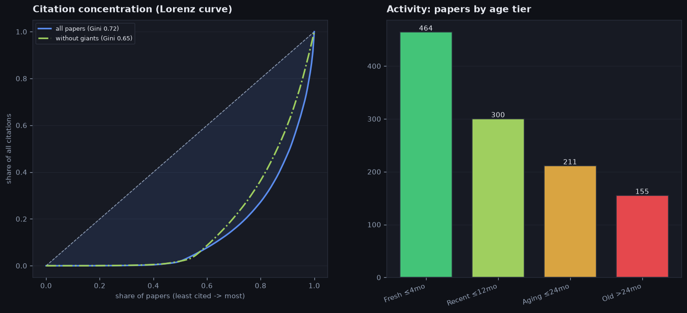

- What the figure shows: on the left — how unevenly the citations are divided. The curve shows what share of all citations papers collect, going from the least- to the most-cited; the more it sags below the diagonal (the diagonal = everyone equal), the more everything is concentrated in a few. The solid line — all papers, the dash-dot — the same papers without the "giants" (the most-cited outliers). The Gini number compresses the curve into a single figure on a 0..1 scale: it is the area of the gap between the diagonal and the curve, divided by the whole area under the diagonal (0 — all papers cited equally, 1 — all citations on one paper). The scale is chosen so as not to depend on either the number of papers or the absolute number of citations. On the right — how many papers by age: younger than 4 months, up to a year, up to 2 years, older than 2 years.
- Citation unevenness (across all papers): the top 10% most-cited collect 75% of all citations (Gini 0.85) — a few "giants" pull the field.
- How 0.85 arises on real numbers: going from the least-cited, the bottom half of papers (66 of 133) collects only 0% of all citations, while the top 10% — 75%. If citations were shared equally, the bottom half would collect its 50%, the curve would lie on the diagonal and Gini would be 0; the further this share is from 50%, the closer Gini is to 1 — here 0.85.
- Who counts as a "giant" (these are citation outliers): papers whose citations exceed the upper bound by Tukey's rule — the third quartile plus 1.5 interquartile ranges (that is, noticeably above the typical spread). Here the threshold is 188 citations; above it are 23 articles of 133 (the citation count runs over the 133 papers with a known citation number — for the remaining 20 of 153 the counter is not yet filled in). Which ones exactly we exclude (by descending citations):
  - [`P01` Universal and Transferable Adversarial Attacks (GCG)](https://arxiv.org/pdf/2307.15043) — 3250 citations (2023)
  - [`P14` Jailbroken: How Does Safety Training Fail](https://arxiv.org/pdf/2307.02483) — 1947 citations (2023)
  - [`P09` PAIR](https://arxiv.org/pdf/2310.08419) — 1518 citations (2023)
  - [`P58` HarmBench](https://arxiv.org/pdf/2402.04249) — 1269 citations (2024)
  - [`P70` Representation Engineering (RepE)](https://arxiv.org/pdf/2310.01405) — 1112 citations (2023)
  - [`P71` Contrastive Activation Addition (CAA)](https://arxiv.org/pdf/2312.06681) — 827 citations (2023)
  - [`P17` Refusal Is Mediated by a Single Direction](https://arxiv.org/pdf/2406.11717) — 807 citations (2024)
  - [`P72` The Geometry of Truth](https://arxiv.org/pdf/2310.06824) — 595 citations (2023)
  - … and 15 more (all with citations above 188)
- The same computation without the giants (on the remaining 110 papers): concentration drops noticeably — Gini 0.85 -> 0.80, and the top 10% now collect 67% of citations instead of 75%. The median paper still gets 2 quotes (was 4), but the maximum among the remaining ones is 183 (it was 3250). That is, without a few super-cited works the field is still uneven, but no longer "all in a handful".
- How much a typical paper is cited (across all): median value 4, top 5% — 680, maximum 3250. That is, an ordinary paper is cited little, while a handful hold the whole volume.
- Age: 63% of papers are younger than a year, median age 9 months — a young and active stream. Breakdown by age group (how many papers in each): younger than 4 months: 58, from 4 months to a year: 38, from a year to 2 years: 33, older than 2 years: 24.

## What type of field this is (among all maps)

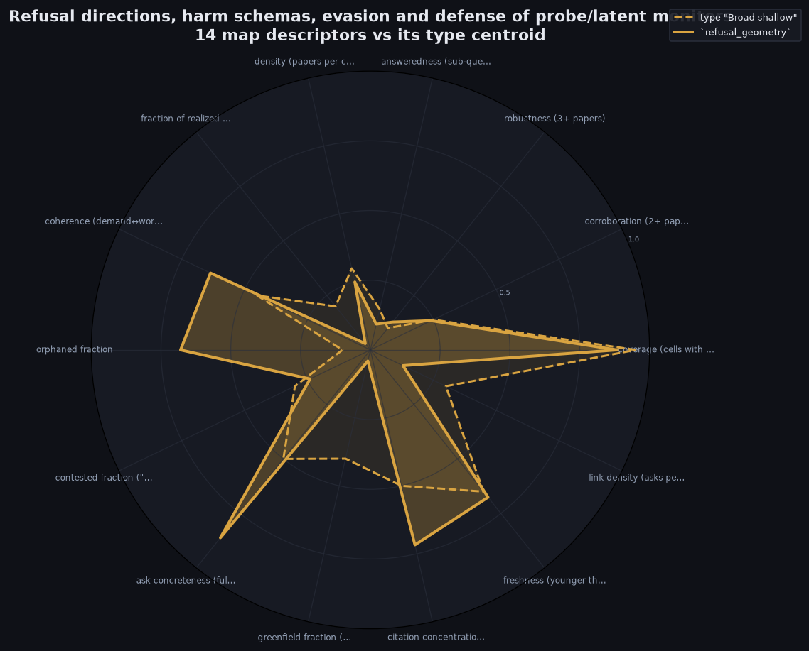

- What the figure shows: the solid line — 14 descriptors of THIS map, the dashed line — the center of its nearest type among all possible maps (both in the type's color). Matching lines = the map is typical of its type; divergences along the spokes show how it stands out from the type.
- Closest to the archetype **Contested / "on paper"** (broadly covered but declared "done" while sub-questions are still open); Euclidean distance over the 6 composite axes 0.63 (0 — exactly at the type's center).
- The map's composite axes (each in [0,1]): maturity (maturity: share of re-checked findings) 0.12, freshness (freshness: share of young papers) 0.63, coherence (coherence: how much the field works on what it asks for) 0.58, coverage (coverage: share of closed cells) 0.58, interaction (interaction density: future-work requests per cell) 0.69, canon (canon concentration: citation inequality (Gini)) 0.85.
- Deviates most from the type's center: orphaned fraction 72% vs 15% for the type; coherence (demand↔work) 58% vs 20% for the type; ask concreteness (full+partial) 86% vs 50% for the type.

## Field scores by theory

Another slice: where this field stands on the axes of published theories of evaluating scientific areas (and our synthesis). The value in [0,1] is computed from our field descriptors and composite axes — no made-up network metrics. **faithful** — the axis is reproduced honestly, **proxy** — approximately; non-operationalizable theory axes (N/A) are omitted.

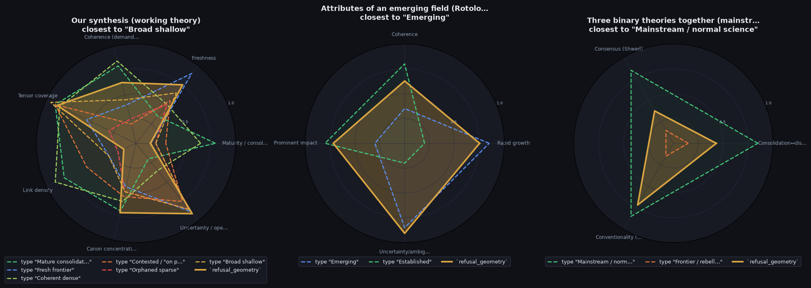

- What the figure shows: the solid line — the position of THIS field on each theory's computable axes (in its type's color), the dashed lines — the theory's ideal types (each in its own color). A match = the field resembles that ideal type. The first panel is our synthesis: the field on the 6 consolidated axes (maturity, freshness, coherence, coverage, interaction density, canon concentration) plus open-ness, overlaid on the 6 reference field archetypes.
- **Our synthesis (working theory)**: closest to the ideal type "Fresh frontier"; Euclidean distance over the theory's axes 0.66 (0 — exactly in this type). The field's axes: Maturity / consolidation 0.12, Freshness 0.63, Coherence (demand↔work) 0.58, Tensor coverage 0.58, Link density 0.69, Canon concentration 0.85, Uncertainty / openness 0.99.
- **Attributes of an emerging field (Rotolo–Hic…**: closest to the ideal type "Emerging"; Euclidean distance over the theory's axes 0.65 (0 — exactly in this type). The field's axes: Rapid growth 0.63, Coherence 0.58, Prominent impact 0.85, Uncertainty/ambiguity 0.99.
- **Three binary theories together (mainstream …**: closest to the ideal type "Mainstream / normal science"; Euclidean distance over the theory's axes 0.64 (0 — exactly in this type). The field's axes: Consolidation↔disruption … 0.48, Consensus (Shwed) 0.33, Conventionality (Uzzi) 0.85.

| Theory | Axis | Type | Field value | What the axis shows |
| --- | --- | --- | --- | --- |
| Our synthesis (working theory) | Maturity / consolidation | faithful | 0.12 | a re-checked, answered core |
| Our synthesis (working theory) | Freshness | faithful | 0.63 | share of fresh papers |
| Our synthesis (working theory) | Coherence (demand↔work) | faithful | 0.58 | the field works on what it asks for |
| Our synthesis (working theory) | Tensor coverage | faithful | 0.58 | share of filled cells |
| Our synthesis (working theory) | Link density | faithful | 0.69 | requests per cell |
| Our synthesis (working theory) | Canon concentration | faithful | 0.85 | citation inequality (Gini) |
| Our synthesis (working theory) | Uncertainty / openness | faithful | 0.99 | share of unclosed sub-questions (a Rotolo-style extension) |
| Attributes of an emerging field (… | Rapid growth | faithful | 0.63 | an influx of fresh work |
| Attributes of an emerging field (… | Coherence | faithful | 0.58 | growing internal connectedness |
| Attributes of an emerging field (… | Prominent impact | faithful | 0.85 | citation concentration / giants |
| Attributes of an emerging field (… | Uncertainty/ambiguity | faithful | 0.99 | share of unclosed sub-questions |
| Consolidation ↔ disruption (CD in… | Consolidation↔disruption | proxy | 0.48 | reliance on giants vs. rupture (proxy = canon+maturity) |
| Consensus formation (Shwed–Bearma… | Consensus | proxy | 0.33 | coherence + core robustness |
| Conventionality × novelty (Uzzi; … | Conventionality | proxy | 0.85 | reliance on canonical, familiar combinations (proxy = canon) |

## The field as an attention market

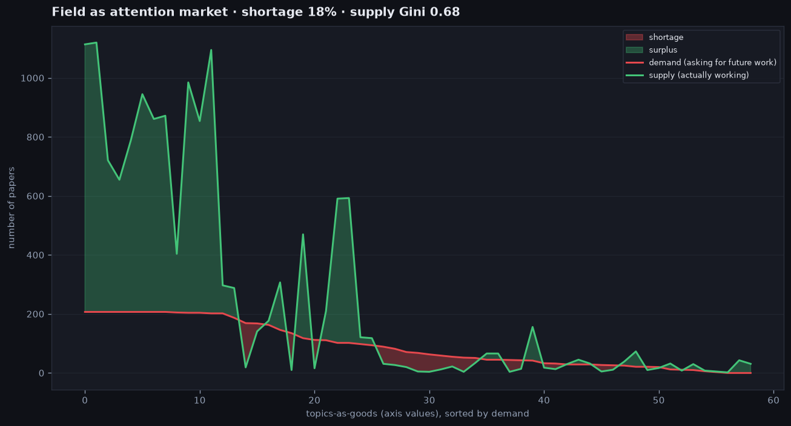

- What the figure shows: each map axis value (for example, `MODELS:multi`) is a "good". Its demand is how many papers ASK for future work there, supply is how many actually WORK there. Goods are sorted by demand; the red fill — unmet demand (shortage), the green — surplus. This is a view of the field as a market: where demand for future work outruns supply.
- Goods (axis values): 57; total demand 5507, supply 1989; unmet demand 3519 (**shortage index 64%** = share of demand without supply).
- Concentration of work: **supply Gini 0.67** (0 — work spread evenly across themes, 1 — all in one), **HHI 0.052** (Herfindahl index of supply shares). High values = work pulled toward a few themes.
- Work is most lacking in "LOCUS:cone-subspace": demand 169, but only 7 work there (shortage 162).

## What stands out (individual records)

- **Papers.**
  - most cited: [`P01` Universal and Transferable Adversarial Attacks (GCG)](https://arxiv.org/pdf/2307.15043) — 3250 citations (2023)
  - citation anti-record: [`P93` Metis: Self-Evolving Metacognitive Jailbreak](https://arxiv.org/pdf/2605.10067) — only 0 citations (2026)
  - old but still key: [`P01` Universal and Transferable Adversarial Attacks (GCG)](https://arxiv.org/pdf/2307.15043) — 3250 citations, age 35 months
  - most "weighty" by the composite importance score: [`P88` Persona Vectors: Monitoring & Controlling Traits](https://arxiv.org/pdf/2507.21509) — score 2.10 (the score = the paper's freshness plus the contribution of its citedness — the percentile among age peers, i.e. what share of peers are cited less than it; the fresher and more cited, the higher the score, so an old, lightly-cited work lands near the lower bound, while a fresh, most-cited one gets the field's highest score; this work's age is 11 months — "from 4 months to a year" — and 234 citations, which together give 2.10)
  - freshest landmark work: [`P03` Improved Optimization-Based Jailbreaking (I-GCG)](https://arxiv.org/pdf/2405.21018) — age 25 months
- **Areas (map axes).**
  - most asked-for area "Models / families: multi" (total demand 207 request papers)
  - most work in the area "non-unique-direction: no" (145 articles)
  - demand without supply: "evaluation-chain stage: weights" is asked for by 98, yet only 2 articles work there
  - worked on but no longer asked for: "modality: code" — 1 article, and zero requests for future work
- **Map points (cells).**
  - the point most often asked to extend further: RQ18: Transfer of safety geometry across modality (text… | refusal vector for other safety dimensions; auto-… — 5 requests for extension converge on it
  - there are no fully answered points (0 open sub-questions) that are still asked to extend — the field asks to extend only points that still have open sub-questions
- **Request themes (F).**
  - most requested theme: `F1` cross-model transfer — asked for by 21 articles
  - theme touching the most map points: `F1` cross-model transfer — 23 target points (map cells the theme asks to close)
  - least requested theme: `F19` boundary data — asked for by only 2 articles
  - most strongly "solved on paper": `F20` steering reliability — claimed done, but open-ness 3.1 of 4
  - loudest asked-for but nobody takes it up: `F1` cross-model transfer — demand 21, realizations 0
- **Directions (RQ).**
  - most asked-for direction RQ8: Transfer across models (suffix/dir/feature/neuron) (total demand 129 articles)
  - the most abandoned themes are under the direction RQ10: Attacks stronger than GCG — 9 themes "nobody does it"
  - most empty points: RQ12: Shallow vs deep alignment — 100% empty (1 point); most worked-out: RQ16: Predict-control: a feature predicts but does not control — 0% empty
