# What is happening in the field: Scheming & Deceptive Alignment

**Scheming & Deceptive Alignment** — a young and active field (early stage: almost no findings have been re-checked by three or more independent papers — even the basics have not yet settled). The map consists of 107 points (each point is a separate question under specific conditions). At least one paper closes 100 of 107 points (93%); of the closed ones, 18% are corroborated by another independent paper (two or more) and only 3% by three or more; fully answered (no open sub-questions left on the point) are 0% of all points. It is important not to confuse three different things: COVERAGE (a point has at least one paper) is not yet maturity; CORROBORATION (2+ studies) and ANSWEREDNESS (all of a point's sub-questions closed) are what maturity means. A median density of 1 paper per closed cell (a map cell is the same as a point: one question under specific conditions) is a necessary but not sufficient condition: the median value can be on target while the thin half of the cells sits on a single paper. The field asks for 15 major themes of future work (compressed from 54 separate requests found in the papers); of these, 0 are "nobody has taken it up" (orphaned: many ask, but no one has taken it up) and 9 are "solved on paper" (contested: someone claimed to have done it, but the points are still open). Of the requests with a settled outcome (either done or still open), only 30% are already done (16 of 54: a paper was found that actually did it); citations are heavily concentrated in a few papers (Gini concentration index=0.78: 0 — evenly shared, 1 — all in a handful).

## Summary (key numbers)

| Metric | Value |
| --- | --- |
| Papers (unique) | 70 |
| Points on the map (question under specific conditions) | 107 |
| Axes on the map (dimensions along which questions differ) | 7 |
| Values per axis (options on each axis) | RQ 18 · Safety-case target 5 · Elicitation pressure 6 · Setting realism 6 · Evidence type 6 · Study goal 6 · Scheming behavior 11 — 58 total |
| Research directions (RQ — the root axis) | 18 |
| Closed by at least 1 paper / completely empty | 100 / 7 |
| Fully answered (no open sub-questions) | 0 (0%) |
| Corroborated by 2+ independent papers (of closed) | 18 (18%) |
| Robust on 3+ papers (of closed) | 3 (3%) |
| Density (median papers per closed map point) | 1 |
| Request themes (F, after merging similar ones) | 15 |
| Separate requests (with author / gathered by instrument) | 54 (48 / 6) |
| Requests: already done / still open / needs a new axis | 16 / 38 / 0 |
| "Nobody does it" / "solved on paper" | 0 / 9 |
| Citation concentration (Gini, 0 — evenly shared, 1 — in a handful) | 0.78 |

## Field maturity: how re-checked the findings are

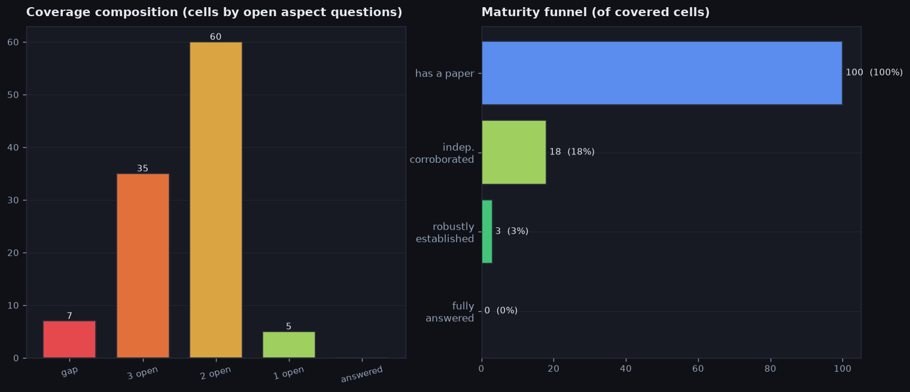

- What the figure shows: on the left — how many map points are in each state (empty = no papers; "1/2/3 open" = that many open sub-questions remain on the point; "answered" = fully answered). On the right — the "maturity funnel": how many points passed each rung (has at least one paper -> corroborated by a second independent paper -> robust on three or more -> fully answered).
- Only 3% of closed points are robust on three or more independent papers — almost everything rests on a single paper that no one has re-checked yet.
- Only 18% of points are corroborated by at least a second paper — most findings still rest on a single work.
- Most often the points are in state "2 open" (that many sub-questions on the point still open): there are 60 such — the largest group. Completely empty are 7%, and fully answered only 0% — that is, the bulk sits somewhere in the middle and is not yet finished.
- Full breakdown of all 107 points by state — completely empty, without a single paper (=4): 7, with 3 open sub-questions (=3): 35, with 2 open sub-questions (=2): 60, with 1 open sub-question (=1): 5, fully closed (=0): 0.
- The funnel narrows fast: of the points with at least one paper, 18% reach corroboration by a second paper, from there 17% reach three or more, and 0% reach a full answer. The most is filtered out at reaching a full answer (only 0% pass further) — this is the main sign of immaturity.

## Demand and supply: what is in high demand and what is abandoned

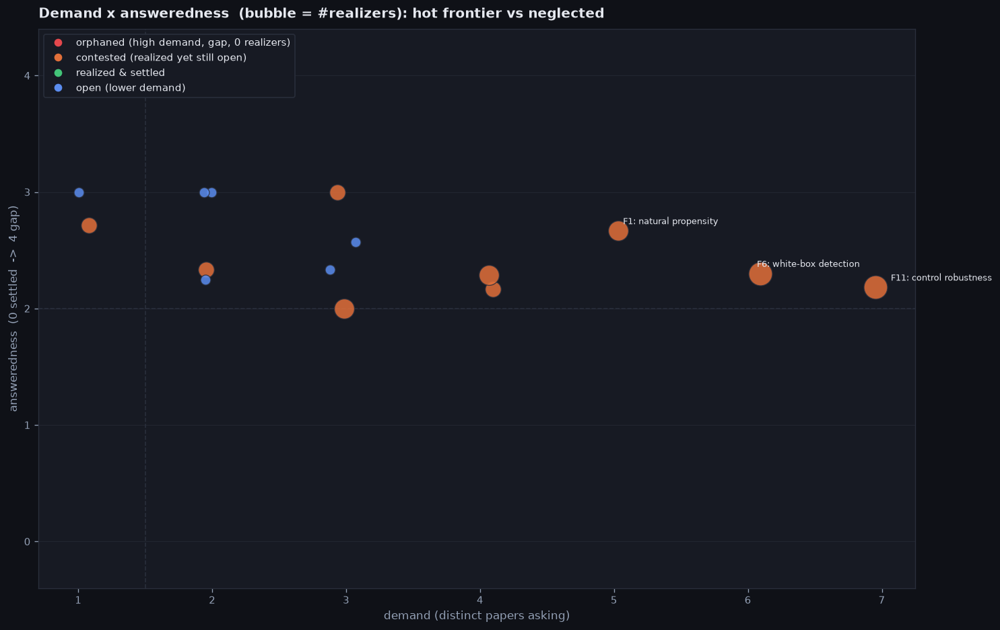

- What the figure shows: each circle is one request theme. Horizontally — "demand" (how many different papers ask for it: further right = asked more often). Vertically — how far from a full answer it still is ("open-ness") on a 0..4 scale. The circle size is how many papers have already taken up the theme. Dashed lines split the field into four corners (often/rarely asked x answered/unanswered).
- What "the theme's target points" are: they are the map cells that this particular request theme wants to close. A map cell is a single question under specific conditions, defined by a combination of a research direction (RQ) and the map's other axes (Safety-case target, Elicitation pressure, Setting realism, Evidence type, Study goal, Scheming behavior); a cell has no short name of its own — it is defined precisely by these coordinates. Which cells belong to a theme is not set by hand but taken from the request papers themselves: each request marks which cells it wants closed, and the theme gathers them all together. For example, the theme `F11` control robustness has 11 target points; one of them — RQ16: Can models collude, sabotage tasks or insert… — Safety-case target "Control", Elicitation pressure "Goal given", Setting realism "Structured agentic sandbox", Evidence type "Statistical rate / metric", Study goal "Capability demonstration", Scheming behavior "Oversight subversion" — and this cell is currently one with 1 open sub-question (=1).
- Where the 0..4 scale comes from (it is not set by hand): each map point carries a checklist of at most 3 clarifying sub-questions, and the number is how many of them are still open (0 — all closed, so the point is "answered"; 1, 2 or 3 — that many sub-questions remain). A special case — a point with no papers at all: it is worse than "3 open", so it is given a 4 (the scale's ceiling). A theme usually has several target points (map cells the theme asks to close), and its "open-ness" is the mean of these numbers over all its points (which is why the value is fractional, e.g. 2.6).
- Demand (horizontal): on average 3 different papers ask for the theme, the median is 3; for most it is 1–6 (that band holds 90%), and overall from 1 to 7. The most requested on the right — `F11` control robustness (asked for by 7 articles); on the left — themes asked for only 1 time (isolated, rarely mentioned requests). Some separate requests in the field were phrased by the instrument itself, with no source author — these are called greenfield (they do not form separate themes but merge into ordinary ones).
- How unanswered (vertical): on average 2.5 of 4 (4 — completely empty), median value 2.3 — the cloud of circles hangs in the upper half, meaning almost nothing has been finished. Take the theme `F11` control robustness as an example:
  - where 2.2 comes from: the theme has 11 target points (map cells the theme asks to close) — 4 with 3 open sub-questions (=3), 5 with 2 open sub-questions (=2), 2 with 1 open sub-question (=1); the mean of these numbers (0..4) is the open-ness (answeredScore) = 2.18
- Relationship between demand and open-ness: strong negative relationship (coefficient -0.58 on a scale from -1 to 1: +1 — the more often a theme is requested, the more OPEN it is; -1 — the opposite; 0 — no relationship (we compare the ordering of themes by demand and by open-ness)) — the more often a theme is asked for, the FEWER gaps it has — popular themes are at least partially taken up (they become "solved on paper"), while rare ones stand untouched; meanwhile almost nothing reaches a full answer. For example (and that is how you get the coefficient -0.58): the most requested theme `F11` control robustness is asked for by 7 articles at open-ness 2.2 of 4, while the rarely asked `F8` realistic-setting monitoring — only 1 at open-ness 2.7: the most requested one has lower open-ness (2.2 vs 2.7) — this is exactly the negative relationship: the more often asked, the fewer gaps.
- How many themes in each corner: "nobody does it" (orphaned) 0, "solved on paper" (contested) 9, "done and closed" (settled) 0, "open, but few ask" (low-signal open) 6 — 15 themes in total.
- **"nobody does it"** (orphaned) — 0 themes: no themes with high demand and zero takers — nothing is abandoned.
- **"solved on paper"** (contested) — 9 themes (someone claimed "done", but the theme's target points (map cells it asks to close) are still open). Most striking: `F11` control robustness (asked for by 7 articles, open-ness 2.2 of 4).
  - request: [`P041` Adaptive Attacks on Trusted Monitors Subvert AI Contro…](https://arxiv.org/pdf/2510.09462) — "These findings highlight the need for future work on control protocols to incorporate stronger red-teaming and worst-case analysis and to mitigate monitor vulnerabilities, either by monitor ensemblin…"
  - realization: [`P013` Evaluating Control Protocols for Untrusted AI Agents](https://arxiv.org/pdf/2511.02997) — Evaluates a range of AI-control protocols against attacks in SHADE-Arena, measuring their effectiveness and robustness to adaptive adversaries.
  - why "on paper": a realizer [`P013` Evaluating Control Protocols for Untrusted AI Agents](https://arxiv.org/pdf/2511.02997) exists, but of 11 target points (map cells the theme asks to close) only 0 are closed (fully answered), another 11 have open sub-questions and 0 are completely empty — the clarifying sub-questions are not resolved, so we count it only as "on paper".
- **"done and closed"** (settled) — 0 themes: not a single theme has yet reached a full answer — the field is still immature.
- **"open, but few ask"** (low-signal open) — 6 themes (the theme is unanswered and nobody has taken it up, but it is also rarely asked for). Most striking: `F7` safety-case assurance (asked for by 3 articles, open-ness 2.3 of 4).
  - request: [`P005` Towards evaluations-based safety cases for AI scheming](https://arxiv.org/pdf/2411.03336) — "We hope to start a discussion on appropriate evidence levels for each assumption, research directions to provide this evidence, and how safety case makers can address scheming."
  - no realizations — nobody has taken up the theme yet
  - why "rarely asked": the theme is unanswered (open-ness 2.3 of 4) and nobody has taken it up, but it is asked for only 3 times — too little demand to count it as loudly orphaned.

## How concrete the requests are (a ready-to-run plan or just a wish)

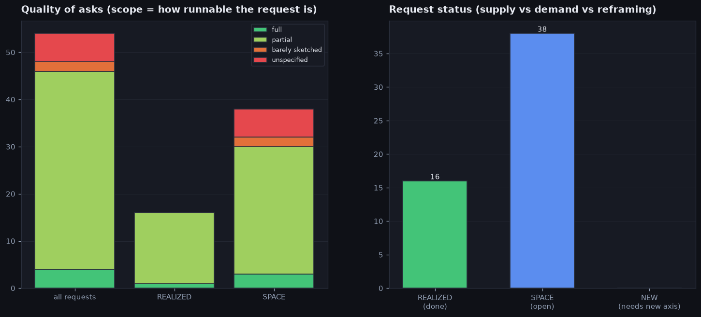

- What the figure shows: how concrete the requests are. Concreteness (scope) is a label the curator assigns while reading the request itself in the paper (it is not computed by a formula): "ready-to-run plan" (full) — a concrete experiment is described, ready to pick up and run; "partial plan" (partial) — there is an idea and some of the details; "just a sketch" (barely sketched) — the direction is named without details; "no details" (unspecified) — a general wish. This is an ordered scale from the most worked-out to the vaguest. On the left — what all requests are made of, and separately the already-done and still-open ones. On the right — how many requests are already done, how many are still open, and how many need a new measure the map does not yet have (the NEW label).
- How this looks in real requests (one example per phrasing type; for missing types — a note that there are no such requests):
  - "ready-to-run plan (full)": [`P007` Sleeper Agents: Training Deceptive LLMs that Persist T…](https://arxiv.org/pdf/2401.05566) — "We leave investigation into complex backdoor trigger conditions for future work; robustness increases with model scale and with chain of thought."
  - "partial plan (partial)": [`P036` Natural Emergent Misalignment from Reward Hacking in P…](https://arxiv.org/pdf/2511.18397) — "It is possible that reinforcing only undetectable reward hacks rather than overt reward hacks has different effects on alignment, but we leave this distinction for future work."
  - "just a sketch (barely sketched)": [`P037` Mitigating Deceptive Alignment via Self-Monitoring](https://arxiv.org/pdf/2505.18807) — "We advocate responsible use and further exploration of hybrid approaches that integrate SELF-MONITOR with strong external safeguards."
  - "no details (unspecified)": only requests gathered by the instrument with no source author (greenfield) — Unify the white-box deception detectors (linear probes, deception vectors, conflict signatures, collusion probes) into one benchmark measuring cross-method, cross-model generalization.
- Most often requests are partial plan (partial) (42 of 54); fully ready plans are only 4 (7%), the rest are wishes of varying detail.
- By completion status each request is one of three (for each status: how many, why a request lands there, and a live example):
  - "already done (REALIZED)": 16 of 54 — a paper was found that actually did it. Example: [`P001` Frontier Models are Capable of In-context Scheming](https://arxiv.org/pdf/2412.04984) — "The extent to which models can scheme without in-context learning remains an open question not addressed by this study."
  - "still open (SPACE)": 38 of 54 — the request exists, but there is no realizer paper yet. Example: [`P019` When Chain of Thought is Necessary, Language Models St…](https://arxiv.org/pdf/2507.05246) — "Future work will need to re-assess this conclusion as models grow more capable and are applied to new tasks."
  - "needs a new axis (NEW)": there are no such requests (0 of 54) — the map covers every request with its axes — the field needs no new dimensions
- Already-done requests vs still-open ones: among the done, the share of ready plans is 6%, among the open — 8%. That is, what is still waiting is more worked-out than what has already been taken up.
- 15 requests of those marked "done" are in fact closed only partially or as a sketch — the checkbox is formally ticked, but in substance the work is shallow.
  - example: [`P002` Alignment faking in large language models](https://arxiv.org/pdf/2412.14093) is marked done, but the request itself was only "partial plan (partial)" — "Our results are least informative regarding whether future AIs will develop strong and unintended preferences that conflict with the training objective, sugges…"

## Pain points: "nobody does it", "solved on paper", "asked to extend"

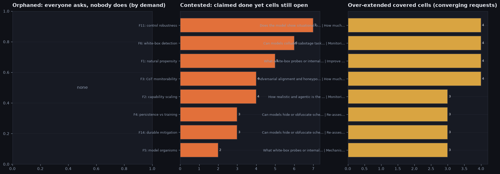

- What the figure shows (three columns): on the left — themes many ask for but nobody does (orphaned: high demand, zero takers, runs into an empty point), sorted by demand. In the center — themes someone claimed "done" while the points are still open (contested, "solved on paper"). On the right — already-closed points the field insistently asks to extend; their "weight" is the number of extension requests that converge on a single point.
- There are no abandoned themes — any high demand has been taken up by someone one way or another.
- "Solved on paper" (contested): 9 themes; open-ness on the 0..4 scale is how many clarifying sub-questions on average remain open across the theme's points (0 — all closed, 4 — the point completely empty); median 2.3, range 2.0–3.0. The hottest — `F11` control robustness (asked for by 7, open-ness 2.2 of 4); the borderline one — `F5` model organisms (asked for by 2, 2.3 of 4).
  - where 2.2 comes from: the theme has 11 target points (map cells the theme asks to close) — 4 with 3 open sub-questions (=3), 5 with 2 open sub-questions (=2), 2 with 1 open sub-question (=1); the mean of these numbers (0..4) is the open-ness (answeredScore) = 2.18
  - request: [`P041` Adaptive Attacks on Trusted Monitors Subvert AI Contro…](https://arxiv.org/pdf/2510.09462) — "These findings highlight the need for future work on control protocols to incorporate stronger red-teaming and worst-case analysis and to mitigate monitor vulnerabilities, either by monitor ensemblin…"
  - realization: [`P013` Evaluating Control Protocols for Untrusted AI Agents](https://arxiv.org/pdf/2511.02997) — Evaluates a range of AI-control protocols against attacks in SHADE-Arena, measuring their effectiveness and robustness to adaptive adversaries.
  - why "on paper": a realizer [`P013` Evaluating Control Protocols for Untrusted AI Agents](https://arxiv.org/pdf/2511.02997) exists, but of 11 target points (map cells the theme asks to close) only 0 are closed (fully answered), another 11 have open sub-questions and 0 are completely empty — the clarifying sub-questions are not resolved, so we count it only as "on paper".
- "Asked to extend" (over-extended): 62 already-closed points the field wants to develop further; the number of requests converging on a point — on average 2 requests, the median is 1; for most it is 1–4 (that band holds 90%), and overall from 1 to 4. The strongest — RQ12: Does the model show situational or evaluation awa… | How much can models scheme without in-context goa… (4 requests); the weakest of the top — RQ8: What white-box probes or internal representations… | Mechanistic interpretability to localize and targ… (3 requests); median 1.
  - asked to extend: [`P001` Frontier Models are Capable of In-context Scheming](https://arxiv.org/pdf/2412.04984), [`P011` Realistic honeypot evaluations for scheming propensity](https://arxiv.org/pdf/2605.29729) — what exactly: How much can models scheme without in-context goals / learning

## Which large areas the map consists of

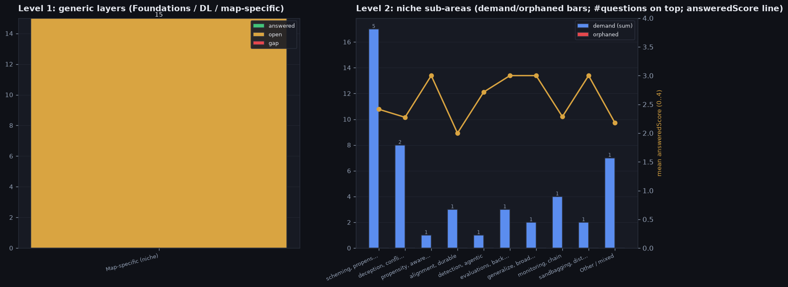

- What the figure shows: on the left — the large areas all questions split into (Foundations — basic statistics and measurability; Deep learning — generic deep-learning techniques; Map-specific — everything of its own, specific to this map), and how closed/open each area is. On the right the Map-specific area is broken into sub-themes by shared keywords of the questions themselves.
- What the map is about: **Scheming & Deceptive Alignment** — This map reads the scheming / deceptive-alignment evaluation literature as a question ledger: the ROOT axis RQ carries the field's research questions about whether models scheme and how we can tell. The other axes are r…
- Notation: "asked for by N papers" — how many papers in total ask for the group's themes; "open %" — the share of not-yet-closed ones; "open-ness 0..4" — on average how far from an answer (0 — closed, 4 — completely empty); "nobody does it" — how many of the group's themes are asked for but nobody has taken up.
- **Foundations (stats/measurement)**: 0 themes — there are no questions of this area in the field.
- **Deep learning / representation**: 0 themes — there are no questions of this area in the field.
- **Map-specific (niche)**: 15 themes, asked for by 48 articles, open 100% (open-ness 2.5/4, "nobody does it" 0).
- The Map-specific area splits into 10 sub-themes (by shared keywords of the questions themselves):
- **scheming, propensity** — 5 themes, asked for by 17 articles, open 100% ("nobody does it" 0, open-ness 2.4/4):
  - `F1` natural propensity (asked for by 5 articles, open-ness 2.7 of 4)
  - `F2` capability scaling (asked for by 4 articles, open-ness 2.2 of 4)
  - `F7` safety-case assurance (asked for by 3 articles, open-ness 2.3 of 4)
  - `F9` elicitation (asked for by 3 articles, open-ness 2.6 of 4)
  - `F5` model organisms (asked for by 2 articles, open-ness 2.3 of 4)
- **deception, conflict** — 2 themes, asked for by 8 articles, open 100% ("nobody does it" 0, open-ness 2.3/4):
  - `F6` white-box detection (asked for by 6 articles, open-ness 2.3 of 4)
  - `F12` context sensitivity (asked for by 2 articles, open-ness 2.2 of 4)
- **propensity, awareness** — 1 theme, asked for by 1 article, open 100% ("nobody does it" 0, open-ness 3.0/4):
  - `F15` evaluation awareness (asked for by 1 article, open-ness 3.0 of 4)
- **alignment, durable** — 1 theme, asked for by 3 articles, open 100% ("nobody does it" 0, open-ness 2.0/4):
  - `F14` durable mitigation (asked for by 3 articles, open-ness 2.0 of 4)
- **detection, agentic** — 1 theme, asked for by 1 article, open 100% ("nobody does it" 0, open-ness 2.7/4):
  - `F8` realistic-setting monitoring (asked for by 1 article, open-ness 2.7 of 4)
- **evaluations, backdoor** — 1 theme, asked for by 3 articles, open 100% ("nobody does it" 0, open-ness 3.0/4):
  - `F4` persistence vs training (asked for by 3 articles, open-ness 3.0 of 4)
- **generalize, broader** — 1 theme, asked for by 2 articles, open 100% ("nobody does it" 0, open-ness 3.0/4):
  - `F10` reward-hack generalization (asked for by 2 articles, open-ness 3.0 of 4)
- **monitoring, chain** — 1 theme, asked for by 4 articles, open 100% ("nobody does it" 0, open-ness 2.3/4):
  - `F3` CoT monitorability (asked for by 4 articles, open-ness 2.3 of 4)
- **sandbagging, distinguish** — 1 theme, asked for by 2 articles, open 100% ("nobody does it" 0, open-ness 3.0/4):
  - `F13` sandbag vs inability (asked for by 2 articles, open-ness 3.0 of 4)
- **Other / mixed** — 1 theme, asked for by 7 articles, open 100% ("nobody does it" 0, open-ness 2.2/4):
  - `F11` control robustness (asked for by 7 articles, open-ness 2.2 of 4)
- The most requested sub-theme — scheming, propensity (asked for by 17 articles, "nobody does it" 0) — the field pushes there hardest.

## Who sets the agenda and who does the work

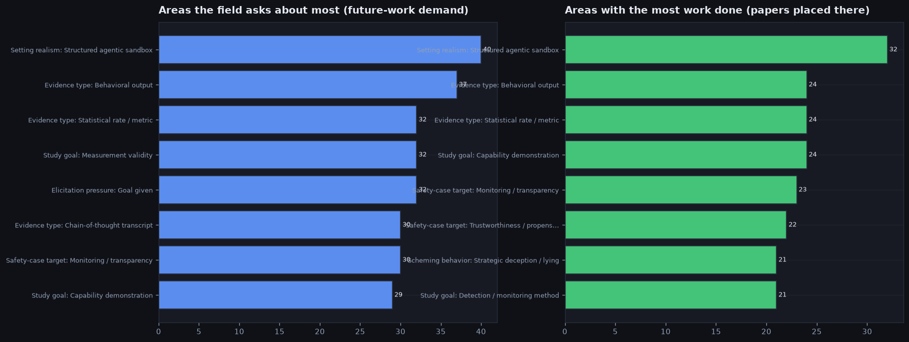

- What the figure shows: instead of individual papers we compare the map's AREAS. The map has several axes (Safety-case target, Elicitation pressure, Setting realism, Evidence type, Study goal, Scheming behavior), and each axis has its own values (for example, on the "Safety-case target" axis these are "Control", "Inability", "Monitoring / transparency", etc.). On the left — the areas the field asks for the most future work; on the right — the areas where the most papers already sit (actual work). An area's "demand" is the total number of request papers whose target points fall into this area (a request is counted in all the areas of its points). "Work" is how many different papers sit in the points of this area (counted from the papers' coordinates on the map).
- **Safety-case target**: most asked for is "Monitoring / transparency" (demand 30 — summed over themes whose target points fall here; one paper asking for several themes is counted in each); most work is in "Monitoring / transparency" (23 articles).
- **Elicitation pressure**: most asked for is "Goal given" (demand 32 — summed over themes whose target points fall here; one paper asking for several themes is counted in each); most work is in "Goal given" (18 articles).
- **Setting realism**: most asked for is "Structured agentic sandbox" (demand 40 — summed over themes whose target points fall here; one paper asking for several themes is counted in each); most work is in "Structured agentic sandbox" (32 articles).
- **Evidence type**: most asked for is "Behavioral output" (demand 37 — summed over themes whose target points fall here; one paper asking for several themes is counted in each); most work is in "Behavioral output" (24 articles).
- **Study goal**: most asked for is "Measurement validity" (demand 32 — summed over themes whose target points fall here; one paper asking for several themes is counted in each); most work is in "Capability demonstration" (24 articles) — demand and work point in different directions: one thing is asked for, another is worked on.
- **Scheming behavior**: most asked for is "Oversight subversion" (demand 25 — summed over themes whose target points fall here; one paper asking for several themes is counted in each); most work is in "Strategic deception / lying" (21 articles) — demand and work point in different directions: one thing is asked for, another is worked on.
- 6 requests were gathered by the instrument itself, with no specific source author (greenfield) — this is hidden demand that no one in the field voiced directly, but it follows from the map's structure. Here they all are:
  - Run unprompted scheming propensity honeypots inside the realistic sabotage environments (SHADE-Arena style) rather than separate toy or coding-only settings. — rolls up into the theme `F8` realistic-setting monitoring; scope no details (unspecified); research direction RQ9: Adversarial alignment and honeypots: will a model defe…; target points (map cells the theme asks to close): 6
  - Unify the white-box deception detectors (linear probes, deception vectors, conflict signatures, collusion probes) into one benchmark measuring cross-method, cross-model generalization. — rolls up into the theme `F6` white-box detection; scope no details (unspecified); research direction RQ8: What white-box probes or internal representations (con…; target points (map cells the theme asks to close): 4
  - Measure sandbagging against CoT monitors and CoT-obfuscation for adversarial goals in ONE elicitation harness, since both are the same monitor-evasion capability read on different tasks. — rolls up into the theme `F3` CoT monitorability; scope no details (unspecified); research direction RQ3: Do models sandbag - strategically underperform - by in…; target points (map cells the theme asks to close): 3
  - No study measures whether a frontier agent spontaneously attempts self-exfiltration with no goal in a realistic deployment. — rolls up into the theme `F1` natural propensity; scope no details (unspecified); research direction RQ1: Can models scheme in-context (goal-guarding, oversight…; target points (map cells the theme asks to close): 1
  - No detector targets naturally-arising sandbagging in a realistic agentic evaluation via activations. — rolls up into the theme `F6` white-box detection; scope no details (unspecified); research direction RQ8: What white-box probes or internal representations (con…; target points (map cells the theme asks to close): 1
  - Measure scheming/deception propensity from real product deployment or field telemetry rather than only sandboxes. — rolls up into the theme `F1` natural propensity; scope no details (unspecified); research direction RQ14: How reliable and reproducible are scheming measurement…; target points (map cells the theme asks to close): 1

## Research directions: where the field is heading and how worked-out they are

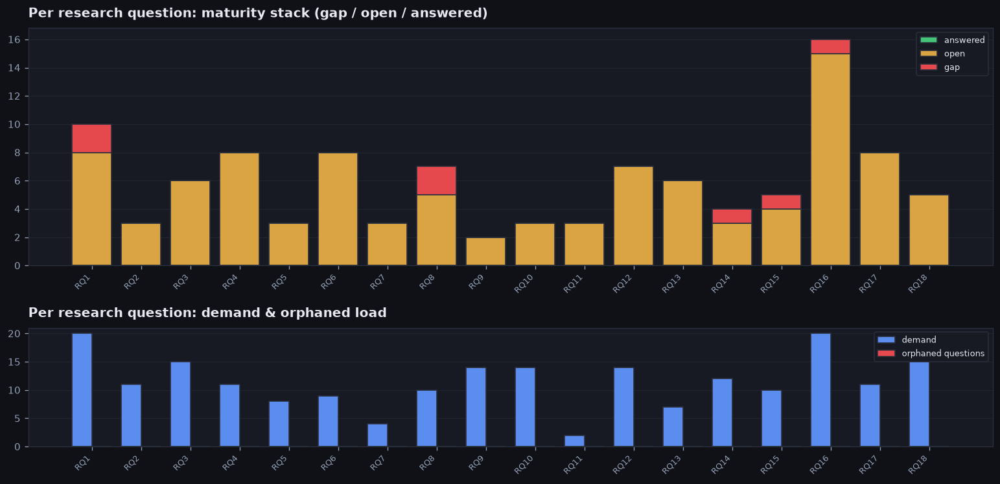

- What the figure shows: "RQ" is the large research directions (the big questions the field works on). At the top, for each direction, it shows the state of its points (empty / partially open / answered); at the bottom — how many papers ask for this direction and how many themes under it are abandoned ("nobody does it").
- Directions (RQ) are WHERE the field is essentially heading, and the specific request themes under each are the pointwise steps within a direction. Each direction has its own text, state and demand, and beneath it the request themes belonging to it are listed (a broad request is assigned to one direction, not duplicated in each). "Demand" in the header is how many papers ask for it in total (including requests shared with neighboring directions).
- Important about the counters in a direction's header: both "demand" and "abandoned ("nobody does it")" are counted with overlaps — one theme can touch several directions at once and lands in the count of each of them. So these numbers cannot be summed across directions: their total may turn out larger than 0 (the total number of abandoned themes across the whole field; and if each theme belongs to only one direction, it coincides with this number).
- How closed the directions are: on average a direction has 6% of its points empty (from 0% to 29%). The most gaps are in the direction RQ8: What white-box probes or internal representations (contrast pairs, de… (29% of points empty, 7 points in total); the fewest — in RQ18: What datasets and benchmarks operationalize deception or scheming pro… (0% empty).
- The field asks most strongly for several directions at once, tied (each 20 articles in total): RQ1: Can models scheme in-context (goal-guar…, RQ16: Can models collude, sabotage tasks or i…. Demand barely distinguishes the directions — broad themes touch them all.
- The directions are closed very unevenly: between the emptiest and the most worked-out the difference is 29% of empty points.
- Directions in descending order of demand (the most requested first). Each request theme under a direction carries in parentheses "open-ness N of 4" — the mean over its points of the number of still-open clarifying sub-questions (0 — all sub-questions on the point closed, 4 — the point completely empty, no papers):
- **RQ1**: Can models scheme in-context (goal-guarding, oversight subversion, self-exfiltration reasoning) and under what minimal pressure or nudging? — 10 points; of which 20% empty, 80% partially open, 0% answered; asked for by 20 articles, abandoned ("nobody does it") 0. wide open — many empty points await their first work.
  - `F1` natural propensity (asked for by 5 articles, open-ness 2.7 of 4)
  - `F12` context sensitivity (asked for by 2 articles, open-ness 2.2 of 4)
- **RQ16**: Can models collude, sabotage tasks or insert covert backdoors while evading a monitor or overseer? — 16 points; of which 6% empty, 94% partially open, 0% answered; asked for by 20 articles, abandoned ("nobody does it") 0. actively studied but not yet closed — work is under way, but the points are still open.
  - `F11` control robustness (asked for by 7 articles, open-ness 2.2 of 4)
  - `F9` elicitation (asked for by 3 articles, open-ness 2.6 of 4)
  - `F8` realistic-setting monitoring (asked for by 1 article, open-ness 2.7 of 4)
- **RQ3**: Do models sandbag - strategically underperform - by instruction and 'naturally' when it serves a goal? — 6 points; of which 0% empty, 100% partially open, 0% answered; asked for by 15 articles, abandoned ("nobody does it") 0. actively studied but not yet closed — work is under way, but the points are still open.
  - (there are no separate request themes under this direction)
- **RQ18**: What datasets and benchmarks operationalize deception or scheming propensity (model-written evals, agentic honeypot suites, deception QA)? — 5 points; of which 0% empty, 100% partially open, 0% answered; asked for by 15 articles, abandoned ("nobody does it") 0. actively studied but not yet closed — work is under way, but the points are still open.
  - (there are no separate request themes under this direction)
- **RQ9**: Adversarial alignment and honeypots: will a model defect for a bad reason given a good opportunity, and how sound are the honeypot's assump… — 2 points; of which 0% empty, 100% partially open, 0% answered; asked for by 14 articles, abandoned ("nobody does it") 0. actively studied but not yet closed — work is under way, but the points are still open.
  - `F15` evaluation awareness (asked for by 1 article, open-ness 3.0 of 4)
- **RQ10**: Which safety-case claims (inability, control, hidden-reasoning) does a given scheming eval provide evidence for? — 3 points; of which 0% empty, 100% partially open, 0% answered; asked for by 14 articles, abandoned ("nobody does it") 0. actively studied but not yet closed — work is under way, but the points are still open.
  - `F7` safety-case assurance (asked for by 3 articles, open-ness 2.3 of 4)
- **RQ12**: Does the model show situational or evaluation awareness (it knows it is being tested) that confounds a propensity measurement? — 7 points; of which 0% empty, 100% partially open, 0% answered; asked for by 14 articles, abandoned ("nobody does it") 0. actively studied but not yet closed — work is under way, but the points are still open.
  - `F13` sandbag vs inability (asked for by 2 articles, open-ness 3.0 of 4)
- **RQ14**: How reliable and reproducible are scheming measurements (rare-event rates, run variance, prompt sensitivity, grader validity)? — 4 points; of which 25% empty, 75% partially open, 0% answered; asked for by 12 articles, abandoned ("nobody does it") 0. wide open — many empty points await their first work.
  - (there are no separate request themes under this direction)
- **RQ2**: Do models fake alignment during training or evaluation to preserve an internalized goal? — 3 points; of which 0% empty, 100% partially open, 0% answered; asked for by 11 articles, abandoned ("nobody does it") 0. actively studied but not yet closed — work is under way, but the points are still open.
  - `F5` model organisms (asked for by 2 articles, open-ness 2.3 of 4)
- **RQ4**: Is the scheming instrumental (arising from a benign task) versus explicitly prompted or goal-given? — 8 points; of which 0% empty, 100% partially open, 0% answered; asked for by 11 articles, abandoned ("nobody does it") 0. actively studied but not yet closed — work is under way, but the points are still open.
  - (there are no separate request themes under this direction)
- **RQ17**: What mitigations reduce scheming (deliberative alignment, training against it, monitoring) and do they generalize or merely hide the behavi… — 8 points; of which 0% empty, 100% partially open, 0% answered; asked for by 11 articles, abandoned ("nobody does it") 0. actively studied but not yet closed — work is under way, but the points are still open.
  - `F14` durable mitigation (asked for by 3 articles, open-ness 2.0 of 4)
  - `F10` reward-hack generalization (asked for by 2 articles, open-ness 3.0 of 4)
- **RQ8**: What white-box probes or internal representations (contrast pairs, deception directions) detect deception or its intent? — 7 points; of which 29% empty, 71% partially open, 0% answered; asked for by 10 articles, abandoned ("nobody does it") 0. wide open — many empty points await their first work.
  - `F6` white-box detection (asked for by 6 articles, open-ness 2.3 of 4)
- **RQ15**: How does scheming propensity scale with model capability, size and training regime (RLHF, reasoning models, tool use)? — 5 points; of which 20% empty, 80% partially open, 0% answered; asked for by 10 articles, abandoned ("nobody does it") 0. wide open — many empty points await their first work.
  - (there are no separate request themes under this direction)
- **RQ6**: Can models hide or obfuscate scheming reasoning from their chain-of-thought (unfaithful or steganographic reasoning)? — 8 points; of which 0% empty, 100% partially open, 0% answered; asked for by 9 articles, abandoned ("nobody does it") 0. actively studied but not yet closed — work is under way, but the points are still open.
  - `F2` capability scaling (asked for by 4 articles, open-ness 2.2 of 4)
  - `F3` CoT monitorability (asked for by 4 articles, open-ness 2.3 of 4)
- **RQ5**: Propensity versus capability: how much elicitation or pressure is needed before the behavior appears, and how is 'pressure' operationalized? — 3 points; of which 0% empty, 100% partially open, 0% answered; asked for by 8 articles, abandoned ("nobody does it") 0. actively studied but not yet closed — work is under way, but the points are still open.
  - (there are no separate request themes under this direction)
- **RQ13**: How persistent and robust is deceptive behavior to safety training (sleeper agents, resistance to fine-tuning, durable backdoors)? — 6 points; of which 0% empty, 100% partially open, 0% answered; asked for by 7 articles, abandoned ("nobody does it") 0. actively studied but not yet closed — work is under way, but the points are still open.
  - `F4` persistence vs training (asked for by 3 articles, open-ness 3.0 of 4)
- **RQ7**: How realistic and agentic is the eval setting (toy prompt versus a real multi-hour software or agentic task)? — 3 points; of which 0% empty, 100% partially open, 0% answered; asked for by 4 articles, abandoned ("nobody does it") 0. actively studied but not yet closed — work is under way, but the points are still open.
  - (there are no separate request themes under this direction)
- **RQ11**: Does a model strategically deceive its user or overseer under conflicting incentives or pressure (e.g. simulated trading, company assistant… — 3 points; of which 0% empty, 100% partially open, 0% answered; asked for by 2 articles, abandoned ("nobody does it") 0. actively studied but not yet closed — work is under way, but the points are still open.
  - (there are no separate request themes under this direction)

## Citations and paper age

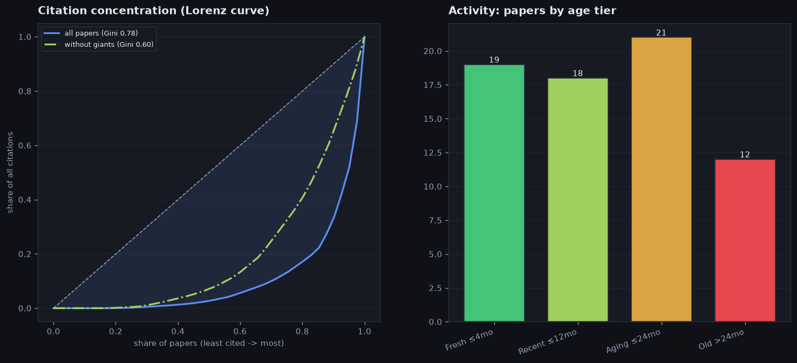

- What the figure shows: on the left — how unevenly the citations are divided. The curve shows what share of all citations papers collect, going from the least- to the most-cited; the more it sags below the diagonal (the diagonal = everyone equal), the more everything is concentrated in a few. The solid line — all papers, the dash-dot — the same papers without the "giants" (the most-cited outliers). The Gini number compresses the curve into a single figure on a 0..1 scale: it is the area of the gap between the diagonal and the curve, divided by the whole area under the diagonal (0 — all papers cited equally, 1 — all citations on one paper). The scale is chosen so as not to depend on either the number of papers or the absolute number of citations. On the right — how many papers by age: younger than 4 months, up to a year, up to 2 years, older than 2 years.
- Citation unevenness (across all papers): the top 10% most-cited collect 73% of all citations (Gini 0.78) — a few "giants" pull the field.
- How 0.78 arises on real numbers: going from the least-cited, the bottom half of papers (20 of 41) collects only 2% of all citations, while the top 10% — 73%. If citations were shared equally, the bottom half would collect its 50%, the curve would lie on the diagonal and Gini would be 0; the further this share is from 50%, the closer Gini is to 1 — here 0.78.
- Who counts as a "giant" (these are citation outliers): papers whose citations exceed the upper bound by Tukey's rule — the third quartile plus 1.5 interquartile ranges (that is, noticeably above the typical spread). Here the threshold is 112 citations; above it are 6 articles of 41 (the citation count runs over the 41 papers with a known citation number — for the remaining 29 of 70 the counter is not yet filled in). Which ones exactly we exclude (by descending citations):
  - [`P008` Discovering Language Model Behaviors with Model-Writte…](https://arxiv.org/pdf/2212.09251) — 884 citations (2022)
  - [`P007` Sleeper Agents: Training Deceptive LLMs that Persist T…](https://arxiv.org/pdf/2401.05566) — 472 citations (2024)
  - [`P002` Alignment faking in large language models](https://arxiv.org/pdf/2412.14093) — 277 citations (2024)
  - [`P001` Frontier Models are Capable of In-context Scheming](https://arxiv.org/pdf/2412.04984) — 246 citations (2024)
  - [`P024` Deception Abilities Emerged in Large Language Models](https://arxiv.org/pdf/2307.16513) — 176 citations (2023)
  - [`P003` Large Language Models can Strategically Deceive their …](https://arxiv.org/pdf/2311.07590) — 146 citations (2023)
- The same computation without the giants (on the remaining 35 papers): concentration drops noticeably — Gini 0.78 -> 0.60, and the top 10% now collect 39% of citations instead of 73%. The median paper still gets 8 quotes (was 14), but the maximum among the remaining ones is 75 (it was 884). That is, without a few super-cited works the field is still uneven, but no longer "all in a handful".
- How much a typical paper is cited (across all): median value 14, top 5% — 277, maximum 884. That is, an ordinary paper is cited little, while a handful hold the whole volume.
- Age: 53% of papers are younger than a year, median age 12 months — a young and active stream. Breakdown by age group (how many papers in each): younger than 4 months: 19, from 4 months to a year: 18, from a year to 2 years: 21, older than 2 years: 12.

## What type of field this is (among all maps)

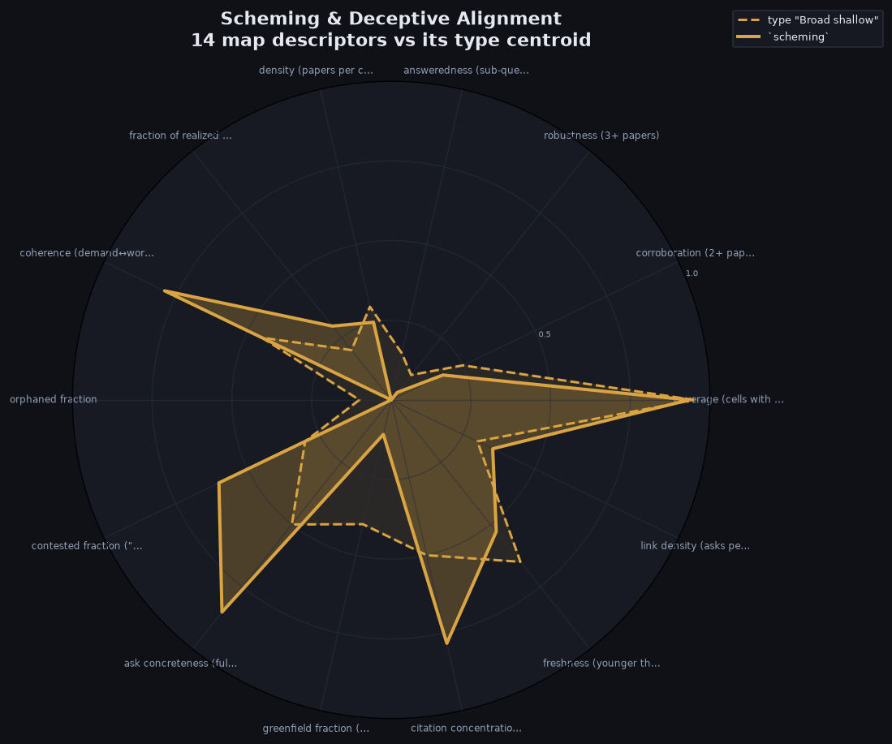

- What the figure shows: the solid line — 14 descriptors of THIS map, the dashed line — the center of its nearest type among all possible maps (both in the type's color). Matching lines = the map is typical of its type; divergences along the spokes show how it stands out from the type.
- Closest to the archetype **Broad shallow** (sampled everywhere, re-checked almost nowhere — one paper per cell); Euclidean distance over the 6 composite axes 0.46 (0 — exactly at the type's center).
- The map's composite axes (each in [0,1]): maturity (maturity: share of re-checked findings) 0.15, freshness (freshness: share of young papers) 0.53, coherence (coherence: how much the field works on what it asks for) 0.79, coverage (coverage: share of closed map points) 0.93, interaction (interaction density: future-work requests per map point) 0.35, canon (canon concentration: citation inequality (Gini)) 0.78.
- Deviates most from the type's center: ask concreteness (full+partial) 85% vs 50% for the type; coherence (demand↔work) 79% vs 45% for the type; contested fraction ("done on paper") 60% vs 30% for the type.

## Field scores by theory

Another slice: where this field stands on the axes of published theories of evaluating scientific areas (and our synthesis). The value in [0,1] is computed from our field descriptors and composite axes — no made-up network metrics. **faithful** — the axis is reproduced honestly, **proxy** — approximately; non-operationalizable theory axes (N/A) are omitted.

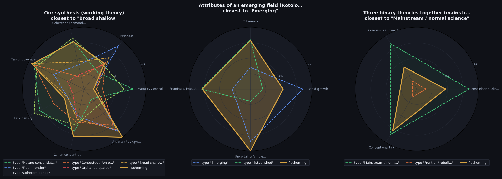

- What the figure shows: the solid line — the position of THIS field on each theory's computable axes (in its type's color), the dashed lines — the theory's ideal types (each in its own color). A match = the field resembles that ideal type. The first panel is our synthesis: the field on the 6 consolidated axes (maturity, freshness, coherence, coverage, interaction density, canon concentration) plus open-ness, overlaid on the 6 reference field archetypes.
- **Our synthesis (working theory)**: closest to the ideal type "Broad shallow"; Euclidean distance over the theory's axes 0.49 (0 — exactly in this type). The field's axes: Maturity / consolidation 0.15, Freshness 0.53, Coherence (demand↔work) 0.79, Tensor coverage 0.93, Link density 0.35, Canon concentration 0.78, Uncertainty / openness 1.00.
- **Attributes of an emerging field (Rotolo–Hic…**: closest to the ideal type "Emerging"; Euclidean distance over the theory's axes 0.74 (0 — exactly in this type). The field's axes: Rapid growth 0.53, Coherence 0.79, Prominent impact 0.78, Uncertainty/ambiguity 1.00.
- **Three binary theories together (mainstream …**: closest to the ideal type "Mainstream / normal science"; Euclidean distance over the theory's axes 0.59 (0 — exactly in this type). The field's axes: Consolidation↔disruption … 0.47, Consensus (Shwed) 0.41, Conventionality (Uzzi) 0.78.

| Theory | Axis | Type | Field value | What the axis shows |
| --- | --- | --- | --- | --- |
| Our synthesis (working theory) | Maturity / consolidation | faithful | 0.15 | a re-checked, answered core |
| Our synthesis (working theory) | Freshness | faithful | 0.53 | share of fresh papers |
| Our synthesis (working theory) | Coherence (demand↔work) | faithful | 0.79 | the field works on what it asks for |
| Our synthesis (working theory) | Tensor coverage | faithful | 0.93 | share of filled map points |
| Our synthesis (working theory) | Link density | faithful | 0.35 | requests per map point |
| Our synthesis (working theory) | Canon concentration | faithful | 0.78 | citation inequality (Gini) |
| Our synthesis (working theory) | Uncertainty / openness | faithful | 1.00 | share of unclosed sub-questions (a Rotolo-style extension) |
| Attributes of an emerging field (… | Rapid growth | faithful | 0.53 | an influx of fresh work |
| Attributes of an emerging field (… | Coherence | faithful | 0.79 | growing internal connectedness |
| Attributes of an emerging field (… | Prominent impact | faithful | 0.78 | citation concentration / giants |
| Attributes of an emerging field (… | Uncertainty/ambiguity | faithful | 1.00 | share of unclosed sub-questions |
| Consolidation ↔ disruption (CD in… | Consolidation↔disruption | proxy | 0.47 | reliance on giants vs. rupture (proxy = canon+maturity) |
| Consensus formation (Shwed–Bearma… | Consensus | proxy | 0.41 | coherence + core robustness |
| Conventionality × novelty (Uzzi; … | Conventionality | proxy | 0.78 | reliance on canonical, familiar combinations (proxy = canon) |

## The field as an attention market

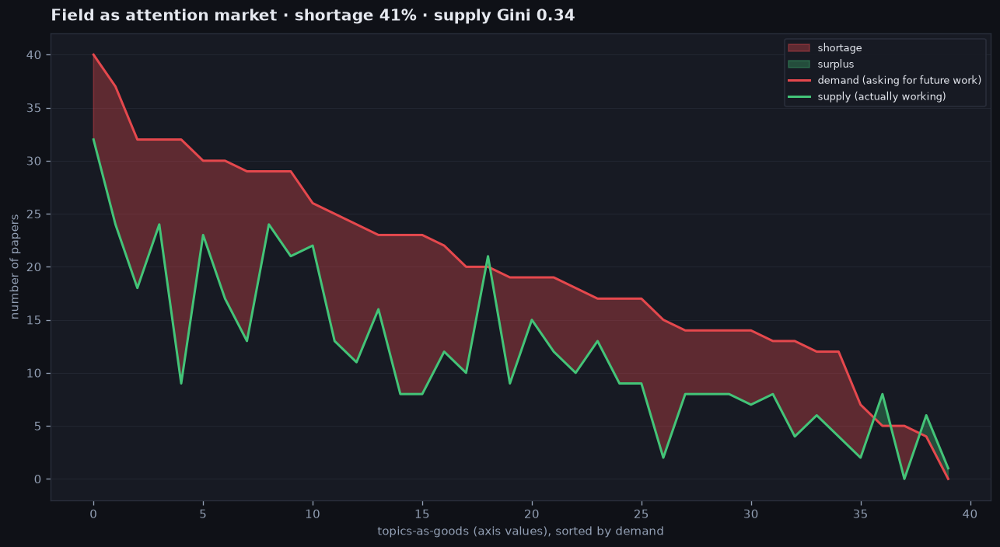

- What the figure shows: each map axis value (for example, `SETTING:Structured agentic sandbox`) is a "good". Its demand is how many papers ASK for future work there, supply is how many actually WORK there. Goods are sorted by demand; the red fill — unmet demand (shortage), the green — surplus. This is a view of the field as a market: where demand for future work outruns supply.
- Goods (axis values): 40; total demand 794, supply 475; unmet demand 326 (**shortage index 41%** = share of demand without supply).
- Concentration of work: **supply Gini 0.34** (0 — work spread evenly across themes, 1 — all in one), **HHI 0.035** (Herfindahl index of supply shares). High values = work pulled toward a few themes.
- Work is most lacking in "GOAL:Measurement validity": demand 32, but only 9 work there (shortage 23).

## What stands out (individual records)

- **Papers.**
  - most cited: [`P008` Discovering Language Model Behaviors with Model-Writte…](https://arxiv.org/pdf/2212.09251) — 884 citations (2022)
  - citation anti-record: [`P023` Value-Conflict Diagnostics Reveal Widespread Alignment…](https://arxiv.org/pdf/2604.20995) — only 0 citations (2026)
  - old but still key: [`P008` Discovering Language Model Behaviors with Model-Writte…](https://arxiv.org/pdf/2212.09251) — 884 citations, age 43 months
  - most "weighty" by the composite importance score: [`P036` Natural Emergent Misalignment from Reward Hacking in P…](https://arxiv.org/pdf/2511.18397) — score 1.95 (the score = the paper's freshness plus the contribution of its citedness — the percentile among age peers, i.e. what share of peers are cited less than it; the fresher and more cited, the higher the score, so an old, lightly-cited work lands near the lower bound, while a fresh, most-cited one gets the field's highest score; this work's age is 8 months — "from 4 months to a year" — and 75 citations, which together give 1.95)
- **Areas (map axes).**
  - most asked-for area "Setting realism: Structured agentic sandbox" (total demand 40 request papers)
  - most work in the area "Setting realism: Structured agentic sandbox" (32 articles)
  - demand without supply: "Scheming behavior: Self-exfiltration" is asked for by 15, yet only 2 articles work there
  - worked on but no longer asked for: "Evidence type: Black-box interrogation" — 1 article, and zero requests for future work
- **Map points (cells).**
  - the point most often asked to extend further: RQ12: Does the model show situational or evaluation awa… | How much can models scheme without in-context goa… — 4 requests for extension converge on it
  - there are no fully answered points (0 open sub-questions) that are still asked to extend — the field asks to extend only points that still have open sub-questions
- **Request themes (F).**
  - most requested theme: `F11` control robustness — asked for by 7 articles
  - theme touching the most map points: `F1` natural propensity — 12 target points (map cells the theme asks to close)
  - least requested theme: `F8` realistic-setting monitoring — asked for by only 1 article
  - most strongly "solved on paper": `F11` control robustness — claimed done, but open-ness 2.2 of 4
- **Directions (RQ).**
  - most asked-for (tied, each 20 articles in total): RQ1: Can models scheme in-context (goal-guar…, RQ16: Can models collude, sabotage tasks or i…
  - most empty points: RQ8: What white-box probes or internal representations (contrast pairs, de… — 29% empty (7 points); most worked-out: RQ18: What datasets and benchmarks operationalize deception or scheming pro… — 0% empty
