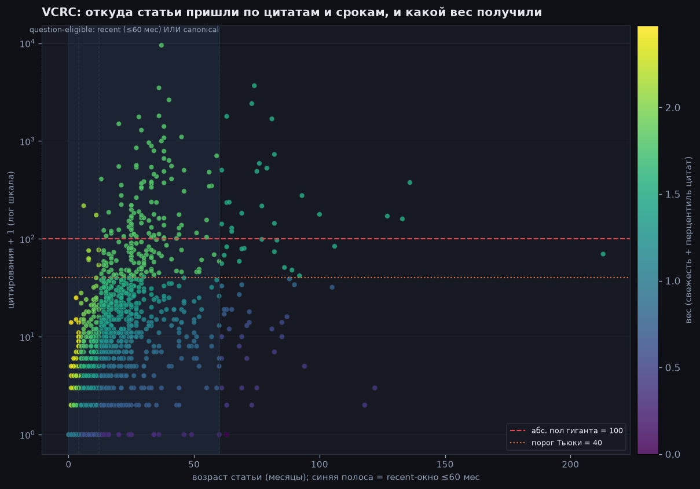
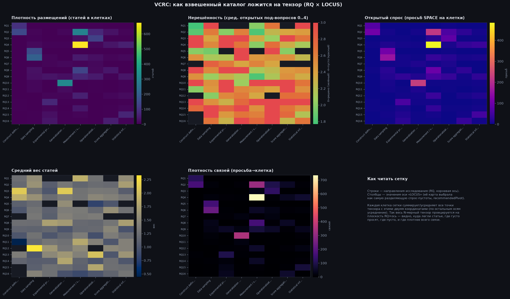
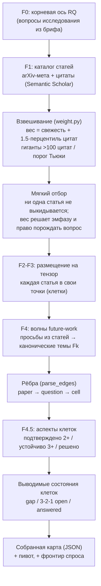

# Как наполняется и строится карта: VCRC

Этот отчёт про МАШИНУ, которая собрала карту, а не про её содержание (для содержания есть `report.md`). Три шага: как статья зарабатывает ВЕС по свежести и цитатам; как взвешенный каталог ЛОЖИТСЯ на тензор (сетки-хитмапы); и общий конвейер сборки. Отбор в каталог — мягкий: ни одна статья не выкидывается по весу или возрасту, вес влияет лишь на эмфазу (размер/цвет узла) и на право статьи ПОРОЖДАТЬ вопрос будущей работы.

Якорь сборки (as_of): 2026-07. Статей в каталоге: 1702; точек на карте: 1495; закрыто ≥1 статьёй: 1492. Просьб будущей работы: 1834. «Гигантов» по цитатам: 226 (порог Тьюки 40 цитат, абсолютный пол 100).

## Инструмент взвешивания и фильтрации

- Что на картинке: слева — вклад СВЕЖЕСТИ как ступень от возраста статьи в месяцах (≤4 мес → 1.0, ≤12 мес → 0.6, ≤60 мес → 0.3, старше → 0); справа — итоговый вес = свежесть + 1.5·перцентиль цитирования, по одной линии на каждую ступень свежести.
- Перцентиль цитирования — это доля каталога, у кого цитат-в-год (age-adjusted) МЕНЬШЕ, чем у этой статьи: [0,1], где 1 — самая цитируемая. Age-adjusted, чтобы старые не набирали фору просто за возраст.
- Множитель канона 1.5 больше максимума свежести 1.0: цитаты ПЕРЕВЕШИВАЮТ свежесть — старая, но сильно цитируемая работа получает высокий вес.
- Гигант (>100 цитат или выше порога Тьюки) и ручной landmark приравниваются к перцентилю 1.0 (эффективный канон) независимо от возраста — их вес садится на верхнюю линию.
- Порог «канона» 0.5: старая статья (старше 60 мес, у которой свежесть уже 0) порождает вопросы и получает полную эмфазу только если её перцентиль ≥ 0.5; иначе остаётся тусклым узлом в каталоге (её не выкидывают).

## Откуда статьи пришли по цитатам и срокам, и какой вес получили

- Что на картинке: каждая точка — статья; по горизонтали её возраст в месяцах, по вертикали цитирования (+1, лог шкала), цвет — заработанный вес. Синяя полоса — окно «recent» (возраст ≤60 мес). Звёздочки — ручные landmark.
- Две горизонтальные линии — пороги «гиганта»: абсолютный пол 100 цитат (красный пунктир) и относительный порог Тьюки Q3+1.5·IQR = 40 цитат для ЭТОГО каталога (оранжевый пунктир). Выше любой из них — гигант, который обязан сохраниться при пересборке.
- Право статьи порождать вопрос (question-eligible) = recent (в синей полосе) ИЛИ canonical (перцентиль ≥ 0.5). Свежая с 0 цитат всё равно eligible; старая с низкими цитатами — нет.
- Вертикальные пунктиры — границы ступеней свежести (4 / 12 / 60 месяцев).

## Как взвешенный каталог ложится на тензор (RQ × LOCUS)

- Что на картинке: пять сеток-хитмапов. Строки — направления RQ (корневая ось), столбцы — значения оси «LOCUS» (карта сама выбрала её как самую разделяющую спрос-пустоты). Каждая клетка сетки сводит все точки тензора с этими двумя координатами (по остальным осям — усреднение), так весь N-мерный тензор проецируется на плоскость.
- «Плотность размещений» — сколько статей стоит в клетках сетки; «Нерешённость 0..4» — сколько под-вопросов в среднем открыто (0 — всё закрыто, 4 — совсем пусто); «Открытый спрос» — сколько ещё не выполненных просьб (SPACE) целят в клетки; «Средний вес» — насколько тяжёлые (свежие/цитируемые) статьи там сидят; «Плотность связей» — сколько рёбер просьба→клетка приходит.
- Так видно неоднородность области: где густо работают, где громко просят при пустоте, и где плотнее всего взаимодействие участников (связи).

## Полный конвейер сборки

От брифа до собранного JSON. Взвешивание — общий поставщик эмфазы и права порождать вопрос; отбор в каталог остаётся мягким (курируется вручную), а состояния клеток и рёбра выводятся детерминированно.

