# Что происходит в области: VCRC

**VCRC** — область молодая и активная (переходная стадия: надёжно перепроверенное ядро уже есть, но большая часть вопросов ещё открыта). Карта состоит из 1495 точек (каждая точка — это отдельный вопрос в конкретных условиях). Хотя бы одной статьёй закрыто 1492 из 1495 точек (100%); из закрытых 36% подтверждены ещё одной независимой статьёй (две и более) и лишь 21% — тремя и более; полностью решено (по точке не осталось открытых под-вопросов) 0% всех точек. Важно не путать три разные вещи: ПОКРЫТИЕ (в точке есть хоть одна статья) — это ещё не зрелость; ПОДТВЕРЖДЁННОСТЬ (2+ исследования) и РЕШЁННОСТЬ (закрыты все под-вопросы точки) и есть зрелость. Серединная плотность 1 статьи на закрытую клетку (клетка карты — это та же точка: один вопрос в конкретных условиях) — необходимое, но недостаточное условие: серединное значение может быть на цели, пока тонкая половина клеток сидит на одной статье. Поле просит 19 крупных тем для будущей работы (это сжато из 1834 отдельных просьб, найденных в статьях); из них 1 — «никто не делает» (orphaned: многие просят, но за это никто не взялся) и 6 — «решили на словах» (contested: кто-то заявил, что сделал, но точки всё ещё открыты). Из просьб с определившимся исходом (выполнена либо ещё открыта) уже сделана лишь 0% (8 из 1834: нашлась статья, которая это реально сделала); цитирования сильно сосредоточены у немногих статей (индекс концентрации Gini=0.90: 0 — поровну, 1 — всё у единиц).

## Сводка (главные числа)

| Метрика | Значение |
| --- | --- |
| Статей (уникальных) | 1702 |
| Точек на карте (вопрос в конкретных условиях) | 1495 |
| Осей на карте (измерений, по которым различаются вопросы) | 6 |
| Значений по осям (вариантов на каждой оси) | RQ 16 · Validity type 5 · Measurement instrument 6 · evaluation-chain stage 8 · Validity threat 8 · Research subject 8 — всего 51 |
| Направлений исследований (RQ — корневая ось) | 16 |
| Закрыто хотя бы 1 статьёй / совсем пустых | 1492 / 3 |
| Полностью решено (нет открытых под-вопросов) | 3 (0%) |
| Подтверждено 2+ независимыми статьями (из закрытых) | 541 (36%) |
| Устоялось на 3+ статьях (из закрытых) | 310 (21%) |
| Плотность (серединно статей на закрытую клетку) | 1 |
| Тем-просьб (F, после объединения похожих) | 19 |
| Отдельных просьб (с автором / собрано инструментом) | 1834 (1812 / 22) |
| Просьб: уже сделано / ещё открыто / нужна новая ось | 8 / 1826 / 0 |
| «Никто не делает» / «решили на словах» | 1 / 6 |
| Концентрация цитат (Gini, 0 — поровну, 1 — у единиц) | 0.90 |

## Зрелость поля: насколько выводы перепроверены

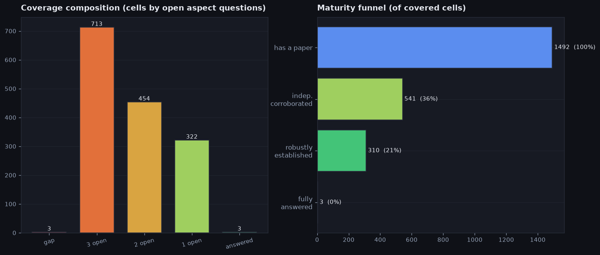

- Что на картинке: слева — сколько точек карты в каком состоянии (пустая = ни одной статьи; «1/2/3 open» = по точке осталось столько-то нерешённых под-вопросов; «answered» = решено полностью). Справа — «воронка зрелости»: сколько точек прошли каждую ступень (есть хотя бы одна статья -> подтверждено второй независимой статьёй -> устоялось на трёх и более -> решено целиком).
- 21% закрытых точек устоялись на трёх и более независимых статьях — есть надёжное ядро, перепроверенное многими.
- Лишь 36% точек подтверждены хотя бы второй статьёй — большинство выводов пока опирается на одну работу.
- Чаще всего точки в состоянии «3 open» (столько под-вопросов по точке ещё открыто): таких 713 — это самая большая группа. Совсем пустых 0%, а решённых до конца лишь 0% — то есть основная масса где-то посередине и пока не доведена до конца.
- Полная разбивка всех 1495 точек по состоянию — совсем пустых, без единой статьи (=4): 3, с 3 открытыми под-вопросами (=3): 713, с 2 открытыми под-вопросами (=2): 454, с 1 открытым под-вопросом (=1): 322, полностью закрытых (=0): 3.
- Воронка быстро сужается: из точек с хотя бы одной статьёй до подтверждения второй статьёй доходит 36%, оттуда до трёх и более — 57%, и до полного решения — 1%. Больше всего отсеивается на доведении до полного решения (дальше проходит лишь 1%) — это и есть главный признак незрелости.

## Спрос и предложение: что нарасхват, а что заброшено

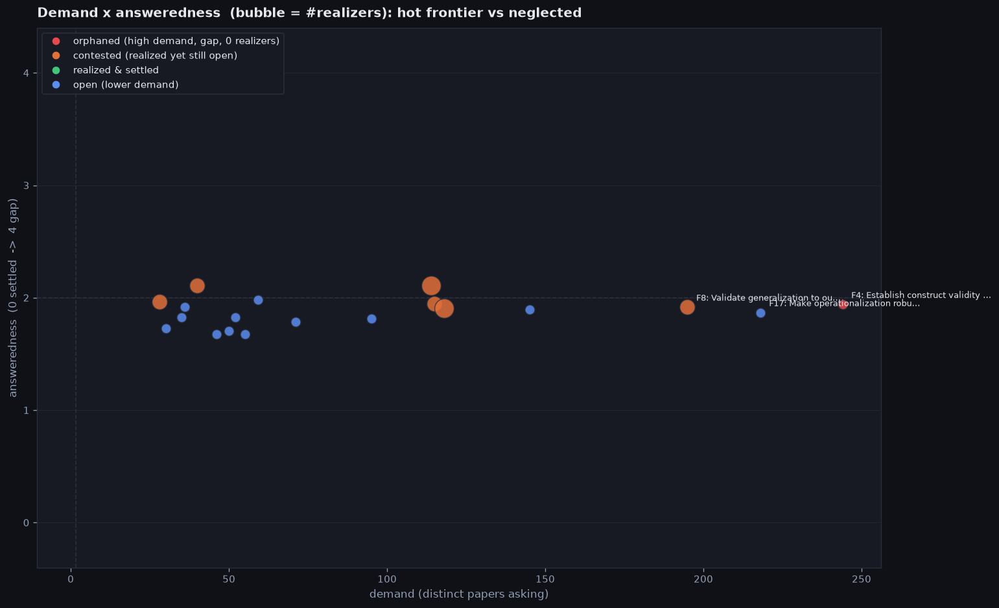

- Что на картинке: каждый кружок — одна тема-просьба. По горизонтали — «спрос» (сколько разных статей об этом просят: правее = просят чаще). По вертикали — «насколько ещё не решено» по шкале 0..4. Размер кружка — сколько статей уже взялись за тему. Пунктиры делят поле на четыре угла (часто/редко просят на решено/не решено).
- Что такое «целевые точки темы»: это клетки карты, которые именно эта тема-просьба хочет закрыть. Клетка карты — это один вопрос в конкретных условиях, заданный сочетанием направления исследования (RQ) и других осей карты (Validity type, Measurement instrument, evaluation-chain stage, Validity threat, Research subject); своего короткого названия у клетки нет — её задают именно эти координаты. Какие клетки относятся к теме, берётся не вручную, а из самих статей-просьб: каждая просьба помечает, какие клетки надо закрыть, а тема собирает их все вместе. Например, у темы `F8` Validate generalization to out-of-distribution, real-w… 311 целевых точек; одна из них — RQ2: Does the measure capture the intended constr… — Validity type «construct», Measurement instrument «none / theoretical», evaluation-chain stage «Construct definition», Validity threat «Construct misrepresentation», Research subject «general-methodology» — и эта клетка сейчас из числа с 1 открытым под-вопросом (=1).
- Откуда шкала 0..4 (её не выставляют вручную): каждая точка карты несёт чек-лист из не более чем 3 уточняющих под-вопросов, и число — это сколько из них ещё открыто (0 — все закрыты, значит точка «решена»; 1, 2 или 3 — столько под-вопросов осталось). Особый случай — точка, по которой нет вообще ни одной статьи: она хуже, чем «3 открытых», поэтому ей дают 4 (потолок шкалы). У темы обычно несколько целевых точек (клеток карты, которые тема просит закрыть), и её «нерешённость» — это среднее этих чисел по всем её точкам (поэтому значение дробное, например 2.6).
- Спрос (горизонталь): в среднем 92 разных статей просят тему, у серединного — 59; у большинства это 30–221 (в такой коридор попадает 90%), а вообще от 28 до 244. Самая востребованная справа — `F4` Establish construct validity (nomological nets, measurement… (её просят 244 статей); слева — темы, которые просят всего 28 раз (единичные просьбы и те, что собрал сам инструмент — в названиях такие темы помечены «(greenfield)»: их сформулировал сам инструмент, без статьи-автора).
- Насколько не решено (вертикаль): в среднем 1.9 из 4 (4 — совсем пусто), серединное значение 1.9 — облако кружков висит в верхней половине, то есть почти ничего ещё не доведено до конца. На примере темы `F8` Validate generalization to out-of-distribution, real-world …:
  - откуда берётся 1.9: у темы 311 целевых точек (клеток карты, которые тема просит закрыть) — 118 с 3 открытыми под-вопросами (=3), 49 с 2 открытыми под-вопросами (=2), 144 с 1 открытым под-вопросом (=1); среднее этих чисел (0..4) и есть «нерешённость» = 1.92
- Связь спроса и нерешённости: слабая положительная связь (коэффициент +0.18 по шкале от -1 до 1: +1 — чем чаще тему просят, тем она НЕрешённее; -1 — наоборот; 0 — связи нет (сравниваем порядок тем по спросу и по нерешённости)) — чем чаще тему просят, тем БОЛЬШЕ по ней пустоты — самый громкий спрос упирается в пустоту. Например (коэффициент 0.18 — это общий порядок по всем 19 темам, отдельная пара его может не повторять): самую востребованную тему `F4` Establish construct validity (nomologic… просят 244 статей при нерешённости 1.9 из 4, а редко спрашиваемую `F5` Test and reduce evaluation awareness wi… — всего 28 при нерешённости 2.0: у самой востребованной нерешённость ниже (1.9 против 2.0) — по этим двум крайним темам положительная связь не проявляется.
- Сколько тем в каждом углу: «никто не делает» (orphaned) 1, «решили на словах» (contested) 6, «сделано и закрыто» (settled) 0, «открыто, но мало кто просит» (low-signal open) 12 — всего 19 тем.
- Уже выполнено лишь 0% просьб — это 8 из 1834 (к 8 нашлась статья, которая их реально сделала; остальные 1826 пока открыты). Просят гораздо больше, чем успевают делать.
- **«никто не делает»** (orphaned) — 1 тем (многие просят, но за тему никто не взялся, и она упирается в пустую точку). Самая яркая: `F4` Establish construct validity (nomological nets, measurement… (её просят 244 статей, нерешённость 1.9 из 4).
  - просьба: [`P497` Autorubric: Unifying Rubric-based LLM Evaluation](https://arxiv.org/abs/2603.00077) — «The framework assumes rubrics are well-designed. Rubric quality assessment—validating that criteria measure what they claim to measure—remains an open problem.»
  - реализаций нет — за тему пока никто не взялся
  - почему «никто не делает»: за тему просят 244 статей, но реализаторов 0, и она упирается в пустые точки (1 без единой статьи) — спрос есть, работы нет.
- **«решили на словах»** (contested) — 6 тем (кто-то заявил «сделано», но целевые точки темы (клетки карты, которые она просит закрыть) всё ещё открыты). Самая яркая: `F8` Validate generalization to out-of-distribution, real-world … (её просят 195 статей, нерешённость 1.9 из 4).
  - просьба: [`P1630` STALE: Can LLM Agents Know When Their Memories Are No …](https://arxiv.org/abs/2605.06527) — «Promising future directions include multi-step cascading updates, coupled attribute changes, and schema-free open-domain evaluation.»
  - реализация: [`P207` Do LLMs Know They Are Being Tested? Evaluation Awarene…](https://arxiv.org/pdf/2510.08624) — Benchmarks for large language models (LLMs) often rely on rubric-scented prompts that request visible reasoning and strict formatting, whereas real deployments…
  - почему «на словах»: реализатор [`P207` Do LLMs Know They Are Being Tested? Evaluation Awarene…](https://arxiv.org/pdf/2510.08624) есть, но из 311 целевых точек (клеток карты, которые тема просит закрыть) закрыта лишь 0 (полностью решена), ещё 311 с открытыми под-вопросами и 0 совсем пустых — уточняющие под-вопросы не сняты, поэтому засчитываем только «на словах».
- **«сделано и закрыто»** (settled) — 0 тем: ни одна тема ещё не доведена до полного решения — поле пока незрелое.
- **«открыто, но мало кто просит»** (low-signal open) — 12 тем (тема не решена и за неё никто не взялся, но и просят её мало). Самая яркая: `F17` Make operationalization robust (prompt-robust, format-robus… (её просят 218 статей, нерешённость 1.9 из 4).
  - просьба: [`P1381` Brittlebench: Quantifying LLM robustness via prompt se…](https://arxiv.org/abs/2603.13285) — «These findings underscore the limitations of current evaluation practices and motivate the adoption of robustness-aware evaluation frameworks to more faithfully assess model capability.»
  - реализаций нет — за тему пока никто не взялся
  - почему «мало просят»: тема не решена (нерешённость 1.9 из 4) и за неё никто не взялся, но просят её лишь 218 раз — спроса слишком мало, чтобы считать её громко брошенной (orphaned).

## Насколько просьбы конкретны (готовый план или просто пожелание)

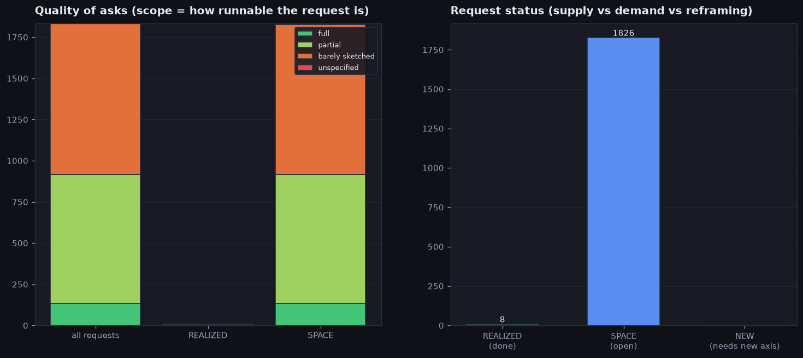

- Что на картинке: насколько просьбы конкретны. Конкретность (scope) — это ярлык, который ставит куратор, читая саму просьбу в статье (его не считают по формуле): «готовый план» (full) — описан конкретный эксперимент, можно брать и делать; «частичный план» (partial) — есть идея и часть деталей; «только набросок» (barely sketched) — направление названо без деталей; «без деталей» (unspecified) — общее пожелание. Это упорядоченная шкала от самого проработанного к самому расплывчатому. Слева — из чего состоят все просьбы и отдельно уже сделанные и ещё открытые. Справа — сколько просьб уже сделано, сколько ещё открыто и сколько требуют новой мерки, которой на карте пока нет (ярлык NEW).
- Как это выглядит в реальных просьбах (по одному примеру на каждый тип формулировки; для отсутствующих типов — пометка, что таких просьб нет):
  - «готовый план (full)»: [`P326` Agentic Harness Engineering: Observability-Driven Auto…](https://arxiv.org/pdf/2604.25850) — «Closing this gap is the clearest direction for future self-evolution loops.»
  - «частичный план (partial)»: [`P142` A Diagnostic Framework and Multi-Evaluator Audit of Ev…](https://arxiv.org/pdf/2606.29719) — «Whether from version drift or symmetric updates, the measurement instability is the finding; causal attribution is future work.»
  - «только набросок (barely sketched)»: [`P326` Agentic Harness Engineering: Observability-Driven Auto…](https://arxiv.org/pdf/2604.25850) — «cross-model transfer numbers conflate harness portability with operating-point coupling»
  - «без деталей (unspecified)»: таких просьб в поле нет ни одной — нет вовсе безадресных общих пожеланий
- Чаще всего просьбы — это только набросок (barely sketched) (915 из 1834); полностью готовых планов лишь 135 (7%), остальное — пожелания разной степени детализации.
- По статусу выполнения каждая просьба — одно из трёх (для каждого статуса: сколько таких, почему просьба туда попадает и живой пример):
  - «уже сделано (REALIZED)»: 8 из 1834 — нашлась статья, которая это реально сделала. Пример: [`P061` Countdown-Code: A Testbed for Studying The Emergence a…](https://arxiv.org/pdf/2603.07084) — «We open-source our environment and code to facilitate future research on reward hacking in LLMs.»
  - «ещё открыто (SPACE)»: 1826 из 1834 — просьба есть, а статьи-реализатора пока нет. Пример: [`P079` Reward Hacking in the Era of Large Models: Mechanisms,…](https://arxiv.org/pdf/2604.13602) — «Future Directions: Future work should focus on building tamper-resistant evaluation environments (sandboxes) where the reward signals cannot be manipulated by …»
  - «нужна новая ось (NEW)»: таких просьб нет (0 из 1834) — карта покрывает все просьбы своими осями — новых измерений поле не требует
- Уже сделанные просьбы против ещё открытых: среди сделанных доля готовых планов 0%, среди открытых — 7%. То есть то, что ещё ждёт, проработано лучше, чем то, за что уже взялись.
- 8 «сделанных» просьб на самом деле закрыты лишь частично или наброском — формально галочка стоит, а по сути сделано неглубоко.
  - пример: [`P173` Unveiling the Spectrum of Data Contamination in Langua…](https://arxiv.org/pdf/2406.14644) помечена сделанной, но сама просьба была лишь «только набросок (barely sketched)» — «Subsequently, we explore strategies for mitigating data contamination, addressing potential challenges, and suggesting directions for future research in this a…»

## Болевые точки: «никто не делает», «решили на словах», «просят расширять»

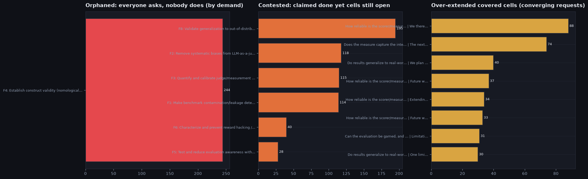

- Что на картинке (три столбца): слева — темы, которые многие просят, но никто не делает (orphaned: высокий спрос, ноль взявшихся, упирается в пустую точку), отсортированы по спросу. В центре — темы, про которые кто-то заявил «сделано», а точки всё ещё открыты (contested, «решили на словах»). Справа — уже закрытые точки, которые поле упорно просит расширять; их «вес» — это число сошедшихся на одной точке просьб о расширении.
- «Никто не делает» (orphaned): 1 тем; спрос (сколько статей просят) — в среднем 244 статей, у серединного — 244; у большинства это 244–244 (в такой коридор попадает 90%), а вообще от 244 до 244. Самая востребованная — `F4` Establish construct validity (nomological nets, measurement… (просят 244); наименее из показанных — `F4` Establish construct validity (nomological nets, measurement… (просят 244); серединное число просьб 244.
  - просьба: [`P497` Autorubric: Unifying Rubric-based LLM Evaluation](https://arxiv.org/abs/2603.00077) — «The framework assumes rubrics are well-designed. Rubric quality assessment—validating that criteria measure what they claim to measure—remains an open problem.»
  - реализаций нет — за тему пока никто не взялся
- «Решили на словах» (contested): 6 тем; нерешённость по шкале 0..4 — это сколько уточняющих под-вопросов в среднем осталось открыто по точкам темы (0 — всё закрыто, 4 — точка совсем пустая); серединное 2.0, размах 1.9–2.1. Самая горячая — `F8` Validate generalization to out-of-distribution, real-world … (просят 195, нерешённость 1.9 из 4); пограничная — `F5` Test and reduce evaluation awareness with deployment-realis… (просят 28, 2.0 из 4).
  - откуда берётся 1.9: у темы 311 целевых точек (клеток карты, которые тема просит закрыть) — 118 с 3 открытыми под-вопросами (=3), 49 с 2 открытыми под-вопросами (=2), 144 с 1 открытым под-вопросом (=1); среднее этих чисел (0..4) и есть «нерешённость» = 1.92
  - просьба: [`P1630` STALE: Can LLM Agents Know When Their Memories Are No …](https://arxiv.org/abs/2605.06527) — «Promising future directions include multi-step cascading updates, coupled attribute changes, and schema-free open-domain evaluation.»
  - реализация: [`P207` Do LLMs Know They Are Being Tested? Evaluation Awarene…](https://arxiv.org/pdf/2510.08624) — Benchmarks for large language models (LLMs) often rely on rubric-scented prompts that request visible reasoning and strict formatting, whereas real deployments…
  - почему «на словах»: реализатор [`P207` Do LLMs Know They Are Being Tested? Evaluation Awarene…](https://arxiv.org/pdf/2510.08624) есть, но из 311 целевых точек (клеток карты, которые тема просит закрыть) закрыта лишь 0 (полностью решена), ещё 311 с открытыми под-вопросами и 0 совсем пустых — уточняющие под-вопросы не сняты, поэтому засчитываем только «на словах».
- «Просят расширять» (over-extended): 1207 уже закрытых точек поле хочет развивать дальше; число сошедшихся просьб на точку — в среднем 3 просьб, у серединного — 2; у большинства это 1–9 (в такой коридор попадает 90%), а вообще от 1 до 88. Сильнее всего — RQ4: How reliable is the scorer/measurement instrument… | We therefore defer calibration analysis to future… (88 просьб); слабее всего из верхушки — RQ10: Do results generalize to real-world / out-of-dist… | One limitation of this paper is that we do not ca… (30 просьб); серединное 2.
  - просят расширить: [`P008` Reliability without Validity: A Systematic, Large-Scal…](https://arxiv.org/pdf/2606.19544), [`P015` LLM Judges Have Dark Current: A Psychometric Datasheet…](https://arxiv.org/pdf/2606.15610), [`P089` Are We on the Right Way to Assessing LLM-as-a-Judge?](https://arxiv.org/pdf/2512.16041) — что именно: We therefore defer calibration analysis to future work; the present study reports agreement, consistency, and bias under the protocols ...

## Из каких больших областей состоит карта

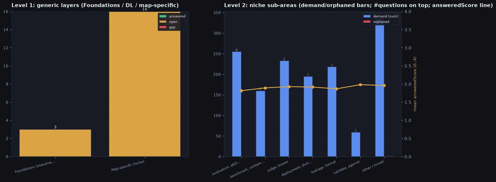

- Что на картинке: слева — на какие большие области делятся все вопросы (Foundations — базовая статистика и измеримость; Deep learning — общие приёмы глубокого обучения; Map-specific — всё своё, специфичное для этой карты), и насколько в каждой области закрыто/открыто. Справа область Map-specific разбита на под-темы по общим ключевым словам самих вопросов.
- О чём карта: **VCRC** — VCRC reads any empirical ML result as a measurement-and-inference chain and asks where its VALIDITY, conceptual robustness and confounders break. The ROOT axis RQ carries the field's research questions about validity (c…
- Обозначения: «просят N статей» — сколько статей суммарно просят темы группы; «открыто %» — доля ещё не закрытых; «нерешённость 0..4» — в среднем насколько далеко до решения (0 — закрыто, 4 — совсем пусто); «никто не делает» — сколько тем группы просят, но за них никто не взялся.
- **Foundations (stats/measurement)**: 3 тем, просят 290 статей, открыто 100% (нерешённость 1.8/4, «никто не делает» 0):
  - `F9` Improve annotation reliability, rater models and ground truth under disagreemen… (просят 145 статей, нерешённость 1.9 из 4)
  - `F7` Remove shortcut/spurious reliance and confounds, ideally without group annotati… (просят 95 статей, нерешённость 1.8 из 4)
  - `F15` Extend validity checks to multilingual and multimodal settings. (просят 50 статей, нерешённость 1.7 из 4)
- **Deep learning / representation**: 0 тем — вопросов этой области в поле нет.
- **Map-specific (niche)**: 16 тем, просят 1456 статей, открыто 100% (нерешённость 1.9/4, «никто не делает» 1).
- Область Map-specific делится на 7 под-тем (по общим ключевым словам самих вопросов):
- **evaluation, ability** — 6 тем, просят 255 статей, открыто 100% («никто не делает» 0, нерешённость 1.8/4):
  - `F19` Make evaluation sets representative and well-sampled of the target population. (просят 71 статей, нерешённость 1.8 из 4)
  - `F10` Bring statistical rigor (significance, multiple comparisons, power, error bars)… (просят 55 статей, нерешённость 1.7 из 4)
  - `F16` Make safety / jailbreak evaluation valid and robustly scored. (просят 36 статей, нерешённость 1.9 из 4)
  - `F11` Make ML evaluation reproducible across runs, seeds, setups and implementations. (просят 35 статей, нерешённость 1.8 из 4)
  - `F13` Scale item-response-theory / ability-based psychometric evaluation of models. (просят 30 статей, нерешённость 1.7 из 4)
  - `F5` Test and reduce evaluation awareness with deployment-realistic evaluations. (просят 28 статей, нерешённость 2.0 из 4)
- **benchmark, contamination** — 2 тем, просят 160 статей, открыто 100% («никто не делает» 0, нерешённость 1.9/4):
  - `F1` Make benchmark contamination/leakage detection reliable and evasion-resistant (… (просят 114 статей, нерешённость 2.1 из 4)
  - `F12` Handle benchmark saturation and temporal validity over time and scale. (просят 46 статей, нерешённость 1.7 из 4)
- **judge, biases** — 2 тем, просят 233 статей, открыто 100% («никто не делает» 0, нерешённость 1.9/4):
  - `F2` Remove systematic biases from LLM-as-a-judge (position, verbosity, self-prefere… (просят 118 статей, нерешённость 1.9 из 4)
  - `F3` Quantify and calibrate judge/measurement uncertainty, noise and variance. (просят 115 статей, нерешённость 1.9 из 4)
- **deployment, distribution** — 1 тем, просят 195 статей, открыто 100% («никто не делает» 0, нерешённость 1.9/4):
  - `F8` Validate generalization to out-of-distribution, real-world and deployment popul… (просят 195 статей, нерешённость 1.9 из 4)
- **leakage, format** — 1 тем, просят 218 статей, открыто 100% («никто не делает» 0, нерешённость 1.9/4):
  - `F17` Make operationalization robust (prompt-robust, format-robust, leakage-free task… (просят 218 статей, нерешённость 1.9 из 4)
- **validate, against** — 1 тем, просят 59 статей, открыто 100% («никто не делает» 0, нерешённость 2.0/4):
  - `F14` Validate agentic evaluations against harness, scaffold and tool-use confounds. (просят 59 статей, нерешённость 2.0 из 4)
- **Other / mixed** — 3 тем, просят 336 статей, открыто 100% («никто не делает» 1, нерешённость 2.0/4):
  - `F4` Establish construct validity (nomological nets, measurement modeling, psychomet… (просят 244 статей, нерешённость 1.9 из 4)
  - `F18` Make cross-model comparison and leaderboard aggregation fair and sound. (просят 52 статей, нерешённость 1.8 из 4)
  - `F6` Characterize and prevent reward hacking / Goodhart under optimization pressure. (просят 40 статей, нерешённость 2.1 из 4)
- Даже фундамент ещё не закрыт: в области Foundations 3 тем и 100% из них открыты — поле всё ещё переспрашивает базовые вещи (статистику и то, как вообще измерять), общие для всего машинного обучения.
- Самая востребованная под-тема — evaluation, ability (просят 255 статей, «никто не делает» 0) — туда поле давит сильнее всего.

## Кто задаёт повестку, а кто делает работу

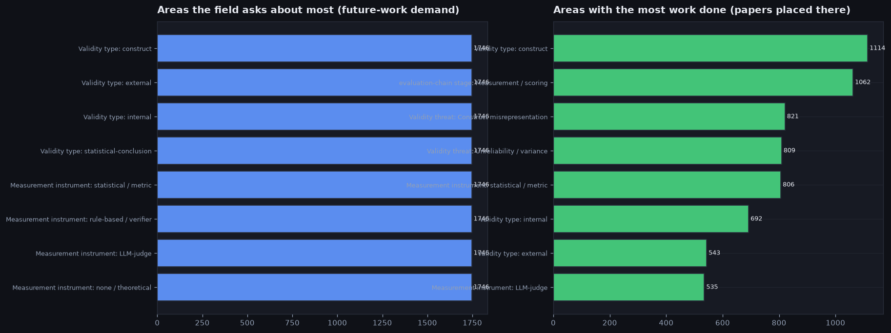

- Что на картинке: вместо отдельных статей сравниваем ОБЛАСТИ карты. У карты несколько осей (Validity type, Measurement instrument, evaluation-chain stage, Validity threat, Research subject), и у каждой оси — свои значения (например, у оси «Validity type» это «construct», «external», «internal» и т.д.). Слева — области, про которые поле просит больше всего будущей работы; справа — области, где уже сидит больше всего статей (реальная работа). «Спрос» области — это суммарное число статей-просьб, чьи целевые точки попадают в эту область (просьбу засчитываем во все области её точек). «Работа» — это сколько разных статей стоят в точках этой области (считаем по координатам статей на карте).
- **Validity type**: больше всего просят «construct» (спрос 1746 — столько статей суммарно просят про это); больше всего работ в «construct» (1114 статей).
- **Measurement instrument**: больше всего просят «statistical / metric» (спрос 1746 — столько статей суммарно просят про это); больше всего работ в «statistical / metric» (806 статей).
- **evaluation-chain stage**: больше всего просят «Measurement / scoring» (спрос 1746 — столько статей суммарно просят про это); больше всего работ в «Measurement / scoring» (1062 статей).
- **Validity threat**: больше всего просят «Confounding» (спрос 1746 — столько статей суммарно просят про это); больше всего работ в «Construct misrepresentation» (821 статей) — спрос и работа смотрят в разные стороны: просят про одно, а делают про другое.
- **Research subject**: больше всего просят «reasoning» (спрос 1746 — столько статей суммарно просят про это); больше всего работ в «generation-quality» (393 статей) — спрос и работа смотрят в разные стороны: просят про одно, а делают про другое.
- 22 просьб собрал сам инструмент, без конкретной статьи-автора (greenfield) — это скрытый спрос, который никто в поле прямо не озвучил, но он вытекает из устройства карты. Вот они все:
  - Greenfield: run the missing internal-validity study of unreliability / variance for general-methodology at measurement / scoring with a LLM-judge instrument — сворачивается в тему `F3` Quantify and calibrate judge/measurement uncertai…; конкретность только набросок (barely sketched); направление RQ4: How reliable is the scorer/measurement instrument (LLM…; целевых точек (клеток карты, которые тема просит закрыть): 1
  - Greenfield: run the missing construct-validity study of construct misrepresentation for generation-quality at measurement / scoring with a LLM-judge instrument — сворачивается в тему `F4` Establish construct validity (nomological nets, m…; конкретность только набросок (barely sketched); направление RQ4: How reliable is the scorer/measurement instrument (LLM…; целевых точек (клеток карты, которые тема просит закрыть): 1
  - Greenfield: run the missing construct-validity study of construct misrepresentation for general-methodology at measurement / scoring with a LLM-judge instrument — сворачивается в тему `F4` Establish construct validity (nomological nets, m…; конкретность только набросок (barely sketched); направление RQ14: How do we provide positive (confirmatory) and negative…; целевых точек (клеток карты, которые тема просит закрыть): 1
  - Greenfield: run the missing construct-validity study of construct misrepresentation for reasoning at measurement / scoring with a LLM-judge instrument — сворачивается в тему `F4` Establish construct validity (nomological nets, m…; конкретность только набросок (barely sketched); направление RQ2: Does the measure capture the intended construct and no…; целевых точек (клеток карты, которые тема просит закрыть): 1
  - Greenfield: run the missing construct-validity study of construct misrepresentation for safety at measurement / scoring with a LLM-judge instrument — сворачивается в тему `F4` Establish construct validity (nomological nets, m…; конкретность только набросок (barely sketched); направление RQ2: Does the measure capture the intended construct and no…; целевых точек (клеток карты, которые тема просит закрыть): 1
  - Greenfield: run the missing construct-validity study of construct misrepresentation for honesty at measurement / scoring with a LLM-judge instrument — сворачивается в тему `F4` Establish construct validity (nomological nets, m…; конкретность только набросок (barely sketched); направление RQ2: Does the measure capture the intended construct and no…; целевых точек (клеток карты, которые тема просит закрыть): 1
  - Greenfield: run the missing internal-validity study of contamination / leakage for safety at data sampling with a statistical / metric instrument — сворачивается в тему `F1` Make benchmark contamination/leakage detection re…; конкретность только набросок (barely sketched); направление RQ6: Can the evaluation be gamed, and can train/test contam…; целевых точек (клеток карты, которые тема просит закрыть): 1
  - Greenfield: run the missing internal-validity study of contamination / leakage for reasoning at data sampling with a LLM-judge instrument — сворачивается в тему `F1` Make benchmark contamination/leakage detection re…; конкретность только набросок (barely sketched); направление RQ6: Can the evaluation be gamed, and can train/test contam…; целевых точек (клеток карты, которые тема просит закрыть): 1
  - Greenfield: run the missing internal-validity study of contamination / leakage for fairness at data sampling with a statistical / metric instrument — сворачивается в тему `F1` Make benchmark contamination/leakage detection re…; конкретность только набросок (barely sketched); направление RQ6: Can the evaluation be gamed, and can train/test contam…; целевых точек (клеток карты, которые тема просит закрыть): 1
  - Greenfield: run the missing statistical-conclusion-validity study of unreliability / variance for honesty at statistical inference with a statistical / metric … — сворачивается в тему `F3` Quantify and calibrate judge/measurement uncertai…; конкретность только набросок (barely sketched); направление RQ4: How reliable is the scorer/measurement instrument (LLM…; целевых точек (клеток карты, которые тема просит закрыть): 1
  - Greenfield: run the missing construct-validity study of unreliability / variance for general-methodology at measurement / scoring with a statistical / metric i… — сворачивается в тему `F3` Quantify and calibrate judge/measurement uncertai…; конкретность только набросок (barely sketched); направление RQ8: Are per-item scores annotated and aggregated without a…; целевых точек (клеток карты, которые тема просит закрыть): 1
  - Greenfield: run the missing construct-validity study of construct misrepresentation for general-methodology at measurement / scoring with a statistical / metri… — сворачивается в тему `F4` Establish construct validity (nomological nets, m…; конкретность только набросок (barely sketched); направление RQ3: Is the operationalization (items/tasks/prompts) a fait…; целевых точек (клеток карты, которые тема просит закрыть): 1
  - Greenfield: run the missing internal-validity study of confounding for general-methodology at operationalization with a classifier / probe instrument — сворачивается в тему `F7` Remove shortcut/spurious reliance and confounds, …; конкретность только набросок (barely sketched); направление RQ9: Is the causal inference about the system warranted, fr…; целевых точек (клеток карты, которые тема просит закрыть): 1
  - Greenfield: run the missing construct-validity study of unreliability / variance for capability at measurement / scoring with a LLM-judge instrument — сворачивается в тему `F3` Quantify and calibrate judge/measurement uncertai…; конкретность только набросок (barely sketched); направление RQ4: How reliable is the scorer/measurement instrument (LLM…; целевых точек (клеток карты, которые тема просит закрыть): 1
  - Greenfield: run the missing construct-validity study of construct misrepresentation for safety at measurement / scoring with a statistical / metric instrument — сворачивается в тему `F4` Establish construct validity (nomological nets, m…; конкретность только набросок (barely sketched); направление RQ2: Does the measure capture the intended construct and no…; целевых точек (клеток карты, которые тема просит закрыть): 1
  - Greenfield: run the missing construct-validity study of construct misrepresentation for honesty at measurement / scoring with a LLM-judge instrument — сворачивается в тему `F4` Establish construct validity (nomological nets, m…; конкретность только набросок (barely sketched); направление RQ4: How reliable is the scorer/measurement instrument (LLM…; целевых точек (клеток карты, которые тема просит закрыть): 1
  - Greenfield: run the missing internal-validity study of confounding for general-methodology at statistical inference with a statistical / metric instrument — сворачивается в тему `F7` Remove shortcut/spurious reliance and confounds, …; конкретность частичный план (partial); направление RQ9: Is the causal inference about the system warranted, fr…; целевых точек (клеток карты, которые тема просит закрыть): 1
  - Greenfield: run the missing construct-validity study of unreliability / variance for generation-quality at measurement / scoring with a LLM-judge instrument — сворачивается в тему `F3` Quantify and calibrate judge/measurement uncertai…; конкретность частичный план (partial); направление RQ4: How reliable is the scorer/measurement instrument (LLM…; целевых точек (клеток карты, которые тема просит закрыть): 1
  - Greenfield: run the missing internal-validity study of contamination / leakage for general-methodology at data sampling with a statistical / metric instrument — сворачивается в тему `F1` Make benchmark contamination/leakage detection re…; конкретность частичный план (partial); направление RQ6: Can the evaluation be gamed, and can train/test contam…; целевых точек (клеток карты, которые тема просит закрыть): 1
  - Greenfield: run the missing internal-validity study of confounding for general-methodology at data sampling with a classifier / probe instrument — сворачивается в тему `F7` Remove shortcut/spurious reliance and confounds, …; конкретность частичный план (partial); направление RQ9: Is the causal inference about the system warranted, fr…; целевых точек (клеток карты, которые тема просит закрыть): 1
  - Greenfield: run the missing internal-validity study of unreliability / variance for generation-quality at measurement / scoring with a LLM-judge instrument — сворачивается в тему `F3` Quantify and calibrate judge/measurement uncertai…; конкретность частичный план (partial); направление RQ4: How reliable is the scorer/measurement instrument (LLM…; целевых точек (клеток карты, которые тема просит закрыть): 1
  - Greenfield: run the missing statistical-conclusion-validity study of unreliability / variance for generation-quality at measurement / scoring with a LLM-judge … — сворачивается в тему `F3` Quantify and calibrate judge/measurement uncertai…; конкретность частичный план (partial); направление RQ4: How reliable is the scorer/measurement instrument (LLM…; целевых точек (клеток карты, которые тема просит закрыть): 1

## Направления исследований: куда движется поле и насколько они проработаны

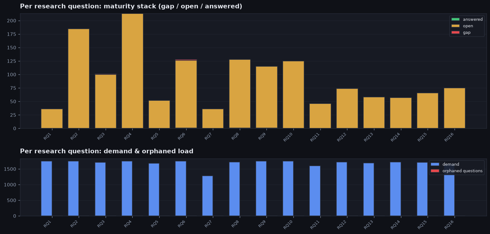

- Что на картинке: «RQ» — это крупные направления исследований (большие вопросы, которыми занимается поле). Сверху для каждого направления показано, в каком состоянии его точки (пусто / частично открыто / решено), снизу — сколько статей это направление просят и сколько тем под ним брошено («никто не делает»).
- Направления (RQ) — это то, КУДА поле движется по сути, а конкретные темы-просьбы под каждым — точечные шаги внутри направления. У каждого направления — свой текст, состояние и спрос, а под ним перечислены относящиеся к нему темы-просьбы (широкая просьба отнесена к одному направлению, а не дублируется в каждом). «Спрос» в шапке — это сколько статей суммарно его просят (включая просьбы, общие с соседними направлениями).
- Важно про счётчики в шапке направления: и «спрос», и «брошено («никто не делает»)» считаются с пересечениями — одна тема может задевать несколько направлений сразу и попадает в счёт каждого из них. Поэтому эти числа нельзя складывать по направлениям: их сумма может оказаться больше, чем 1 разных брошенных тем во всём поле (а если каждая тема относится лишь к одному направлению — совпадает с этим числом).
- Насколько направления закрыты: в среднем у направления пустует 0% точек (от 0% до 2%). Больше всего пустот у направления RQ6: Can the evaluation be gamed, and can train/test contamination be dete… (2% точек пустые, всего 128 точек); меньше всего — у RQ16: Are baselines and comparisons fair (tuning and compute parity, no lea… (0% пустых).
- Сильнее всего поле просит направление RQ1: Is the target construct defined and theory-grounded (nomological netw… (его просят 1746 статей суммарно).
- Направления закрыты очень неравномерно: между самым пустым и самым проработанным разница в 2% пустых точек.
- Направления по убыванию спроса (самые востребованные — первыми). У каждой темы-просьбы под направлением в скобках стоит «нерешённость N из 4» — среднее по её точкам число ещё открытых уточняющих под-вопросов (0 — все под-вопросы по точке закрыты, 4 — точка совсем пустая, без статей):
- **RQ1**: Is the target construct defined and theory-grounded (nomological network, AI-native constructs) before a measure is built? — 36 точек; из них 0% пустые, 100% частично открыты, 0% решены; просят 1746 статей, брошено («никто не делает») 1. активно изучается, но ещё не закрыто — работа идёт, но точки пока открыты.
  - (под этим направлением нет отдельных тем-просьб)
- **RQ2**: Does the measure capture the intended construct and not a confounder or surface proxy (construct + discriminant validity)? — 185 точек; из них 0% пустые, 100% частично открыты, 0% решены; просят 1746 статей, брошено («никто не делает») 1. активно изучается, но ещё не закрыто — работа идёт, но точки пока открыты.
  - `F4` Establish construct validity (nomological nets, measurement modeling, psychomet… (просят 244 статей, нерешённость 1.9 из 4)
  - `F19` Make evaluation sets representative and well-sampled of the target population. (просят 71 статей, нерешённость 1.8 из 4)
  - `F15` Extend validity checks to multilingual and multimodal settings. (просят 50 статей, нерешённость 1.7 из 4)
  - `F12` Handle benchmark saturation and temporal validity over time and scale. (просят 46 статей, нерешённость 1.7 из 4)
  - `F16` Make safety / jailbreak evaluation valid and robustly scored. (просят 36 статей, нерешённость 1.9 из 4)
  - `F11` Make ML evaluation reproducible across runs, seeds, setups and implementations. (просят 35 статей, нерешённость 1.8 из 4)
- **RQ4**: How reliable is the scorer/measurement instrument (LLM-judge variance and bias, item-response theory, statistical power, uncertainty)? — 213 точек; из них 0% пустые, 100% частично открыты, 0% решены; просят 1746 статей, брошено («никто не делает») 1. активно изучается, но ещё не закрыто — работа идёт, но точки пока открыты.
  - `F17` Make operationalization robust (prompt-robust, format-robust, leakage-free task… (просят 218 статей, нерешённость 1.9 из 4)
  - `F2` Remove systematic biases from LLM-as-a-judge (position, verbosity, self-prefere… (просят 118 статей, нерешённость 1.9 из 4)
  - `F3` Quantify and calibrate judge/measurement uncertainty, noise and variance. (просят 115 статей, нерешённость 1.9 из 4)
  - `F10` Bring statistical rigor (significance, multiple comparisons, power, error bars)… (просят 55 статей, нерешённость 1.7 из 4)
  - `F18` Make cross-model comparison and leaderboard aggregation fair and sound. (просят 52 статей, нерешённость 1.8 из 4)
  - `F13` Scale item-response-theory / ability-based psychometric evaluation of models. (просят 30 статей, нерешённость 1.7 из 4)
- **RQ6**: Can the evaluation be gamed, and can train/test contamination be detected (including under reinforcement-learning or evasive hiding)? — 128 точек; из них 2% пустые, 98% частично открыты, 1% решены; просят 1746 статей, брошено («никто не делает») 1. активно изучается, но ещё не закрыто — работа идёт, но точки пока открыты.
  - `F1` Make benchmark contamination/leakage detection reliable and evasion-resistant (… (просят 114 статей, нерешённость 2.1 из 4)
- **RQ9**: Is the causal inference about the system warranted, free of confounds, spurious correlations and shortcut features (internal validity)? — 115 точек; из них 0% пустые, 99% частично открыты, 1% решены; просят 1746 статей, брошено («никто не делает») 1. активно изучается, но ещё не закрыто — работа идёт, но точки пока открыты.
  - `F7` Remove shortcut/spurious reliance and confounds, ideally without group annotati… (просят 95 статей, нерешённость 1.8 из 4)
- **RQ10**: Do results generalize to real-world / out-of-distribution outcomes (external / criterion / ecological validity, transportability)? — 125 точек; из них 0% пустые, 100% частично открыты, 0% решены; просят 1746 статей, брошено («никто не делает») 1. активно изучается, но ещё не закрыто — работа идёт, но точки пока открыты.
  - `F8` Validate generalization to out-of-distribution, real-world and deployment popul… (просят 195 статей, нерешённость 1.9 из 4)
- **RQ8**: Are per-item scores annotated and aggregated without annotator/label/ground-truth dependencies (annotation science, rater effects)? — 128 точек; из них 0% пустые, 99% частично открыты, 1% решены; просят 1718 статей, брошено («никто не делает») 1. активно изучается, но ещё не закрыто — работа идёт, но точки пока открыты.
  - `F9` Improve annotation reliability, rater models and ground truth under disagreemen… (просят 145 статей, нерешённость 1.9 из 4)
- **RQ14**: How do we provide positive (confirmatory) and negative (red-team / falsification) evidence that an evaluation is valid? — 57 точек; из них 0% пустые, 100% частично открыты, 0% решены; просят 1718 статей, брошено («никто не делает») 1. активно изучается, но ещё не закрыто — работа идёт, но точки пока открыты.
  - (под этим направлением нет отдельных тем-просьб)
- **RQ12**: How does optimization pressure corrupt the metric (Goodhart, reward hacking), and what principled limits exist? — 74 точек; из них 0% пустые, 100% частично открыты, 0% решены; просят 1716 статей, брошено («никто не делает») 1. активно изучается, но ещё не закрыто — работа идёт, но точки пока открыты.
  - `F6` Characterize and prevent reward hacking / Goodhart under optimization pressure. (просят 40 статей, нерешённость 2.1 из 4)
- **RQ3**: Is the operationalization (items/tasks/prompts) a faithful, sufficiently-complex realization that does not leak format or shortcut cues? — 101 точек; из них 1% пустые, 99% частично открыты, 0% решены; просят 1706 статей, брошено («никто не делает») 1. активно изучается, но ещё не закрыто — работа идёт, но точки пока открыты.
  - (под этим направлением нет отдельных тем-просьб)
- **RQ15**: Is the empirical result reproducible and statistically sound (replication, significance testing, multiple comparisons, nondeterminism)? — 66 точек; из них 0% пустые, 100% частично открыты, 0% решены; просят 1706 статей, брошено («никто не делает») 1. активно изучается, но ещё не закрыто — работа идёт, но точки пока открыты.
  - (под этим направлением нет отдельных тем-просьб)
- **RQ13**: In agentic/protocol-heavy evaluations, how does the harness/scaffold/training setup confound what is being measured? — 58 точек; из них 0% пустые, 100% частично открыты, 0% решены; просят 1688 статей, брошено («никто не делает») 1. активно изучается, но ещё не закрыто — работа идёт, но точки пока открыты.
  - `F14` Validate agentic evaluations against harness, scaffold and tool-use confounds. (просят 59 статей, нерешённость 2.0 из 4)
- **RQ5**: Is the evaluation set representative and realistic, not convenience sampling, and does it cover the population? — 52 точек; из них 0% пустые, 100% частично открыты, 0% решены; просят 1678 статей, брошено («никто не делает») 1. активно изучается, но ещё не закрыто — работа идёт, но точки пока открыты.
  - (под этим направлением нет отдельных тем-просьб)
- **RQ16**: Are baselines and comparisons fair (tuning and compute parity, no leakage between conditions, sound ranking/aggregation)? — 75 точек; из них 0% пустые, 100% частично открыты, 0% решены; просят 1660 статей, брошено («никто не делает») 1. активно изучается, но ещё не закрыто — работа идёт, но точки пока открыты.
  - (под этим направлением нет отдельных тем-просьб)
- **RQ11**: How does validity drift over time and with scale (temporal validity, benchmark saturation, scaling-law validity)? — 46 точек; из них 0% пустые, 100% частично открыты, 0% решены; просят 1603 статей, брошено («никто не делает») 1. активно изучается, но ещё не закрыто — работа идёт, но точки пока открыты.
  - (под этим направлением нет отдельных тем-просьб)
- **RQ7**: Does the system behave differently because it knows it is being evaluated (evaluation awareness, sandbagging, reactivity)? — 36 точек; из них 0% пустые, 100% частично открыты, 0% решены; просят 1284 статей, брошено («никто не делает») 1. активно изучается, но ещё не закрыто — работа идёт, но точки пока открыты.
  - `F5` Test and reduce evaluation awareness with deployment-realistic evaluations. (просят 28 статей, нерешённость 2.0 из 4)

## Цитирования и возраст статей

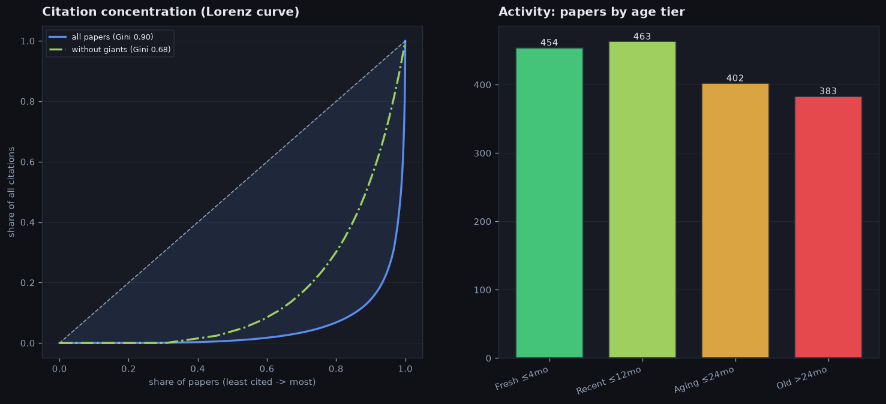

- Что на картинке: слева — насколько неравномерно поделены цитирования. Кривая показывает, какую долю всех цитат набирают статьи, если идти от наименее к наиболее цитируемым; чем сильнее она провисает под диагональю (диагональ = у всех поровну), тем сильнее всё сосредоточено у немногих. Сплошная линия — все статьи, штрих-пунктир — те же статьи без «гигантов» (самых цитируемых выбросов). Число Gini сжимает кривую в одну цифру по шкале 0..1: это площадь зазора между диагональю и кривой, поделённая на всю площадь под диагональю (0 — все статьи цитируют одинаково, 1 — все цитаты у одной статьи). Шкала выбрана так, чтобы не зависеть ни от числа статей, ни от абсолютного числа цитат. Справа — сколько статей по возрасту: моложе 4 месяцев, до года, до 2 лет, старше 2 лет.
- Неравномерность цитат (по всем статьям): верхние 10% самых цитируемых собирают 86% всех цитат (Gini 0.90) — несколько «гигантов» тянут поле.
- Как получается 0.90 на реальных числах: если идти от наименее цитируемых, нижняя половина статей (851 из 1702) собирает лишь 1% всех цитат, а верхние 10% — 86%. Будь цитаты у всех поровну, нижняя половина набрала бы свои 50%, кривая легла бы на диагональ и Gini был бы 0; чем дальше эта доля от 50%, тем ближе Gini к 1 — здесь 0.90.
- Кого считаем «гигантами» (это выбросы по цитатам): статьи, у которых цитат больше верхней границы по правилу Тьюки — третий квартиль плюс 1.5 межквартильных размаха (то есть заметно выше типичного разброса). Здесь порог — 40 цитат; выше него 226 статей из 1702. Кого именно исключаем (по убыванию цитат):
  - [`P452` Judging LLM-as-a-Judge with MT-Bench and Chatbot Arena](https://arxiv.org/pdf/2306.05685) — 9526 цитирований (2023)
  - [`P542` Open Graph Benchmark: Datasets for Machine Learning on…](https://arxiv.org/abs/2005.00687) — 3674 цитирований (2020)
  - [`P477` A Survey on Evaluation of Large Language Models](https://arxiv.org/pdf/2307.03109) — 3497 цитирований (2023)
  - [`P1296` G-Eval: NLG Evaluation using GPT-4 with Better Human A…](https://arxiv.org/abs/2303.16634) — 2632 цитирований (2023)
  - [`P478` The Many Faces of Robustness: A Critical Analysis of O…](https://arxiv.org/pdf/2006.16241) — 2413 цитирований (2020)
  - [`P749` ToolLLM: Facilitating Large Language Models to Master …](https://arxiv.org/abs/2307.16789) — 1804 цитирований (2023)
  - [`P1007` BEIR: A Heterogenous Benchmark for Zero-shot Evaluatio…](https://arxiv.org/abs/2104.08663) — 1786 цитирований (2021)
  - [`P489` LiveCodeBench: Holistic and Contamination Free Evaluat…](https://arxiv.org/pdf/2403.07974) — 1763 цитирований (2024)
  - … и ещё 218 (все с цитатами выше 40)
- Тот же расчёт без гигантов (на оставшихся 1476 статьях): концентрация заметно падает — Gini 0.90 -> 0.68, а верхние 10% теперь собирают 46% цитат вместо 86%. Серединная статья по-прежнему набирает 2 цитат (было 3), но максимум среди оставшихся — 40 (а был 9526). То есть без нескольких сверхцитируемых работ поле всё равно неровное, но уже не «всё у единиц».
- Сколько цитируют типичную статью (по всем): серединное значение 3, у верхних 5% — 155, максимум 9526. То есть обычную статью цитируют мало, а весь объём держат единицы.
- Возраст: 54% статей моложе года, серединный возраст 11 мес — молодой и активный поток. Разбивка по группам возраста (сколько статей в каждой): моложе 4 месяцев: 454, от 4 месяцев до года: 463, от года до 2 лет: 402, старше 2 лет: 383.

## Какой это тип поля (среди всех карт)

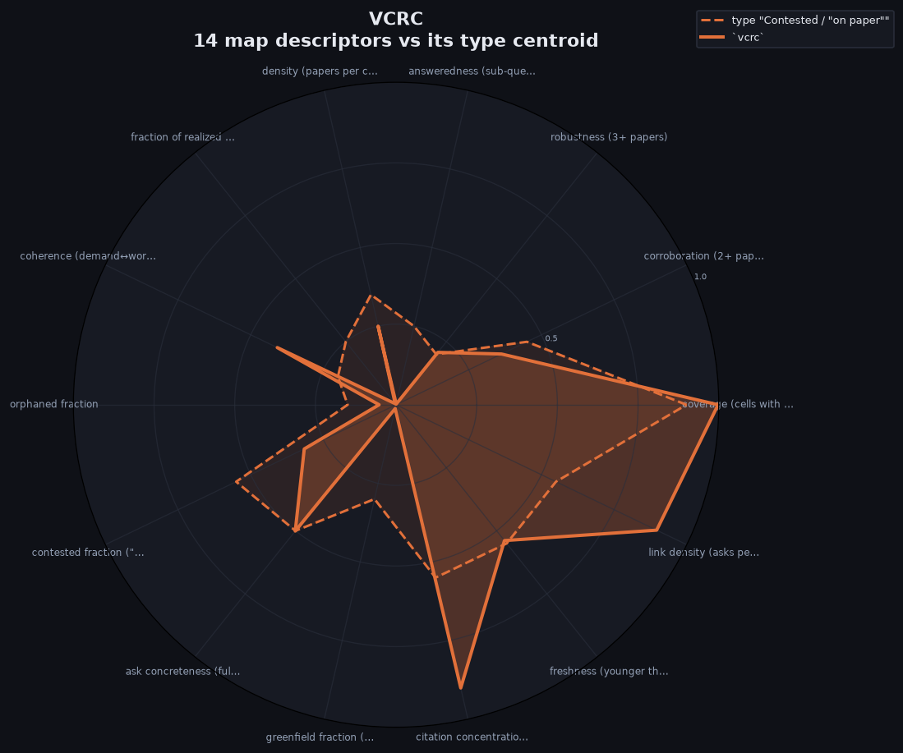

- Что на картинке: сплошная линия — 14 дескрипторов ЭТОЙ карты, пунктир — центр её ближайшего типа среди всех возможных карт (оба в цвете типа). Совпадение линий = карта типична для своего типа; расхождения по спицам показывают, чем она из типа выбивается.
- Ближе всего к архетипу **Contested / "on paper"** (broadly covered but declared "done" while sub-questions are still open); евклидово расстояние по 6 композитным осям 0.56 (0 — точно в центре типа).
- Композитные оси карты: maturity 0.17, freshness 0.54, coherence 0.41, coverage 1.00, interaction 0.90, canon 0.90.
- Сильнее всего отклоняется от центра типа: citation concentration (Gini) 90% vs 55% у типа; link density (asks per cell) 90% vs 55% у типа; greenfield fraction (synthesized asks) 1% vs 30% у типа.

## Оценки поля по теориям

Ещё один срез: где это поле стоит на осях опубликованных теорий оценки научных областей (и нашего синтеза). Значение в [0,1] считается теми же формулами, что и в кросс-картовом отчёте (по нашим дескрипторам/композитным осям — никаких выдуманных сетевых метрик). **faithful** — ось воспроизводится честно, **proxy** — приближённо; неоперационализируемые оси теории (N/A) опущены.

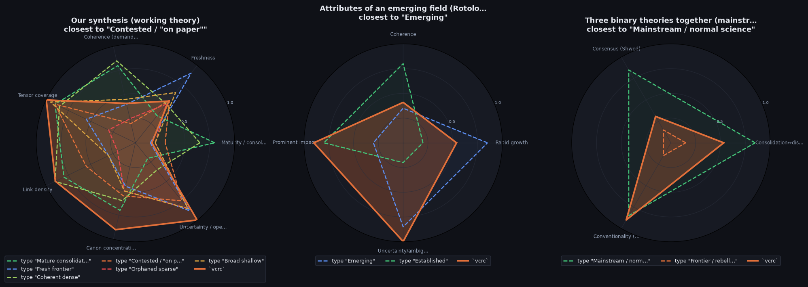

- Что на картинке: сплошная линия — положение ЭТОГО поля на вычислимых осях каждой теории (в цвете его типа), пунктир — идеальные типы теории (каждый своим цветом). Совпадение = поле похоже на этот идеальный тип. Первая панель — наш синтез: поле на 6 консолидированных осях + открытость поверх 6 архетипов (тот же взгляд, что и «Какой это тип поля», но по консолидированным осям).
- **Our synthesis (working theory)**: ближе всего к идеальному типу «Contested / "on paper"»; евклидово расстояние по осям теории 0.61 (0 — точно в этом типе). Оси поля: Maturity / consolidation 0.17, Freshness 0.54, Coherence (demand↔work) 0.41, Tensor coverage 1.00, Link density 0.90, Canon concentration 0.90, Uncertainty / openness 1.00.
- **Attributes of an emerging field (Rotolo–Hic…**: ближе всего к идеальному типу «Emerging»; евклидово расстояние по осям теории 0.70 (0 — точно в этом типе). Оси поля: Rapid growth 0.54, Coherence 0.41, Prominent impact 0.90, Uncertainty/ambiguity 1.00.
- **Three binary theories together (mainstream …**: ближе всего к идеальному типу «Mainstream / normal science»; евклидово расстояние по осям теории 0.63 (0 — точно в этом типе). Оси поля: Consolidation↔disruption … 0.53, Consensus (Shwed) 0.31, Conventionality (Uzzi) 0.90.

| Теория | Ось | Тип | Значение поля | Что показывает ось |
| --- | --- | --- | --- | --- |
| Our synthesis (working theory) | Maturity / consolidation | faithful | 0.17 | перепроверенное решённое ядро |
| Our synthesis (working theory) | Freshness | faithful | 0.54 | доля свежих статей |
| Our synthesis (working theory) | Coherence (demand↔work) | faithful | 0.41 | поле работает над тем, что просит |
| Our synthesis (working theory) | Tensor coverage | faithful | 1.00 | доля закрытых клеток |
| Our synthesis (working theory) | Link density | faithful | 0.90 | просьб на клетку |
| Our synthesis (working theory) | Canon concentration | faithful | 0.90 | неравенство цитат (Gini) |
| Our synthesis (working theory) | Uncertainty / openness | faithful | 1.00 | доля незакрытых под-вопросов (расширение по Rotolo) |
| Attributes of an emerging field (… | Rapid growth | faithful | 0.54 | приток свежих работ |
| Attributes of an emerging field (… | Coherence | faithful | 0.41 | растущая внутренняя связность |
| Attributes of an emerging field (… | Prominent impact | faithful | 0.90 | концентрация цитат/гиганты |
| Attributes of an emerging field (… | Uncertainty/ambiguity | faithful | 1.00 | доля незакрытых под-вопросов |
| Consolidation ↔ disruption (CD in… | Consolidation↔disruption | proxy | 0.53 | опора на гигантов vs слом (прокси = канон+зрелость) |
| Consensus formation (Shwed–Bearma… | Consensus | proxy | 0.31 | согласованность + устойчивость ядра |
| Conventionality × novelty (Uzzi; … | Conventionality | proxy | 0.90 | опора на канонические привычные комбинации (прокси = канон) |

## Поле как рынок внимания

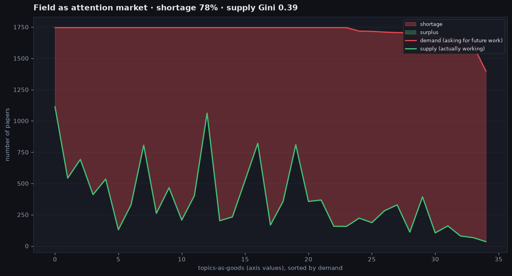

- Что на картинке: каждое значение оси карты (например `Validity type: internal`) — «товар». Его спрос — сколько статей ПРОСЯТ там будущей работы, предложение — сколько там реально РАБОТАЮТ. Товары отсортированы по спросу; красная заливка — незакрытый спрос (дефицит), зелёная — профицит. Это тот же рыночный взгляд, что и в кросс-картовом отчёте, но для одного поля.
- Товаров (значений осей): 35; суммарный спрос 60128, предложение 13086; незакрытый спрос 47042 (**индекс дефицита 78%** = доля спроса без предложения).
- Концентрация работы: **Gini предложения 0.39** (0 — работа ровно размазана по темам, 1 — вся в одной), **HHI 0.044** (индекс Херфиндаля долей предложения). Высокие значения = работа стянута к немногим темам.
- Сильнее всего не хватает работы в «INSTRUMENT:none / theoretical»: спрос 1746, а работают 130 (дефицит 1616).

## Что бросается в глаза (отдельные рекорды)

- **Статьи.**
  - самая цитируемая: [`P452` Judging LLM-as-a-Judge with MT-Bench and Chatbot Arena](https://arxiv.org/pdf/2306.05685) — 9526 цитирований (2023)
  - антирекорд по цитатам: [`P001` Reproducibility study on how to find Spurious Correlat…](https://arxiv.org/pdf/2604.04518) — всего 0 цитирований (2026)
  - старая, но всё ещё ключевая: [`P452` Judging LLM-as-a-Judge with MT-Bench and Chatbot Arena](https://arxiv.org/pdf/2306.05685) — 9526 цитирований, возраст 37 мес
  - самая «весомая» по сводному баллу важности: [`P1382` Mechanistically Eliciting Latent Behaviors in Language…](https://arxiv.org/abs/2606.29604) — балл 2.47 (балл = свежесть статьи плюс вклад её цитируемости — перцентиль среди сверстников по возрасту, то есть какая доля ровесников цитируется слабее неё; чем свежее и чаще цитируется, тем выше балл, поэтому старая малоцитируемая работа получает около нижней границы, а свежая из самых цитируемых — самый высокий балл поля; у этой работы возраст 1 мес — «моложе 4 месяцев» — и 13 цитирований, что вместе и даёт 2.47)
- **Области (оси карты).**
  - больше всего просят область «Validity type: construct» (суммарный спрос 1746 статей-просьб)
  - больше всего работ в области «Validity type: construct» (1114 статей)
  - спрос без предложения: «Validity threat: Reactivity / evaluation awareness» просят на 1399, а работает там всего 35 статей
  - областей, где работают, но совсем не просят продолжения, нет — у каждой обжитой области есть и запрос на будущее
- **Точки карты (клетки).**
  - точку чаще всего просят расширять дальше: RQ4: How reliable is the scorer/measurement instrument… | We therefore defer calibration analysis to future… — на ней сошлось 88 просьб о расширении
  - полностью решённых точек (0 открытых под-вопросов), которые всё равно просят расширять, нет — расширять поле просит только точки, где ещё остались открытые под-вопросы
- **Темы-просьбы (F).**
  - самая востребованная тема: `F4` Establish construct validity (nomological nets, measurement… — её просят 244 статей
  - тема, задевающая больше всего точек карты: `F4` Establish construct validity (nomological nets, measurement… — 384 целевых точек (клеток карты, которые тема просит закрыть)
  - наименее востребованная тема: `F5` Test and reduce evaluation awareness with deployment-realis… — её просят всего 28 статей
  - сильнее всего «решили на словах»: `F8` Validate generalization to out-of-distribution, real-world … — заявлена сделанной, но нерешённость 1.9 из 4
  - громче всего просят, но никто не берётся: `F4` Establish construct validity (nomological nets, measurement… — спрос 244, реализаций 0
- **Направления (RQ).**
  - сильнее всего просят направление RQ1: Is the target construct defined and theory-grounded (nomological netw… (суммарный спрос 1746 статей)
  - больше всего брошенных тем под направлением RQ1: Is the target construct defined and theory-grounded (nomological netw… — 1 тем «никто не делает»
  - больше всего пустых точек: RQ6: Can the evaluation be gamed, and can train/test contamination be dete… — 2% пустые (128 точек); самое проработанное: RQ16: Are baselines and comparisons fair (tuning and compute parity, no lea… — 0% пустых
